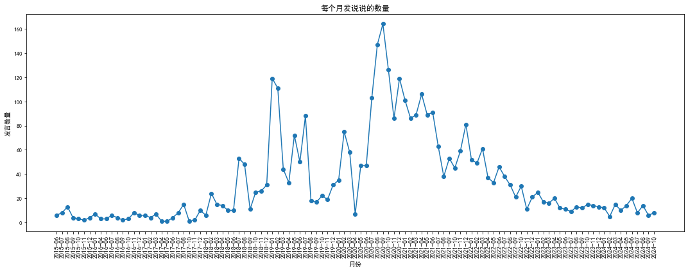

<html lang="zh">
<head>
    <meta charset="UTF-8">
    <meta name="viewport" content="width=device-width, initial-scale=1.0">
    <title>2024年度总结</title>
    
</head>
<body>
    <h1>2024年度总结</h1>
    
王胤杰*

    

        同济大学海洋与地球科学学院, 上海市杨浦区, 中国 
        东京科学大学水文气候实验室, 东京都目黑区, 日本 
        <strong>作者邮箱:</strong> <a href="mailto:wangyinjie@tongji.edu.cn">wangyinjie@tongji.edu.cn </a>
            

    
<strong>发表日期:</strong> 2024年12月31日

    

        <strong>摘要：</strong> 本文总结了作者在2024年度的学术、科研及个人成长方面的主要成就与经验。包括在气候动力学、行星气候可居性、降尺度模型开发及国际交流等领域的贡献，反映了跨学科合作与多平台学习的重要性。
    

    

        <h1>1. 引言</h1>
        
尊敬的各位领导、同事们：

大家好！我是Djungarian，站在这里，心中满怀感激与激动，回顾我们共同走过的2024年。这一年，是挑战与机遇并存的一年，是汗水与收获交织的一年。在时间的长河中，我们携手并进，以不屈不挠的精神，书写了属于自己的辉煌篇章。

回望过去，每一步都凝聚着我们的智慧与努力。面对困难和挑战，我们没有退缩，而是选择勇往直前，用实际行动诠释了“团结就是力量”的真谛。今天，我满怀敬意和自豪，向大家汇报我在2024年的成长与收获，分享那些闪耀着我们光芒的难忘瞬间。

    

    

    <h1>2. 从一系列替代性指看自己的2024</h1>
    在地质学和古气候学研究中，替代性指标（proxy indicators） 是科学家用于间接重建过去地球环境和气候条件的重要工具。这些指标源于自然界中的物理、化学或生物记录，能够在缺乏直接观测数据的情况下，帮助科学家推测出遥远过去的温度、降水量、大气成分以及生态系统变化等信息。由于时间的跨度可能长达数千年甚至数百万年，直接获取这些时期的环境数据几乎不可能，因此科学家转向研究那些能够保存环境变化痕迹的自然“档案”。例如，冰芯中的气泡可以封存远古大气成分，冰层中氧同位素（如δ¹⁸O）的比例可以反映当时的温度和降水条件。树轮的宽度和密度则提供了年度气候波动的信息，树木在温暖湿润的年份会形成较宽的年轮，而在寒冷或干旱的年份则较窄。湖泊和海洋沉积物同样是重要的替代性指标，它们积累的花粉、有孔虫壳体、沉积物颗粒大小等可以揭示湖泊或海洋在特定时期的温度、降水、流速等环境条件。此外，珊瑚礁中碳酸钙的化学成分也会受到海水温度和盐度的影响，从而成为海洋古环境的重要代用指标。这些不同类型的替代性指标各有其时间分辨率和地理适用性，但它们在综合分析中常常能够相互验证，从而提高气候重建的可靠性和精确度。替代性指标不仅帮助科学家还原了地球在冰期和间冰期的气候面貌，还为理解当前和未来气候变化趋势提供了宝贵的参考。通过这些自然界的“时间胶囊”，我们能够穿越时空，窥见地球过去的气候奥秘。 
    虽然对于自己的研究并不像广泛的自然科学一样有坚实的数据与因果逻辑支撑，但这种思路同样可以类比到个人习惯的自我审视上。可以通过一些“替代性指标”来推测大致的使用趋势和变化，并可对其中变化发生的原因进行进一步的猜测。
        <h2>2.1短视频与长视频平台</h2>
        虽然没有数据（懒得爬取自己的手机屏幕数据），但是我可以确定的是这一年把之前刷短视频成瘾以及睡觉前不睡觉玩一两小时手机没完没了已经克服掉了。原因未知，我也没法说到底是什么影响的。可能就是年纪大了吧，我认为潜在的一个原因是通过大量的脱敏训练，避免对其进行限制（如果限制就会产生禁果效应）然后自己的幻想就会作祟，正因为限制然后更加的产生诱惑作用。当然这里所谓不加限制也不是意味着就一个劲拥抱着成瘾，我觉得应该是脑子里至少要加一个“正则项”或者设立一个第三方视角看着，至少是在自己还在理性的时候，去客观分析自己到底爽了没。只要多想，也不用逼着自己改，可能等说服了自己潜意识的时候就会脱离这些趣味了吧。不得不说自己去驯服自己真是个有趣的理论，实操也很有趣，单单在自己还算理性的时候去看自己出于动物性的行为就足够好玩。 
        另外一点短视频和长视频浏览知识内容成为今年的主导内容，这里就又用到一个驯服自己动物性的策略了--趁他不注意给他掉包（有点像骗小孩吃药就把外包装看起来像饮料）。一个类似的生活中原理，如果爱喝含糖碳酸饮料，可以偷偷换成无糖可乐，然后喝的时间长了还得故意冒出点优越感（这里不是那种和小屁孩一样的尬夸带来情绪价值的，而是说服你的潜意识）。接下来就可以继续偷换成茶和咖啡了。一个实操的例子：把抖音本体卸载换成抖音精选app，给你推的内容就不一样了，而且也不是那种连着刷的形式。然后就开始戒断一段时间，等你不再依赖了（有点像水泥凝固前要装架子兜起来）潜意识就会对这些原来的问题没那么感冒了。
        <h2>2.2文字信息平台</h2>
在2024年4月19日我决定放弃知乎作为日常信息的获取途径，因为在大数据对人类爱欲的操控下，现在一切大型网络论坛的推送信息流里很难再获得高质量的知识，充满了抖机灵、八卦、开车、偏激、煽动性的情绪，从大量低质量数据会让本来灵光的大脑不停的退行，我可以说这已经在当代从高中生做题家直接转换成大学生的群体里面成了重病，我也受其影响，所以现在以更为愤怒的决心彻底洗掉遗毒，我认为也是现代人类应该克服的一关。 
在2024年8月开始使用得到app进行电子书听书阅读，经过实际体验认为听书形式对于传记社科、历史、人文、科普内容适合，但是对于理工图书较难以理解。因为你需要经常动笔进行公式推导，因此我使用两管齐下的阅读方式。 
以下为在得到app上以及实体书和pdf电子书阅读的名单：
<head>
    <meta charset="UTF-8">
    <meta name="viewport" content="width=device-width, initial-scale=1.0">
    <title>本年度阅读书籍汇总</title>
    
</head>
<body>
    

    <table>
        <thead>
            <tr>
                <th>序号</th>
                <th>中文名</th>
                <th>副标题</th>
                <th>作者</th>
                <th>出版社</th>
                <th>原作名</th>
                <th>译者</th>
            </tr>
        </thead>
        <tbody>
            <tr>
                <td>1</td>
                <td>探路之役：1978—1992年的中国经济改革</td>
                <td></td>
                <td>萧冬连</td>
                <td>社会科学文献出版社</td>
                <td></td>
                <td></td>
            </tr>
            <tr>
                <td>2</td>
                <td>控制论</td>
                <td>或动物与机器的控制和通信的科学</td>
                <td>[美] 诺伯特·维纳</td>
                <td>商务印书馆</td>
                <td>Cybernetics: or the Control and Communication in the Animal and the Machine</td>
                <td>王文浩</td>
            </tr>
            <tr>
                <td>3</td>
                <td>小镇喧嚣</td>
                <td>一个乡镇政治运作的演绎与阐释</td>
                <td>吴毅</td>
                <td>生活·读书·新知三联书店</td>
                <td></td>
                <td></td>
            </tr>
            <tr>
                <td>4</td>
                <td>现象学入门</td>
                <td>胡塞尔的认识批判</td>
                <td>何涛</td>
                <td>社会科学文献出版社</td>
                <td></td>
                <td></td>
            </tr>
            <tr>
                <td>5</td>
                <td>论中国</td>
                <td></td>
                <td>[美] 亨利·基辛格</td>
                <td>中信出版社</td>
                <td>On China</td>
                <td>胡利平 / 林华</td>
            </tr>
            <tr>
                <td>6</td>
                <td>爱欲与文明</td>
                <td></td>
                <td>[美] 赫伯特·马尔库塞</td>
                <td>上海译文出版社</td>
                <td></td>
                <td>黄勇 / 薛民</td>
            </tr>
            <tr>
                <td>7</td>
                <td>精神分析引论</td>
                <td></td>
                <td>[奥] 西格蒙德·弗洛伊德</td>
                <td>上海译文出版社</td>
                <td></td>
                <td>黄珊</td>
            </tr>
            <tr>
                <td>8</td>
                <td>寻找宜居行星</td>
                <td></td>
                <td>James Kasting</td>
                <td>上海教育出版社</td>
                <td>How to Find a Habitable Planet</td>
                <td>郑永春 / 刘晗</td>
            </tr>
            <tr>
                <td>9</td>
                <td>辩证唯物主义原理-第三版</td>
                <td></td>
                <td>萧前</td>
                <td>北京师范大学出版社</td>
                <td></td>
                <td></td>
            </tr>
            <tr>
                <td>10</td>
                <td>娱乐至死</td>
                <td></td>
                <td>[美] 尼尔·波兹曼</td>
                <td>中信出版社</td>
                <td>Amusing Ourselves to Death: Public Discourse in the Age of Show Business</td>
                <td>章艳</td>
            </tr>
            <tr>
                <td>11</td>
                <td>科学哲学视野中的复杂系统与模拟方法</td>
                <td></td>
                <td>齐磊磊</td>
                <td>中国社会科学出版社</td>
                <td></td>
                <td></td>
            </tr>
            <tr>
                <td>12</td>
                <td>我们时代的神经症人格</td>
                <td></td>
                <td>[德] 卡伦·霍妮</td>
                <td>上海文化出版社</td>
                <td></td>
                <td>郑世彦</td>
            </tr>
            <tr>
                <td>13</td>
                <td>个体心理学</td>
                <td></td>
                <td>[奥] 阿尔弗雷德·阿德勒</td>
                <td>湖南文艺出版社</td>
                <td>The Practice and Theory of Individual Psychology</td>
                <td>谢海伦 / 王明霞 / 张倩倩</td>
            </tr>
            <tr>
                <td>14</td>
                <td>爱的艺术</td>
                <td></td>
                <td>[美] 艾里希·弗洛姆</td>
                <td>人民文学出版社</td>
                <td></td>
                <td>刘福堂</td>
            </tr>
            <tr>
                <td>15</td>
                <td>筚路维艰</td>
                <td>中国社会主义路径的五次选择</td>
                <td>萧冬连</td>
                <td>社会科学文献出版社</td>
                <td></td>
                <td></td>
            </tr>
            <tr>
                <td>16</td>
                <td>置身事内</td>
                <td>中国政府与经济发展</td>
                <td>兰小欢</td>
                <td>上海人民出版社</td>
                <td></td>
                <td></td>
            </tr>
            <tr>
                <td>17</td>
                <td>心理动机</td>
                <td>激发行动力的底层逻辑</td>
                <td>[瑞] 安吉拉·阿霍拉</td>
                <td>人民邮电出版社</td>
                <td></td>
                <td>邝慧玲</td>
            </tr>
            <tr>
                <td>18</td>
                <td>行星的秘密生活</td>
                <td>太阳系的秩序、混乱与独特性</td>
                <td>[英] 保罗·默丁</td>
                <td>浙江科学技术出版社</td>
                <td></td>
                <td>陈锐珊</td>
            </tr>
            <tr>
                <td>19</td>
                <td>县中的孩子</td>
                <td>中国县域教育生态</td>
                <td>林小英</td>
                <td>上海人民出版社</td>
                <td></td>
                <td></td>
            </tr>
            <tr>
                <td>20</td>
                <td>性心理学</td>
                <td></td>
                <td>[英] 哈夫洛克·霭理士</td>
                <td>国际文化出版公司</td>
                <td></td>
                <td>潘光旦</td>
            </tr>
            <tr>
                <td>21</td>
                <td>地球的故事</td>
                <td>从一粒星尘到充满生命的世界，45亿年的地球演化史诗</td>
                <td>[美] 罗伯特·哈森</td>
                <td>中信出版集团</td>
                <td>The Story of Earth</td>
                <td>刘小鸥</td>
            </tr>
            <tr>
                <td>22</td>
                <td>混沌</td>
                <td>开创一门新科学</td>
                <td>[美] 詹姆斯·格雷克</td>
                <td>图灵｜人民邮电出版社</td>
                <td>Chaos: Making a New Science</td>
                <td>楼伟珊</td>
            </tr>
            <tr>
                <td>23</td>
                <td>毛泽东选集第一卷</td>
                <td></td>
                <td>毛泽东</td>
                <td>人民出版社</td>
                <td></td>
                <td></td>
            </tr>
            <tr>
                <td>24</td>
                <td>科学社会主义基础理论研究</td>
                <td></td>
                <td>秦宣</td>
                <td>北京师范大学出版社</td>
                <td></td>
                <td></td>
            </tr>
            <tr>
                <td>25</td>
                <td>探索者的海洋</td>
                <td>斯托梅尔自传</td>
                <td>[美]亨利·斯托梅尔</td>
                <td>海洋出版社</td>
                <td>The Sea of Beholder</td>
                <td>贾复、黄瑞新</td>
            </tr>
            <tr>
                <td>26</td>
                <td>君主论</td>
                <td></td>
                <td>[意]尼可罗·马基亚维利</td>
                <td>中华书局</td>
                <td>The Prince</td>
                <td>吕健忠</td>
            </tr>
            <tr>
                <td>27</td>
                <td>为什么</td>
                <td>关于因果关系的新科学</td>
                <td>[美]朱迪亚·珀尔、[美]达纳·麦肯齐</td>
                <td>中信出版社</td>
                <td>The book of why ：The new science of cause and effect</td>
                <td>江生 / 于华</td>
            </tr>
        </tbody>
    </table>
    

</body>
<h2>2.3社交媒体平台</h2>
微信朋友圈数据没办法爬取，但是QQ空间有办法，能发现年纪越大话越少，中间峰值是高考后放出来的时候。来了日本之后可能发的又多了一点，因为出去玩的多，要是我蹲在阳泉/上海研究东西估计什么都不发了。其实话最多的时候有点中二病的，现在已经达到稳态。人的发言数量随着年纪大应该变少，但是同一时间内应该是守恒的，必须有个出口。如果你发现有个人不怎么和你说话了说明他能量使唤到其他地方去了，如果有个人突然开始老发朋友圈其实有可能说明他最近没有出口泄洪了。
    

        
        
差不多近十年空间说说每月条数

    

最近也跳脱出当局者观察了几个群聊，感觉大部分所谓论坛本质是情绪价值舞台，是学不到什么真东西的。之前社交是以网络+群聊为主导的，现在在日本也没机会也没必要布局什么新关系，蓄势一段时间等回国了开始尝试向现实+私聊社交进行转轨。来日本之后别的不说，现在能随便和人搭讪了（包括外国人），为什么要括弧非要说这个外国人呢？因为之前不知道为什么潜意识里就觉得外国人是天外来客，和自己不是一个物种。（其实很多小地方人看见外国人大惊小怪过份热情也可能是一个原因）这里的外国人还一般不是说日本人，因为日本人和中国人长得差不多，行为也差不多（之前也觉得有点天外来客）。主要说儒家文化圈外的民族。东工大学校里宿舍里汉字文化圈外族人太多了，抬头低头都是。反正整个意思就是现在随便和人搭讪聊天包括外国人感觉问题不大，以前让我站讲台上说个话都吓得僵死（这个是新希望的锅，我在三中可不是这样）。
<h1>3.从三个方面复盘自己的2024</h1>
<h2>3.1工作</h2>
首先是争取到了未来的研究主题是自己当前热忱的，这点挺好，做自己有点兴趣的内容是很能够废寝忘食进入心流状态的。当然更多应该说的是工作当中遇到的问题的反思，首先是今年扎实认识到了胳膊拗不过大腿，人胜不了天。初三班主任勉励我们的主要旋律是人有多大胆地有多大产。这个在历史上起过巨大的积极作用，能够把自己潜力逼出来。这也一直秉持过了我整个高中。但是其实也隐藏着危机，在高中是执迷不悟，无法认清现实（这个无法认清现实的意思不是眼高手低，而是没法认清现实就做不出来基于实际情况的正确决策）在大学是容易把自己逼的太死，容易饼摊太大然后自己处理不完了，或者直接挑战自己身体极限把身体搞出问题。
<h2>3.2学习</h2>
本科期间走过的正路邪路直路弯路给我积累了不少东西，通识博雅了很多庶民知识，这些东西虽然基础和较为低级，但是也能起到凝结核的作用，让那些正儿八经的东西生长出来。我从小到大本身兴趣就挺多的，在大学的自由氛围也探索了不少内容，虽然看起来和老本行没什么用，但是我隐约能感觉到它能帮助我的实际工作。现在我储备的数据量以及这些数据训练出来的2024版本人脑大模型已经能够让我去尝试一点更为抽象、更为理论、更为科班的内容乃至是形式科学了。所以最近做的一边是2.2内容里面的通识内容整合专业化，另一方面是开始大胆尝试啃硬骨头，抱有饶有兴趣的心态去尝试理解一些哲学（辩证唯物主义、现象学、科学技术哲学）数学（辛几何、偏微分方程、矢量运算）物理（理论力学、统计物理、数学物理方法）的内容。前者个人感觉是可以做下去的，后者刚刚开始，成效未知。另外由于《北京大学物理学院博士生培优计划》的入学考试，我确实得开始梭哈了（虽然我导师让我别考上面那些内容，去考基础天文学）。
<h2>3.3生活</h2>
成就：
1.学会早睡早起，从高三高考结束后对于睡眠问题是完全没有节制的，从2024年11月开始学会进行有规律节制的睡眠规划。基本保持东京时间1点半睡觉，9点半起床。你还觉得这个很晚吗？我之前如果完全没有节制的情况下是三四五点睡觉，十二点一点起床的。具体策略其实不是定点睡觉，而是定点起床，不睡自然醒的觉，这样晚上容易困。 
2.学会逛超市，买生活物资，过日子：本科阶段由于各种原因（占大头的是中国太方便了以及太忙）基本不去超市买生活物资，来了东京之后的特殊情况被迫学会过的像家庭主妇一样买清洁用品、买生食材进行烹饪。另外还会给自己买水果吃买奶喝，之前我从来不会主动去做这些事情。具体原因为什么我也不知道，可能是INTP的某些奇怪的点吧。 
3.学会健身，在这之前对自己身体完全是不在乎的情况，随便用，随便乱吃。去年底可能算是个潜在的开始，进行过一次激进的绝食减肥，但是后来吃碳水太少了导致晕，就停止了。今年这次在去年的基础上又掉了6kg体重，体脂率降到了15％（但是应该低估了3％，网上说是体脂秤通病，真正的15绝对可以看到腹肌纹路，我现在情况是还不太清楚）还耦合上了增肌健身，目的是增加基础代谢率让我多吃也不胖。减脂增肌行动的动因原因不明，有可能是夏令营最后一天和我导师meeting时候他上来就劝我注意身体，也有可能是东京男人臭美风气（我去过的男士最精干的城市，之前所有地方是只有女的精干）也把我感染了，东京这边男的很重视健身、增肌以及其他体育活动。 
4.脱发有所缓解，疑似种群已经从衰退期走向增长期。2023年末脱发非常严重，已经可以看到M型发样。其实本科阶段也一直在掉，谁让我搞这么一个长头发就容易拽下来。所以在2024年初开始使用米诺地尔进行生发，已经使用11个月，M型基本已经恢复。但是头上效果不如其他部位效果大（其实并没有涂抹到其他部位），现在把我搞成大胡子了。

<h1>4.2024的遗憾与不足及2025的预期</h1>
<h2>4.1 2024的遗憾</h2>
没什么遗憾
<h2>4.2 2025的预期</h2>
不知道
<h1>5.致谢</h1>
感谢Github老板汤姆·普雷斯顿·沃纳让我把这个页面上传到Github上，感谢蒂姆·伯纳斯·李创立超文本标记语言语言让我把这些文字写下来。
<body>
    <footer>
        
* 通讯作者

        
版权所有 © 2024 王胤杰

    </footer>
</body>

