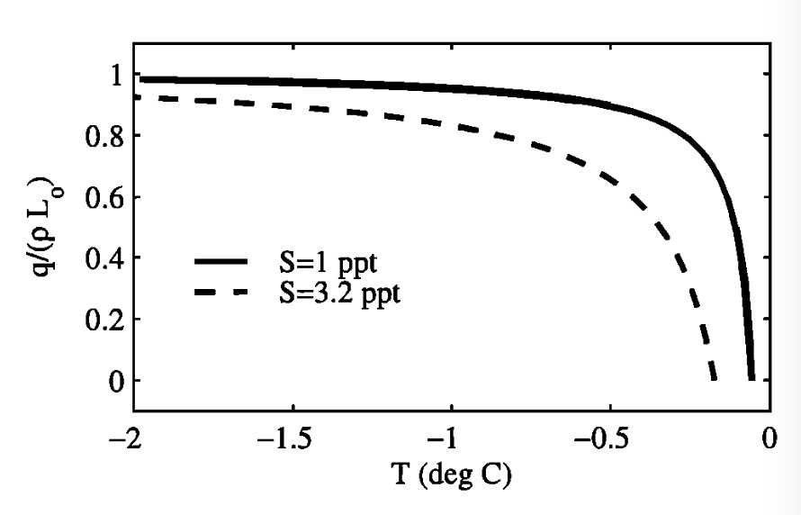
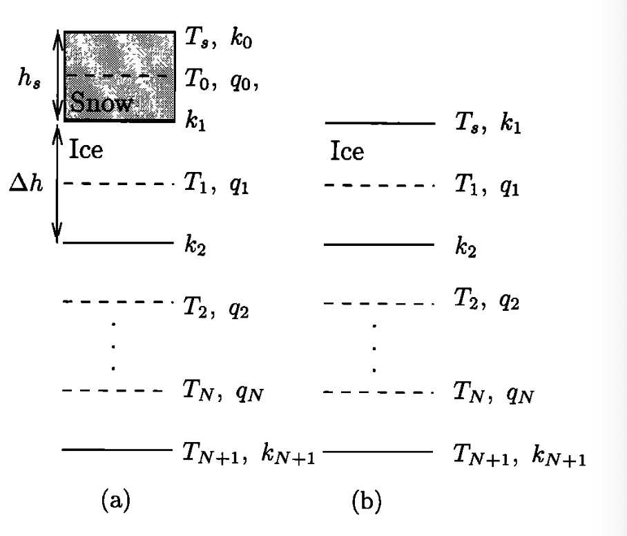
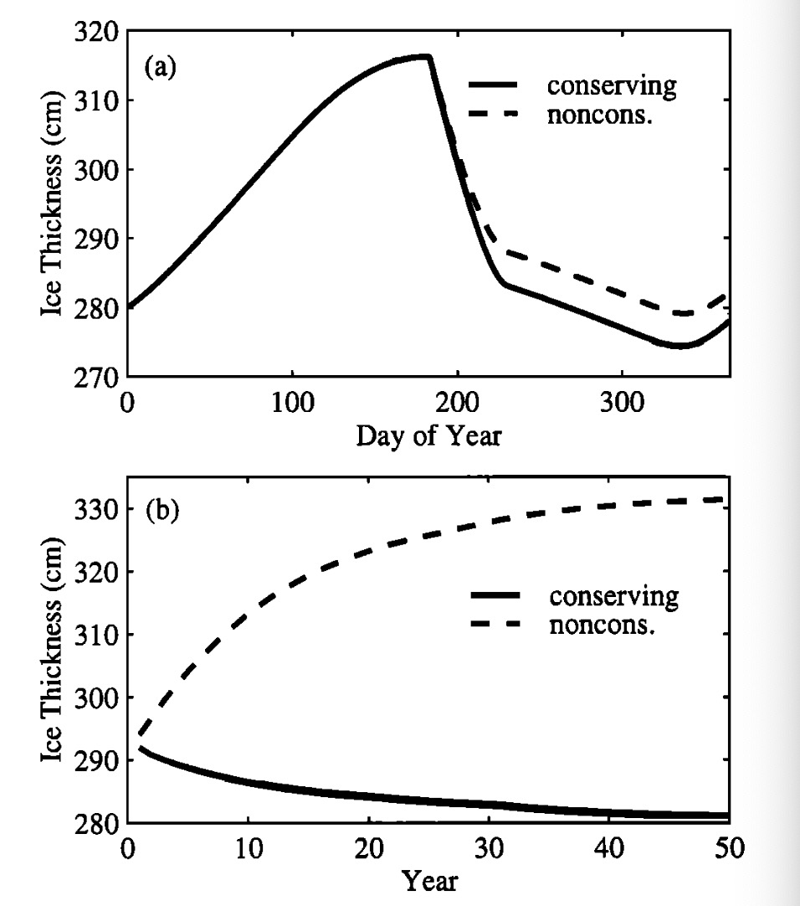
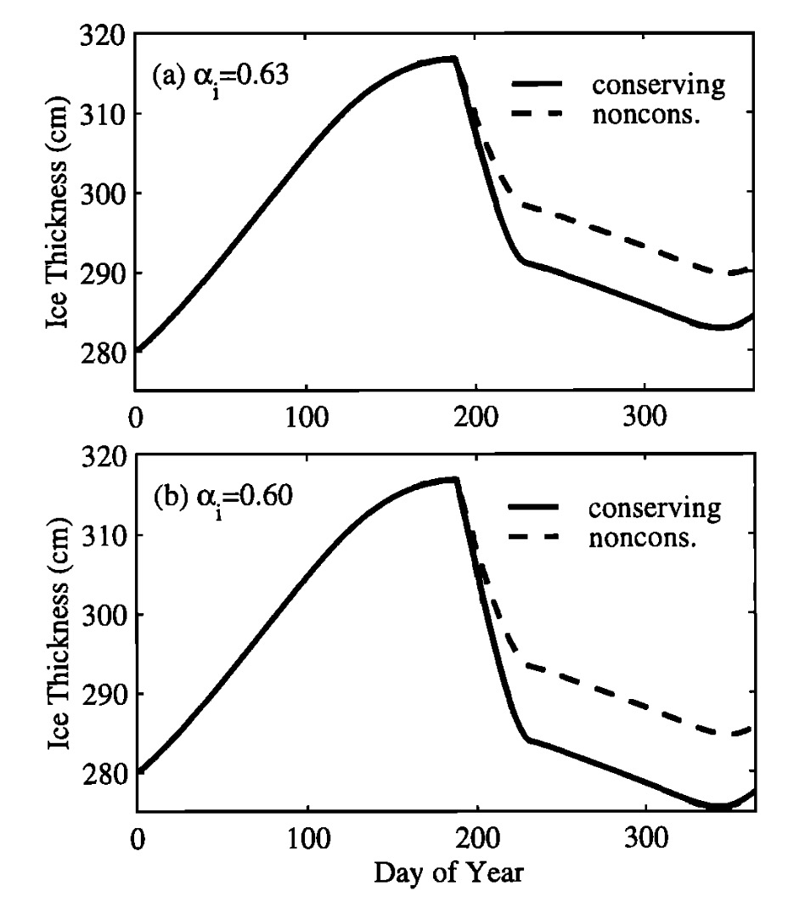
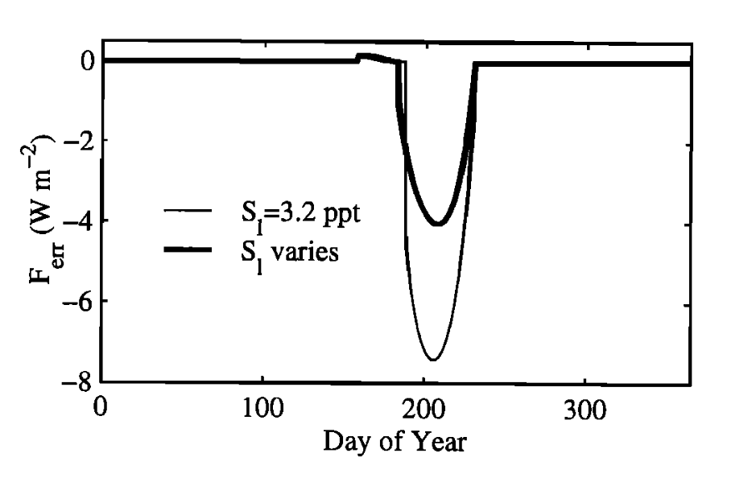
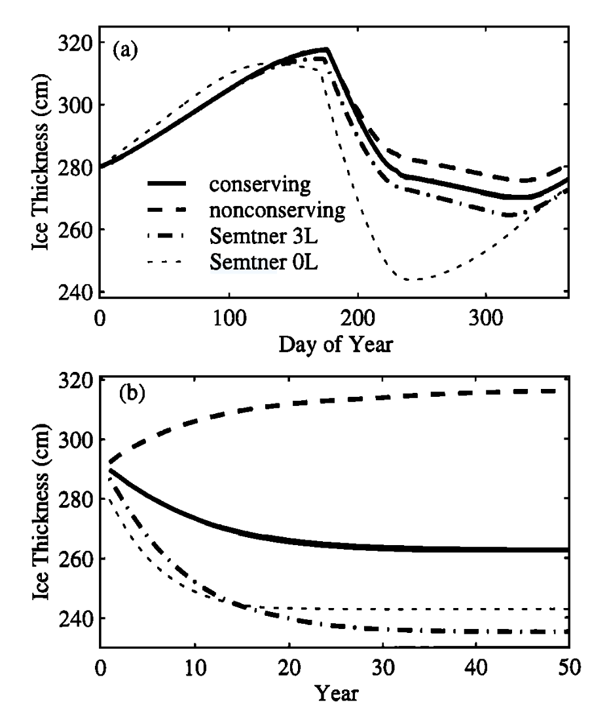

<html lang="zh-CN">
<head>
    <meta charset="UTF-8">
    <title>能量守恒的海冰热力学模型</title>
    
    
</head>
<body>
    <h1>能量守恒的海冰热力学模型</h1>
    
<strong>C.M. Bitz1</strong>

    
1维多利亚大学地球与海洋科学系，加拿大不列颠哥伦比亚省

    
<strong>William H. Lipscomb2</strong>

    
2华盛顿大学大气科学系，美国西雅图

    <h2>摘要</h2>
    
我们提出了一种用于气候研究的能量守恒海冰模型，该模型考虑了内部盐水囊融化对表面消融的影响。许多海冰模型在参数化盐水囊中的潜热存储时，未能按比例减少表面消融所需的能量，这些模型在夏季融化季节无法保持能量守恒。与我们的能量守恒模型相比，非守恒模型低估了多年冰的表面消融量12-22%，并高估了平衡冰厚度50-124厘米。此外，非守恒模型对扰动的响应不如我们的能量守恒模型敏感：由于表面反照率扰动，平衡厚度变化减少了22-44%；由于向下长波辐射扰动，平衡厚度变化减少了13-31%。较小的差异与具有时间无关、垂直变化的盐度分布的模型相关，而较大的差异与假设海冰为等盐度（盐度为3.2‰）的模型相关。具有垂直变化盐度分布的模拟在顶部表面的盐度较低，导致热传导减少，内部盐水囊融化减少，表面消融增加。

    <h2>1. 引言</h2>
    
高纬度地区在全球气候中的重要作用促使人们通过使用更真实的热力学来改进海冰模型。这些模型的“真实性”应以一种能够保持能量（当然还有水）守恒的方式添加。目前，大多数气候模型使用基于Semtner [1976]的零层或三层冰模型的变体。虽然这些模型在能量守恒方面做得相当不错，但在某些方面缺乏普遍性和有效性[Semtner, 1984]。一个物理上真实的海冰模型应准确表示热容量（将单位质量的冰温度升高1℃所需的能量）和融化能量（融化单位体积冰所需的能量），这些值与纯冰的值不同，尤其是在接近0℃时。这种差异主要是由于盐水囊的存在，盐水囊的大小会随着冰的温度变化而变化，以保持与冰的热平衡[Schwerdtfeger, 1963]。当冰冷却时，盐水囊中的水必须冻结，以使盐水囊的盐度增加到适合较低温度的值。同样，当冰变暖时，盐水囊的盐度必须降低，这是通过融化盐水囊壁上的冰来实现的。因此，海冰的热容量不仅包括升高纯冰温度所需的能量，还包括升高盐水温度和融化盐水囊壁上冰所需的能量。由于内部已经发生的融化，融化剩余冰所需的能量比相同体积的纯冰要少。当冰接近0℃时，盐水囊可能占据总体积的很大一部分。在多年北极冰中，孔隙率（即单位体积海冰中盐水和空气的体积）通常在上部30厘米处达到20-30% [Eicken et al., 1995]，在老化的融池下方可能高达40-50% [Maykut et al., 1992]。海冰的融化能量应按孔隙率比例减少。然而，许多具有盐度依赖性热容量表达式的海冰模型（例如Maykut和Untersteiner [1971]，以下简称MU71，以及Ebert和Curry [1993]）未对表面融化的潜热进行适当的校正，以考虑内部盐水囊的融化。这些模型在表面融化时施加了过多的能量，结果无法保持能量守恒。这是我们本文旨在纠正的一个错误。

    
首先，我们在第2节中推导了海冰的热容量和融化能量作为温度和盐度的函数的表达式。然后在第3节中，我们展示了如何在海冰模型中使用这些表达式以保持能量守恒。在第4节中，我们将新的能量守恒模型与未进行适当校正的模型版本进行了比较。我们通过一系列敏感性实验探讨了这两种方法之间的差异。我们还将新的能量守恒模型与Semtner [1976]的零层和三层模型进行了比较。最后，我们在第5节和第6节中讨论了这些结果并给出了结论。

    
<strong>关键词：</strong>海冰，能量守恒，热力学模型，盐水囊，融化

    
1现任职于华盛顿大学第四纪研究中心，美国西雅图。

    
2现任职于洛斯阿拉莫斯国家实验室T-3组，美国新墨西哥州洛斯阿拉莫斯。

    
版权所有 © 1999 美国地球物理联合会。

    
论文编号：1999JC900100。

    
0148-0227/99/1999JC900100509.00

    <h2>2. 理论</h2>
    
Malmgren [1927] 对海冰热力学性质的探索促使 Untersteiner [1961] 提出了一个相对简单的海冰热容量近似公式：

    

        \[
        c(T, S) = c_0 + \frac{\gamma S}{T^2},
        \]
    

    
其中 \( c_0 = 2110 \, \text{J kg}^{-1} \, \text{deg}^{-1} \) 是淡水冰的热容量，\( S \) 是以千分比表示的盐度，\( T \) 是以摄氏度表示的温度。Untersteiner 根据 Malmgren 的热容量表，设 \( \gamma = 4100 \, \text{cal deg g}^{-1} \)（即 \( 17.2 \, \text{kJ deg kg}^{-1} \)）。后来，Ono [1967] 指出，方程 (1) 可以从基本原理推导出来，得到：

    

        \[
        \gamma = L_0 \mu,
        \]
    

    
忽略可以忽略的小项后，方程 (2) 定义了 \( \gamma \)，其中 \( L_0 \) 是淡水冰在 \( 0^\circ \text{C} \) 时的融化潜热，\( \mu \) 是海冰融化温度与盐度之间关系的经验常数：

    

        \[
        T_m = -\mu S.
        \]
    

    
根据 Assur [1958] 的研究，取 \( L_0 = 334 \, \text{kJ kg}^{-1} \) 和 \( \mu = 0.054^\circ \)，我们得到 \( \gamma = 18.0 \, \text{kJ deg kg}^{-1} \)，比 Untersteiner 1961 年的值高出 5%。

    
方程 (1) 可以乘以海冰密度 \( \rho \) 并积分，得到将单位体积海冰从温度 \( T \) 升高到 \( T' \) 所需的能量 \( Q \)：

    

        \[
        Q(S, T, T') = \rho c_0 (T' - T) - \rho L_0 \mu S \left( \frac{1}{T'} - \frac{1}{T} \right).
        \]
    

    
假设我们令 \( T' = T_m \)。在这个温度下，单位体积的海冰应该完全由盐水组成，即融化完成。我们发现，融化单位体积盐度为 \( S \)、温度为 \( T \) 的海冰所需的能量 \( q \) 等于：

    

        \[
        q(S, T) = \rho c_0 (T_m - T) + \rho L_0 \left( 1 + \frac{\mu S}{T} \right).
        \]
    

    
我们将 \( q \) 称为海冰的融化能量，其单位为 \( \text{J m}^{-3} \)。当 \( S = 0 \) 时，融化能量与纯冰的预期值一致：一个热容量项等于将温度升高到 \( 0^\circ \text{C} \) 所需的能量，一个潜热项等于融化冰所需的能量。尽管 \( q \) 在 \( 0^\circ \text{C} \) 时未定义，但在达到 \( T_m \) 之前表现良好，此时 \( q = 0 \)，冰完全融化。因此，在相关温度范围内，方程 (1) 或 (5) 中不存在奇点，正如一些作者所假设的那样，也不需要规定一个最大值（例如 \(-0.1^\circ \text{C}\)），超过该值海冰的温度不能上升。方程 (4) 和 (5) 中出现的海冰密度表示纯冰和盐水囊区域的平均值，并假设为常数（\( \rho = 917 \, \text{kg m}^{-3} \)）。方程 (5) 中第二项的因子 \( \rho (1 + \mu S / T) \) 相当于单位体积海冰中未融化冰的质量（即海冰的质量减去单位体积盐水的质量）。

    
Schwerdtfeger [1963] 也推导了海冰热容量的表达式。然而，他忽略了纯冰融化能量的温度依赖性，因此在他的热容量表达式中得到了额外的项 \( (c_w - c_0) \mu S / T \)（他的方程 (1.3.7)），其中 \( c_w \) 是纯液态水的热容量。如果他使用了更准确的纯冰融化能量表达式，额外的项将被抵消，他将得到更简单的结果（方程 (1)）。

    
我们认为，如果海冰达到融化温度，则不需要额外的能量来融化冰。因此，海冰的消融和增长取决于融化能量：

    

        \[
        F(T) = -q(S, T) \frac{dh}{dt},
        \]
    

    
其中 \( F \) 是朝向顶部或底部表面的净通量，\( h \) 是冰的厚度，\( t \) 是时间。这就是过去使用盐度依赖性热容量的海冰模型的问题所在。据我们所知，所有这些模型（除了 Björk [1992] 的模型）在计算顶部表面的消融率时都假设 \( q \) 等于 \( \rho L_0 \)（例如 MU71；Gabison, 1987；Ebert 和 Curry, 1993；Bitz 等, 1996；Flato 和 Brown, 1996）。然而，在接近融化温度时，\( q \) 明显小于 \( \rho L_0 \)（图 1）。使用正确的 \( q \) 表达式在顶部表面温度接近 \( T_m \) 时尤为重要，因为方程 (5) 表明，对于任何非零盐度，\( q \) 随着 \( T \) 接近 \( T_m \) 而趋近于零。

    
一些模型（例如 MU71；Ebert 和 Curry, 1993）假设冰底部的 \( q \) 比 \( \rho L_0 \) 小约 10%。海冰与海洋接触，海洋的温度通常接近其冰点。根据方程 (5)，当 \( T = -2^\circ \text{C} \) 且 \( S = 3.2\% \) 时，\( q = 0.92 L_0 \)，其中 \( S \) 被选为代表多年冰底部的盐度 [Weeks 和 Ackley, 1986]。因此，假设海冰底部的 \( q = 0.9 L_0 \) 不会导致底部表面增长和消融率的较大误差。

图 1. 当 S = 3.2%0 和 S = 1%0 时，纯冰的熔化潜热与熔化能量的关系。

    <h3>模型的局限性</h3>
    
我们模型的一个局限性是假设密度 \( \rho \) 为常数。在融化季节，通常在顶部表面观察到一层 5-10 厘米厚的退化冰，其密度为 \( 500 \, \text{kg m}^{-3} \) 或更低。在这层退化冰的下方，多年冰含有充满空气的孔隙，这可以使其密度降低到 \( 700-800 \, \text{kg m}^{-3} \)（在上部 30-50 厘米处）[Eicken 等, 1995]。通过固定密度，我们的模型隐含地假设所有排干的盐水囊不是充满空气，而是充满融水。因此，模型会低估秋季上层冰层的冷却速率和春季这些层的升温速率。然而，我们的模型确实保持了未融化冰总质量的能量守恒，我们认为这一点更为重要。未来的模型可能会希望更详细地处理顶部表面的融化过程，并引入深度依赖的密度分布。

    <h3>能量守恒的重要性</h3>
    
忽略使用完整的融化能量表达式的后果取决于模型的公式及其使用背景。我们将在接下来的部分进一步探讨这些问题。然而，在继续之前，我们想强调，在具有显式盐水囊参数化的海冰模型中，为了保持能量守恒，必须使用正确的融化能量表达式。

    <h2>3. 能量守恒模型</h2>

    <h3>3.1 附加方程</h3>
    
海冰中的垂直热传导和热存储由热方程控制，该方程经过修改以包含太阳辐射的内部吸收：

    

        \[
        \rho c \frac{\partial T}{\partial t} = \frac{\partial}{\partial z} \left( k \frac{\partial T}{\partial z} \right) + \kappa I_0 e^{-\kappa z},
        \]
    

    
其中 \( k \) 是热导率，\( I_0 \) 是穿透上层表面的太阳辐射，\( \kappa = 1.5 \, \text{m}^{-1} \) [Untersteiner, 1961] 是根据比尔定律得出的消光系数。由于海冰的热容量是温度的函数，根据方程 (4) 和 (7)，我们有：

    

        \[
        \int_{T}^{T'} \rho c \, dT = \rho c_0 (T' - T) \left( 1 + \frac{L_0 \mu S}{c_0 T' T} \right) = \int_{t}^{t'} \left( \frac{\partial}{\partial z} \left( k \frac{\partial T}{\partial z} \right) + \kappa I_0 e^{-\kappa z} \right) dt,
        \]
    

    
其中 \( T \) 和 \( T' \) 分别是初始温度和最终温度。方程 (8) 是热力学第一定律的表达式：内部能量的变化等于进入 \( dz \) 层的热量。如果在评估方程 (8) 左侧的积分时将热容量固定为 \( c(T, S) \)（正如以往的热力学模型通常所做的那样），那么当 \( S > 0 \) 时，能量将不守恒。

    
为了模拟热传导和热存储，我们使用了一个固定层数的模型，冰层数为 \( N \)，并包含一层雪（见图 2）。能量守恒模型使用隐式后向欧拉法和空间中心差分格式求解非线性方程 (8)，并使用牛顿-拉夫森法处理耦合方程。关于方程 (8) 的数值解法的文档由 Lipscomb [1998] 提供。

    
盐水囊也会影响冰的热导率，其表达式为：

    

        \[
        k(S, T) = k_0 + \frac{\beta S}{T},
        \]
    

    
其中 \( k_0 = 2.034 \, \text{W m}^{-1} \, \text{deg}^{-1} \) 是淡水冰的热导率，\( \beta = 0.117 \, \text{W m}^{-1} \%_0^{-1} \)，根据 Untersteiner [1964] 的研究。

图 2. 海冰的垂直网格（a）有雪时和（b）无雪时。Ah 值是每个冰层的厚度，hs 是雪层的厚度。两种情况下的表面温度均为 To。

    <h3>3.2 盐度分布</h3>
    
有人认为，多年冰的盐度分布几乎随时间保持不变 [Maykut 等, 1992]。因此，热力学海冰模型通常基于 Schwarzacher [1959] 的观测结果，假设一个与时间无关的盐度分布，该分布在靠近上层表面处盐度较低（例如 MU71）。另一种策略是假设冰是等盐度的 [例如 Ebert 和 Curry, 1993]，其中平均盐度根据 Cox 和 Weeks [1974] 的估计从厚度中经验性地确定，厚度超过 60 厘米的海冰盐度为 3.2‰。

    
为了与以往使用热力学模型研究多年海冰的研究进行比较，我们探讨了模型对两种理想化盐度分布的敏感性，这两种分布都假设为时间固定的。第一种是等盐度分布，每层 \( l \) 的盐度 \( S_l = 3.2\%_0 \)；第二种具有垂直变化的盐度分布：

    

        \[
        S_l = 1.6 - 1.6 \cos \left[ \pi \left( \frac{l - 0.5}{N} \right)^{\frac{1}{n+1} - \frac{1}{m-1}} \right],
        \]
    

    
根据 MU71，其中 \( n = 0.407 \) 和 \( m = 0.573 \) 是根据 Schwarzacher [1959] 的分布通过最小二乘法拟合得出的。该分布从顶部的 0‰ 变化到底部的 3.2‰。

    <h3>3.3 顶部表面温度边界条件</h3>
    
夏季，融水通过海冰排出，冲刷掉靠近上层表面的盐水 [例如 Weeks 和 Ackley, 1986]。因此，多年海冰的盐度往往向顶部表面递减，形成一个几乎无盐的表面层，厚度为几厘米。出于这个原因，当我们使用垂直变化的盐度分布时，允许上层表面冰温 \( T_0 \) 在融化季节达到 \( 0^\circ \text{C} \)。当我们使用等盐度分布时，上层表面的融化温度应介于 \(-0.17^\circ \text{C}\)（根据方程 (3)）和 \( 0^\circ \text{C} \) 之间，具体取决于边界处的盐度。我们假设融化冰的 \( T_0 = -0.10^\circ \text{C} \)，遵循 Ebert 和 Curry [1993] 的研究。由于雪是淡水的，上层雪表面可以独立于海冰盐度达到 \( 0^\circ \text{C} \)。

    
在融化季节，热方程的边界条件高于盐水冰 \( q \) 的定义温度范围。然而，这并不是问题，因为下层的海水比上层冰表面更冷，形成了冰内的温度梯度，防止内部层温度达到 \( T_m \)，更不用说 \(-0.1^\circ \text{C}\) 或 \( 0^\circ \text{C} \)。然而，如果内部温度确实达到 \( T_m \)，则该层将完全融化，总冰厚度可以相应减少。

    <h3>3.4 强迫和参数设定</h3>
    
我们使用 MU71 标准案例中的模型强迫，该强迫基于 Fletcher [1965] 的工作。来自海洋的热通量 \( F_w \) 假设为恒定的 \( 2 \, \text{W m}^{-2} \)。穿透上层冰表面的太阳辐射比例 \( i_0 \) 假设为 \( 0.3 \left[ 10 / (h_s + 10) \right] \)，根据 Betige 等 [1996] 的研究，其中 \( h_s \) 以厘米为单位（除了在第 4.4 节中，\( i_0 \) 被重新定义以与 Semtner [1976] 的三层模型一致）。对于反照率，我们假设干雪的反照率 \( \alpha_s = 0.80 \)，融化雪的反照率 \( \alpha_s = 0.75 \)，裸露冰的反照率 \( \alpha_i = 0.63 \)，除非另有说明。裸露冰的反照率是唯一调整的参数，以达到大约 300 厘米的合理平衡厚度。模型以 4 小时的时间步长和 \( N = 10 \) 进行积分，除非另有说明。

    <h2>4. 结果</h2>
    
接下来，我们检查了不同模型配置下的平衡冰厚度以及年度厚度周期的相位和振幅。我们明确计算了从大气和海洋进入冰-雪系统的热量，并将其与海冰中的能量存储进行比较。我们测试了模型对降低裸露冰反照率 0.01 和增加净长波辐射 1 W m-2 的敏感性。最后，我们将我们的模型与 Semtner [1976] 的零层和三层模型进行了比较。

    <h2>4.1 海冰厚度对内部盐水囊融化的敏感性</h2>
    
从垂直变化的盐度分布开始，我们比较了以下两种模型的结果：(1) 能量守恒模型，使用正确的 \( q \) 表达式来考虑内部盐水囊的融化；(2) 能量非守恒模型，忽略内部融化，通过在方程 (6) 中设顶部表面的 \( q = \rho L_0 \) 和底部表面的 \( q = 0.92 \rho L_0 \)（在其他模型中通常设 \( q_s = \rho_s L_0 \)）。图 3a 显示了在初始化两个模型具有相同冰厚度和温度分布后的第一个年度周期。尽管两个模型的强迫条件相同，但非守恒模型的年度冰厚度周期振幅（定义为第一个冬季的最大值减去第一个融化季节的最小值）比守恒模型小 12%。差异主要来自守恒模型的融化速率增加。尽管如此，融化季节的长度和相位几乎相同。

    
这些不同的融化速率导致了显著不同的平衡厚度。图 3b 显示了前 50 年积分的年度平均厚度。非守恒模型的平衡厚度为 331 厘米，比守恒模型厚 50 厘米。（平衡厚度定义为 100 年积分最后一年的年度平均厚度。到 100 年结束时，年度平均厚度的变化远小于 1 厘米/年。）这些实验的结果总结在表 1 中。

    
这一比较显示了正确处理内部融化对冰厚度的影响，类似于 MU71 模型，该模型使用了类似的盐度分布。图 3 中的积分只有 10 层（或每层约 30 厘米厚），因此我们的温度分辨率比 MU71 粗糙，MU71 指定了 10 厘米厚的层。然而，使用 30 层（或每层 10 厘米厚）时，模型结果非常相似。

    <figure>
        
        <figcaption>图 3. 垂直变化盐度分布下能量守恒模型（实线）和非守恒模型（虚线）的冰厚度比较：(a) 第一个年度周期，(b) 前 50 年的年度平均值。</figcaption>
    </figure>
    
尽管我们的非守恒模型与 MU71 非常接近，但由于我们允许更多的太阳辐射穿透冰表面（根据 Grenfell 和 Maykut [1977]，我们设裸露冰的 \( i_0 = 0.30 \)，而 MU71 中 \( i_0 = 0.17 \)），并且我们的裸露冰反照率低 1%，年度周期和平衡厚度与 MU71 的标准情况不同。有关冰厚度如何依赖于 \( i_0 \) 的更多信息，请参阅 MU71 和 Semtner [1984] 的工作。

    
接下来，我们对盐度为 \( S_l = 3.2\%_0 \) 的等盐度冰进行了相同的实验。图 4a 显示了在 \( \alpha_i = 0.63 \) 时，守恒和非守恒模型的第一个年度周期。顶部表面的消融大大减少，平衡厚度也显著增加。

    <table>
        <caption>表 1. 守恒和非守恒方法实验结果总结</caption>
        <thead>
            <tr>
                <th>实验描述</th>
                <th>\( h_{eq} \), cm</th>
                <th>振幅, cm</th>
                <th>最大 \( |F_{err}| \), W m-2</th>
            </tr>
        </thead>
        <tbody>
            <tr>
                <td>垂直变化盐度</td>
                <td>281</td>
                <td>42</td>
                <td>4.0</td>
            </tr>
            <tr>
                <td>等盐度</td>
                <td>400</td>
                <td>34</td>
                <td>5.9</td>
            </tr>
            <tr>
                <td>等盐度（\( \alpha_i = 0.60 \)）</td>
                <td>259</td>
                <td>41</td>
                <td>7.4</td>
            </tr>
        </tbody>
    </table>
        <figure>
        
        <figcaption>图 4. 等盐度剖面的能量守恒（实线）和非能量守恒（虚线）模型的冰厚比较。裸冰反照率从 (a) c•i = 0.63 变化到 (b) c•i= 0.60。</figcaption>
    </figure>
    <h2>4.2 忽略内部盐水囊融化导致的能量损失</h2>
    
为了诊断非守恒模型的能量损失，进入冰和雪的热通量应等于垂直积分内部能量的单位时间变化。对于后向欧拉时间步进，我们定义了能量守恒的误差形式：

    

        \[
        F_{err}^{j+1} = F_{net}^{j+1} - F_{rb}^{j+1} + F_w^{j+1} - \left( h_s^{j+1} q_s^{j+1} - h_s^j q_s^j \right) / \Delta t - \left( \Delta h^{j+1} \sum_{i=1}^N q_i^{j+1} - \Delta h^j \sum_{i=1}^N q_i^j \right) / \Delta t,
        \]
    

    
其中 \( j \) 是时间索引，\( F_{rb}^{j+1} \) 是通过海冰底部的太阳辐射。（与降雪相关的热量未包含在方程 (13) 中。）图 5 显示了垂直变化盐度分布和等盐度冰（\( \alpha_i = 0.60 \)）下非守恒模型的年度 \( F_{err} \) 周期。在雪开始融化之前，\( F_{err} \) 可以忽略不计，这导致在计算雪的融化速率时忽略 \( -\rho_s c_0 T \) 而产生小的正误差。一旦海冰开始融化，\( F_{err} \) 会变得非常负，因为在计算融化速率时忽略了方程 (5) 中的 \( \rho c_0 (T_m - T) + \rho L_0 \mu S / T \) 项。大部分误差来自第二项，该项考虑了内部盐水囊的融化。

    <figure>
        
        <figcaption>图 5. 垂直变化盐度分布和等盐度冰（\( \alpha_i = 0.60 \)）下 \( F_{err} \) 的年度周期。（乘以 86.4 将 \( F_{err} \) 转换为每天损失的能量，单位为千焦耳。）</figcaption>
    </figure>

    
内部盐水囊融化（\( F_{err} \) 的主要来源）是由于穿透冰内部的太阳辐射 \( I_0 \) 的吸收，以及在较小程度上由于热传导的热量汇聚。\( I_0 \) 取决于表面的净太阳辐射和雪的深度。在融化季节，\( I_0 \) 平均为 8 W m-2，其中约 3 W m-2 被吸收在最终在该融化季节融化的冰部分中。因此，垂直变化盐度情况下的 \( F_{err} \) 几乎完全由 \( I_0 \) 引起。对于等盐度情况，上层冰层中的热传导汇聚贡献了额外的 3 W m-2，大约使 \( F_{err} \) 翻倍。

     <h2>4.3 模型对表面反照率和向下长波辐射扰动的敏感性</h2>
    
我们通过以下方式测试模型对扰动强迫的敏感性：(1) 将裸露冰的反照率降低 0.01；(2) 将表面的向下长波辐射全年增加 1 W m-2（表 2）。为了比较两种盐度分布下能量守恒和非守恒模型的敏感性，重要的是从大致相同的基本状态对各个模型进行扰动。这是通过调整 \( \alpha_i \) 来实现的，以使平衡厚度在 281 到 297 厘米之间，年度周期的振幅在 37 到 42 厘米之间。

    
与能量守恒模型相比，非守恒模型的平衡厚度对 \( \alpha_i \) 扰动的敏感性低 22-44%，对 \( F_L \) 扰动的敏感性低 13-31%。较大的差异发生在模型具有等盐度分布时。直接通过扰动 \( \alpha_i \) 来改变净太阳辐射会导致两种模型的响应差异更大，因为太阳辐射的变化直接影响内部融化，而长波辐射的变化仅通过改变表面能量平衡间接影响内部融化。

    <table>
        <caption>表 2. 守恒和非守恒模型对扰动强迫的平衡厚度变化</caption>
        <thead>
            <tr>
                <th>盐度分布</th>
                <th>降低 \( \alpha_i \) 0.01</th>
                <th>增加 \( F_L \) 1 W m-2</th>
            </tr>
        </thead>
        <tbody>
            <tr>
                <td>垂直变化</td>
                <td>27</td>
                <td>-48</td>
            </tr>
            <tr>
                <td>等盐度</td>
                <td>39</td>
                <td>-77</td>
            </tr>
        </tbody>
    </table>

    <h3>4.4 能量守恒模型与零层和三层模型的比较</h3>
    
接下来，我们将我们的模型与 Semtner [1976] 的零层和三层模型进行比较，使用第 3.4 节中描述的相同强迫。我们为能量守恒和非守恒模型指定了垂直变化的盐度分布。我们修改了允许穿透表面的太阳辐射比例，因为 Semtner 的三层模型仅在冰无雪时允许太阳辐射穿透表面。因此，对于 Semtner 的模型和我们的能量守恒及非守恒模型，我们在表面无雪时使用 \( i_0 = 0.30 \)，否则使用 \( i_0 = 0 \)。零层模型不允许太阳辐射穿透上层表面。为了补偿，我们根据 Semtner 的建议修改了裸露冰的反照率和冰的导热率。我们在零层和三层模型中使用相同的顶部和底部表面的融化潜热，以避免虚构的能量汇。Semtner 使用了比顶部小 10% 的底部融化潜热来与 MU71 进行比较。

    
图 6a 显示了所有四个积分的结果。Semtner [1976] 三层模型的第一个年度周期振幅为 50 厘米，比我们的守恒模型（48 厘米）大约 5%，比非守恒模型（42 厘米）大约 15%。Semtner 三层模型的平衡厚度（图 6b）为 235 厘米，比守恒模型（162 厘米）少 10%，比非守恒模型（316 厘米）少 26%。虽然 Semtner 发现三层模型与 MU71 模型的平衡厚度非常接近，但我们发现三层模型产生的冰比非守恒模型（近似于 MU71）薄得多。这是因为与 Semtner 不同，我们在三层模型中使用了相同的顶部和底部融化潜热。

    
与 Semtner [1976] 的结果一致，零层模型高估了海冰厚度年度周期的振幅约 50%。零层模型预测的平衡厚度（243 厘米）小于能量守恒模型。

    
能量守恒误差 \( F_{err} \) 被计算（修改方程 (13) 以包含储存在盐水囊库中的能量）用于零层和三层模型（未显示）。误差通常很小（\( F_{err} \leq 0.25 \, \text{W m}^{-2} \)），并且可以通过对代码进行微小更改完全消除。

    <figure>
        
        <figcaption>图 6. 能量守恒模型（实线）和非守恒模型（虚线）（具有垂直变化盐度分布）与 Semtner [1976] 三层模型（点划线）和零层模型（虚线）的冰厚度比较：(a) 第一个年度周期，(b) 前 50 年的年度平均值。</figcaption>
    </figure>

    <h2>5. 讨论</h2>
    
能量守恒模型包含了内部盐水囊融化对顶部表面融化能量的重要影响。忽略这种影响会使顶部表面的消融减少12-22%，并使厚度约为300厘米的多年冰的平衡厚度增加50-124厘米。我们研究了能量非守恒对北极中部多年冰的影响。我们的结果相对保守，而在季节性冰区域，吸收的太阳辐射更大，可能会产生更大的影响。增加太阳辐射会增加在同一季节融化的冰内部吸收的能量。因此，守恒模型和非守恒模型之间的表面消融差异会更大。

    
与能量守恒模型相比，非守恒模型的平衡厚度对表面反照率扰动的敏感性低22-44%，对向下长波辐射扰动的敏感性低13-31%。鉴于这些显著差异，我们认为一些使用非守恒模型的先前结果应重新审视。特别是，关于海冰对净太阳辐射变化（例如通过表面反照率或云参数化变化）的敏感性研究可能存在错误。先前的模型可能通过调整来达到合理的平衡冰厚度，但未能保持能量守恒。

    
盐度分布对顶部表面消融有显著影响。在靠近表面处，高盐度导致温度梯度陡峭，热量从表面传导到冰内部。因此，顶部表面的融化减少，而内部融化增加。如果在计算顶部表面融化时忽略这种内部融化，模型预测的消融量会大大减少，平衡冰厚度会显著增加。

    
等盐度分布代表了冬季结束时观测到的一年冰。近似等盐度的多年冰在南极洲[Eicken, 1992]和北极冬季的低洼处（冰面低于平均高度的冰）[Cox和Weeks, 1974]也有观测到。然而，大多数多年冰的盐度观测结果类似于Schwarzacher [1959]的分布（方程 (12)）[例如Cox和Weeks, 1974; Tucker等, 1987; Eicken等, 1995]。鉴于夏季消融对盐度的强烈依赖性，改进对脱盐过程的理解可能是海冰建模迈向现实的重要一步。

    
Semtner [1976]开发了三层模型以简化MU71模型。在Semtner的模型中，无雪期间穿透冰表面的太阳能被储存在一个虚构的热库中。这些能量不会在夏季贡献于表面融化，而是延迟秋季的冷却。为了与MU71更好地吻合，Semtner指定了冰底部的融化潜热比顶部低10%。Semtner指出，使用不等价的融化潜热意味着冰中存在一个非物理的热汇。在我们对Semtner三层模型的实现中，我们避免了这种热汇，结果与我们的能量守恒模型更加一致，而非非守恒模型。

    <h2>6. 结论</h2>
    
与能量守恒模型相比，非守恒模型的平衡冰厚度：(1) 在垂直变化盐度分布下增加了50厘米，因为主要由于吸收的太阳辐射导致的内部融化被忽略，这些冰在季节后期会在顶部表面融化；(2) 在等盐度分布下增加了124厘米，因为被忽略的内部融化不仅包括吸收的太阳辐射，还包括从顶部表面到冰内部的大量热传导。我们承认，尽管这些差异显著，但通过调整裸露冰反照率几个百分点或添加融池参数化也可以获得类似的变化。然而，忽略盐水囊融化对顶部表面消融的影响尤为重要，因为它涉及能量守恒。在耦合的大气-冰-海洋模型中，未能保持几瓦每平方米的能量守恒可能会对长期结果产生偏差。我们的新模型能够高精度地保持能量守恒，因此适用于需要能量守恒的应用（例如耦合气候建模）。

    
能量守恒模型已成功与海洋环流模型耦合（由C. M. Bitz完成）。第2节和第3节中描述的海冰热力学演化的数值解约占耦合全球冰-海洋系统总积分时间的三分之一，其中冰的时间步长是海洋的五分之一。因此，我们的模型适用于长期全球模拟。

    <h2>致谢</h2>
    
我们感谢B. Briegleb、M. Holland、G. Maykut、W. Tucker III、N. Untersteiner和S. Warren的有益建议。我们感谢A. Semtner Jr.提供了零层和三层模型的代码。这项工作是在CMB获得加拿大气候研究所气候变率运营资助和WHL获得美国国家科学基金会研究生奖学金和NASA全球变化奖学金的支持下完成的。

    <h2>参考文献</h2>
    <ul>
        <li>Assur, A., Composition of sea ice and its tensile strength, in Arctic Sea Ice, N. A. S. N. R. C. Publ., 598, 106-138, 1958.</li>
        <li>Bettge, T. W., J. W. Weatherly, W. M. Washington, D. Pollard, B. P. Briegleb, and W. G. Strand Jr., The NCAR CSM sea ice model, NCAR Tech. Note, TN-425+STR, 25 pp., Natl. Cent. for Atmos. Res., Boulder, Colo., 1996.</li>
        <li>Bitz, C. M., D. S. Battisti, R. E. Moritz, and J. A. Beesley, Low frequency variability in the arctic atmosphere, sea ice, and upper ocean system, J. Clim., 9, 394-408, 1996.</li>
        <li>Björk, G., On the response of the equilibrium thickness distribution of sea ice to ice export, mechanical deformation and thermal forcing with application to the Arctic Ocean, J. Geophys. Res., 97, 11,287-11,298, 1992.</li>
        <li>Cox, G. F. N., and W. S. Weeks, Salinity variations in sea ice, J. Glaciol., 13, 109-120, 1974.</li>
        <li>Ebert, E. E., and J. A. Curry, An intermediate one-dimensional thermodynamic sea ice model for investigating ice-atmosphere interactions, J. Geophys. Res., 98, 10,085-10,109, 1993.</li>
        <li>Eicken, H., Salinity profiles of Antarctic sea ice: Field data and model results, J. Geophys. Res., 97, 15,545-15,557, 1992.</li>
        <li>Eicken, H., M. Lensu, M. Leppäranta, W. B. Tucker III, A. J. Gow, and O. Salmela, Thickness, structure, and properties of level summer multiyear ice in the Eurasian sector of the Arctic Ocean, J. Geophys. Res., 100, 22,697-22,710, 1995.</li>
        <li>Flato, G. M., and R. D. Brown, Variability and climate sensitivity of landfast Arctic sea ice, J. Geophys. Res., 101, 25,767-25,777, 1996.</li>
        <li>Fletcher, J. O., The heat budget of the Arctic Basin and its relation to world climate, Tech. Rep. R-444-PR, 179 pp., The Rand Corp., Santa Monica, Calif., 1965.</li>
        <li>Gabison, R., A thermodynamic model of the formation, growth, and decay of first-year sea ice, J. Glaciol., 33, 105-119, 1987.</li>
        <li>Grenfell, T. C., and G. A. Maykut, The optical properties of ice and snow in the Arctic Basin, J. Glaciol., 18, 445-463, 1977.</li>
        <li>Lipscomb, W. H., Modeling the thickness distribution of Arctic sea ice, Ph.D. thesis, 155 pp., Dep. of Atmos. Sci., Univ. of Wash., Seattle, 1998.</li>
        <li>Malmgren, F., On the properties of sea ice, in The Norwegian North Polar Expedition with the 'Maud' 1918-1925, edited by H. U. Sverdrup, vol. 1a no. 5, pp. 1-67, printed by John Griegs Boktr., Bergen, Norway, 1927.</li>
        <li>Maykut, G. A., and N. Untersteiner, Some results from a time-dependent thermodynamic model of sea ice, J. Geophys. Res., 76, 1550-1575, 1971.</li>
        <li>Maykut, G. A., T. C. Grenfell, and W. F. Weeks, On estimating spatial and temporal variations in the properties of ice in the polar oceans, J. Mar. Syst., 3, 41-72, 1992.</li>
        <li>Ono, N., Specific heat and heat of fusion of sea ice, in Physics of Snow and Ice, edited by H. Oura, vol. 1, pp. 599-610, Inst. of Low Temp. Sci., Hokkaido, Japan, 1967.</li>
        <li>Schwarzacher, W., Pack ice studies in the Arctic Ocean, J. Geophys. Res., 64, 2357-2367, 1959.</li>
        <li>Schwerdtfeger, P., The thermal properties of sea ice, J. Glac., 4, 789-807, 1963.</li>
        <li>Semtner, A. J., A model for the thermodynamic growth of sea ice in numerical investigations of climate, J. Phys. Oceanogr., 6, 379-389, 1976.</li>
        <li>Semtner, A. J., On modelling the seasonal thermodynamic cycle of sea ice in studies of climatic change, Clim. Change, 6, 27-37, 1984.</li>
        <li>Tucker, W. B., III, A. J. Gow, and W. F. Weeks, Physical properties of summer sea ice in the Fram Strait, J. Geophys. Res., 92, 6787-6803, 1987.</li>
        <li>Untersteiner, N., On the mass and heat budget of Arctic sea ice, Arch. Meteorol. Geophys. Bioklimatol. Ser. A, 12, 151-182, 1961.</li>
        <li>Untersteiner, N., Calculations of temperature regime and heat budget of sea ice in the Central Arctic, J. Geophys. Res., 69, 4755-4766, 1964.</li>
        <li>Untersteiner, N., Natural desalination and equilibrium salinity profile of perennial sea ice, J. Geophys. Res., 73, 1251-1257, 1968.</li>
        <li>Weeks, W. S., and S. F. Ackley, The growth, structure, and properties of sea ice, in The Geophysics of Sea Ice, NATO ASI Ser., Ser. B, vol. 146, edited by N. Untersteiner, pp. 9-164, Plenum, New York, 1986.</li>
    </ul>
</body>
</html>