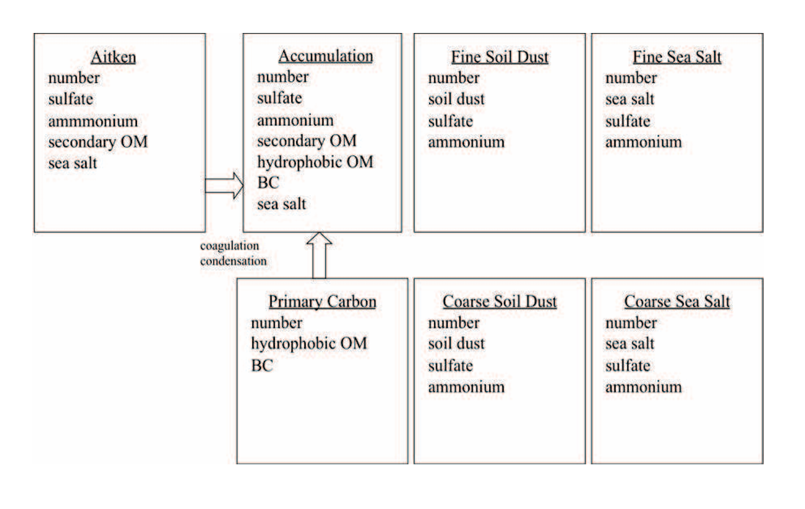
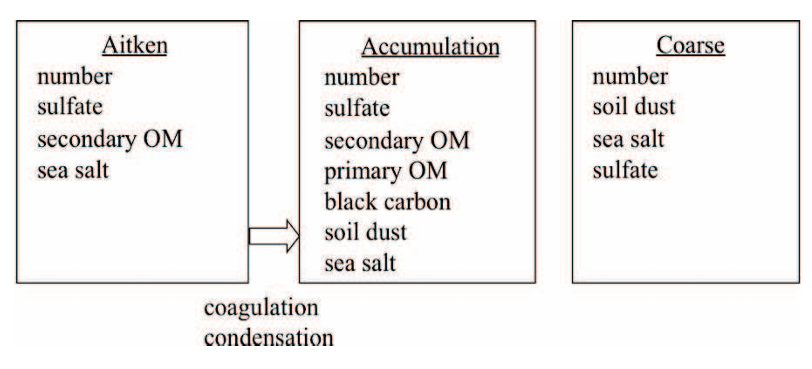

<html lang="zh-CN">
<head>
    <meta charset="UTF-8">
    <meta name="viewport" content="width=device-width, initial-scale=1.0">
    <title>第四章：模型物理过程</title>
    
</head>
<body>
    <h1>第四章：模型物理过程</h1>
    

        正如第二章所述，CAM 5.0 的总参数化包由一系列组件组成，表示为：
    

    

        $$ P = \{M, R, S, T\}, $$
    

    

        其中 \(M\) 表示（湿）降水过程，\(R\) 表示云和辐射，\(S\) 表示地表模型，\(T\) 表示湍流混合。
    

    

        每个组件又细分为多个部分：
        \(M\) 包括一个可选的干绝热调整（通常仅应用于平流层）、湿穿透对流、浅对流和大尺度稳定凝结；
        \(R\) 首先计算云参数化，然后计算辐射参数化；
        \(S\) 提供从陆地、海洋和海冰模型获得的地表通量，或者基于指定的地表条件（如海表温度和海冰分布）计算通量。
        这些地表通量为湍流混合 \(T\) 提供了下边界条件，\(T\) 包括行星边界层参数化、垂直扩散和重力波拖曳。
    

    

        上述段落中提到的变量更新（除温度外）是直接的。
        然而，温度的更新稍微复杂一些，它遵循 Boville 和 Bretherton [2003a] 描述的基于干静能的通用方法。
        每个时间分裂参数化组件更新后的状态变量是干静能 \(s_i\)。
        假设 \(i\) 是一系列时间分裂过程中的索引。
        在第 \(i\) 个过程结束时的干静能为 \(s_i\)。
        干静能通过第 \(i\) 个过程计算的加热率 \(Q\) 来更新：
    

    

        $$ s_i = s_{i-1} + (\Delta t) Q_i(s_{i-1}, T_{i-1}, \Phi_{i-1}, q_{i-1}, \ldots). $$
    

    

        （4.2）
    

    

        对于不基于干静能而是基于温度倾向公式化的过程，加热率由以下公式给出：
    

    

        $$ Q_i = \frac{T_i - T_{i-1}}{C_p \Delta t}. $$
    

    

        温度 \(T_i\) 和重力势能 \(\Phi_i\) 通过以下公式从干静能 \(s_i\) 中反算得到：
    

    

        $$ s = C_p T + gz = C_p T + \Phi, $$
    

    

        结合静力学方程替代 \(\Phi\)：
    

    

        $$ \Phi_k = \Phi_s + R \sum_{l=k}^H H_{kl} T_{vl}. $$
    

    

        （4.3, 4.4）
    

    

        每个过程的温度倾向也在整个过程中累积。
        对于基于干静能公式化的过程，温度倾向由干静能的倾向计算得到。
        假设 \(\frac{\Delta T_i}{\Delta t}\) 表示第 \(i\) 个过程结束时的总累积，则有：
    

    

        $$ \frac{\Delta T_i}{\Delta t} = \frac{\Delta T_{i-1}}{\Delta t} + \frac{\Delta s_i}{C_p \Delta t}, $$
    

    

        其中：
    

    

        $$ \frac{\Delta s_i}{\Delta t} = \frac{s_i - s_{i-1}}{\Delta t}. $$
    

    

        （4.5, 4.6）
    

    

        这里假设 \(\Phi\) 不变。
        注意，\(s\) 的反算会导致 \(T\) 和 \(\Phi\) 变化。
        这种变化未计入上述公式中。
        对于不基于干静能而是基于温度倾向公式化的过程，这种倾向会直接累积。
    

    

        在最后一个参数化完成后，最后更新的干静能会被保存下来。
        这个最终的列能量会在下一次物理计算开始时用于计算与动力核心相关的全局能量修正。
        这意味着，将上述 \(T\) 传递给有限体积（FV）动力核心而不是通过干静能反算得到的 \(T\) 所引入的能量不一致性，会包含在归因于动力学的修正中。
    

    

        累积的物理温度倾向也在最后一个参数化完成后可用，\(\frac{\Delta T_I}{\Delta t}\)。
        从中可以通过以下公式计算出更新后的温度：
    

    

        $$ T_I = T_0 + \frac{\Delta T_I}{\Delta t} \cdot \Delta t. $$
    

    

        （4.7）
    

    

        这个温度被转换为虚拟位温并传递给有限体积动力核心。
        温度倾向本身被传递给谱变换欧拉和半拉格朗日动力核心。
        上述温度和干静能使用中的不一致性在模型的未来版本中应被消除。
    

</body>
</html>
<html lang="zh-CN">
<head>
    <meta charset="UTF-8">
    <meta name="viewport" content="width=device-width, initial-scale=1.0">
    <title>气溶胶 - 章节 4.8</title>
    
</head>
<body>
    <h2>4.8 气溶胶</h2>
    

        在 CAM5 中实现了两种不同的气溶胶模式表示法。一个是具有 7 模式的气溶胶模式模型 (MAM-7)，作为进一步简化的基准。它包括艾肯模式、积聚模式、初级碳模式、细尘模式、海盐模式，以及粗尘和粗海盐模式（见图 4.3）。在单一模式中，例如积聚模式，内部混合的硫酸盐、铵盐、二次有机气溶胶（SOA）、由初级碳模式老化形成的初级有机物（POM）、由初级碳模式老化形成的黑碳（BC）、海盐的质量混合比以及积聚模式颗粒的数量混合比都是被预测的。初级碳颗粒（有机物和黑碳）会首先以初级碳模式排放，然后通过H₂SO₄、NH₃和SOA（气相）的凝结以及与艾肯模式和积聚模式的颗粒的凝聚作用逐渐老化并转变为积聚模式（详见下文）。
    

    

        气溶胶粒子存在于不同的附着状态中。我们通常认为悬浮在空气中的气溶胶粒子（清洁或云空气），这些被称为“间质气溶胶粒子”。气溶胶粒子还可以附着在或包含于不同的水成物（如云滴）中。在 CAM5 中，“间质气溶胶粒子”以及层状云中的气溶胶粒子（称为云携带气溶胶粒子）都被明确预测（Easter et al., 2004）。间质气溶胶物种存储在状态变量的 <code>q</code> 数组中，并在三维空间中传输；而云携带气溶胶物种存储在物理缓冲区的 <code>qqcw</code> 数组中，且不进行三维传输（除了垂直湍流混合），以节省计算时间，同时对其预测值影响较小（Ghan 和 Easter, 2006）。
    

    

        每种模式与间质气溶胶相关的气溶胶水混合比根据 Kohler 理论诊断得出（参见以下章节中的吸湿性），假设与环境相对湿度处于平衡状态。这些混合比同样不进行三维传输，存储在物理缓冲区的 <code>qaerwat</code> 数组中。
    

    

        每种模式的粒径分布假定为对数正态分布，模式干或湿半径随粒子数量和总干或湿体积的变化而变化，标准偏差按照图 4.3 所示设定。对于 MAM-7 模式，总共传输的气溶胶种类为 31 种，而传输的气态物种包括 SO2、H2O2、DMS、H2SO4、NH3 和 SOA（气态）。
    

    <figure>
        
        <figcaption>图 4.3: MAM-7 模式中每种气溶胶模式下的间质和云生成分的预测物种。每种模式的标准偏差分别为 1.6（艾肯模式）、1.8（积聚模式）、1.6（初级碳模式）、1.8（细尘和粗尘）、2.0（细海盐和粗海盐）。</figcaption>
    </figure>
    

    对于长期（多个世纪）气候模拟，还开发了一种3模式的MAM（MAM-3），其仅包含艾肯模式、积聚模式和粗模式（见图4.4）。对于MAM-3，作了以下假设：
     （1）初级碳与二次气溶胶内部混合，将初级碳模式与积聚模式合并；
     （2）粗尘和海盐模式合并为一个单一的粗模式，假设尘埃和海盐在地理上是分开的。此假设将影响撒哈拉沙漠尘埃输送到大西洋中部的尘埃负荷，因为假定尘埃与海盐在此处内部混合将增加尘埃的吸湿性，从而导致湿清除增加；
     （3）细尘和海盐模式类似地与积聚模式合并；
     （4）硫酸盐部分被铵盐中和，以NH₄HSO₄的形式存在，因此铵盐被有效地规定，NH₃不被模拟。
    我们注意到，在MAM-3中，我们预测硫酸盐气溶胶的质量混合比为NH₄HSO₄形式，而在MAM-7中为SO₄形式。MAM-3中传输的气溶胶示踪物总数为15种。
    

    <figure>
        
        <figcaption>图 4.4: 每种气溶胶模式在MAM-3中间质和云生组分的预测物种。每种模式的标准偏差分别为1.6（艾肯模式）、1.8（积聚模式）和1.8（粗模式）。</figcaption>
    </figure>
    

    间质气溶胶质量（<i>Mai,j</i>）和数量（<i>Naj</i>）的时间演变过程对于第<i>i</i>个物种和第<i>j</i>个模式由以下方程描述：
    

    

        对于 i-th 物种和 j-th 模式的间质气溶胶质量 (\(M_a^{i,j}\)) 和数量 (\(N_a^j\)) 的时间演化如下：
    

    

        $$
        \begin{aligned}
        \frac{\partial M_a^{i,j}}{\partial t} &+ \frac{1}{\rho} \nabla \cdot (\rho u M_a^{i,j}) = 
        \frac{\partial M_a^{i,j}}{\partial t}_{\text{conv}} + 
        \frac{\partial M_a^{i,j}}{\partial t}_{\text{diffus}} + 
        \frac{\partial M_a^{i,j}}{\partial t}_{\text{nuc}} \\
        &+ \frac{\partial M_a^{i,j}}{\partial t}_{\text{cond}} + 
        \frac{\partial M_a^{i,j}}{\partial t}_{\text{activ}} + 
        \frac{\partial M_a^{i,j}}{\partial t}_{\text{resus}} \\
        &+ \frac{\partial M_a^{i,j}}{\partial t}_{\text{emis}} + 
        \frac{\partial M_a^{i,j}}{\partial t}_{\text{sedime}} + 
        \frac{\partial M_a^{i,j}}{\partial t}_{\text{drydep}} \\
        &+ \frac{\partial M_a^{i,j}}{\partial t}_{\text{impscav}}
        \end{aligned}
        $$
    

    

        $$
        \begin{aligned}
        \frac{\partial N_a^j}{\partial t} &+ \frac{1}{\rho} \nabla \cdot (\rho u N_a^j) = 
        \frac{\partial N_a^j}{\partial t}_{\text{conv}} + 
        \frac{\partial N_a^j}{\partial t}_{\text{diffus}} + 
        \frac{\partial N_a^j}{\partial t}_{\text{nuc}} \\
        &+ \frac{\partial N_a^j}{\partial t}_{\text{coag}} + 
        \frac{\partial N_a^j}{\partial t}_{\text{activ}} + 
        \frac{\partial N_a^j}{\partial t}_{\text{resus}} \\
        &+ \frac{\partial N_a^j}{\partial t}_{\text{emis}} + 
        \frac{\partial N_a^j}{\partial t}_{\text{sedime}} + 
        \frac{\partial N_a^j}{\partial t}_{\text{drydep}} \\
        &+ \frac{\partial N_a^j}{\partial t}_{\text{impscav}}
        \end{aligned}
        $$
    

    

        类似地，云携带气溶胶质量 (\(M_c^{i,j}\)) 和数量 (\(N_c^j\)) 的时间演化如下：
    

    

        $$
        \begin{aligned}
        \frac{\partial M_c^{i,j}}{\partial t} &= 
        \frac{\partial M_c^{i,j}}{\partial t}_{\text{conv}} + 
        \frac{\partial M_c^{i,j}}{\partial t}_{\text{diffus}} + 
        \frac{\partial M_c^{i,j}}{\partial t}_{\text{chem}} \\
        &+ \frac{\partial M_c^{i,j}}{\partial t}_{\text{activ}} + 
        \frac{\partial M_c^{i,j}}{\partial t}_{\text{resus}} + 
        \frac{\partial M_c^{i,j}}{\partial t}_{\text{sedime}} \\
        &+ \frac{\partial M_c^{i,j}}{\partial t}_{\text{drydep}} + 
        \frac{\partial M_c^{i,j}}{\partial t}_{\text{nucscav}}
        \end{aligned}
        $$
    

    

        $$
        \begin{aligned}
        \frac{\partial N_c^j}{\partial t} &= 
        \frac{\partial N_c^j}{\partial t}_{\text{conv}} + 
        \frac{\partial N_c^j}{\partial t}_{\text{diffus}} + 
        \frac{\partial N_c^j}{\partial t}_{\text{activ}} \\
        &+ \frac{\partial N_c^j}{\partial t}_{\text{resus}} + 
        \frac{\partial N_c^j}{\partial t}_{\text{sedime}} + 
        \frac{\partial N_c^j}{\partial t}_{\text{drydep}} \\
        &+ \frac{\partial N_c^j}{\partial t}_{\text{nucscav}}
        \end{aligned}
        $$
    

    

        其中 \(t\) 表示时间，\(u\) 是三维风速向量，\(\rho\) 是空气密度。右侧符号项表示质量和数量的源/汇项。
    

</body>
</html>
<head>
    <meta charset="UTF-8">
    <meta name="viewport" content="width=device-width, initial-scale=1.0">
    
</head>
<body>
    <h2>4.8.1 排放 (Emissions)</h2>
    
<strong>人类活动排放</strong>（这里定义为来源于工业、家庭和农业活动部门的排放）基于 <strong>Lamarque et al. [2010a]</strong> 的 IPCC 第五次评估报告（AR5）排放数据集。黑碳 (BC) 和有机碳 (OC) 的排放数据是对 <strong>Bond et al. [2007]</strong> 和 <strong>Junker and Liousse [2008]</strong> 的更新，二氧化硫 (SO₂) 的排放数据是对 <strong>Smith et al. [2001, 2004]</strong> 的更新。

    
IPCC AR5 排放数据集包括以下人类活动产生的气溶胶及其前体气体的排放：SO₂、初级有机物 (POM) 和黑碳 (BC)。然而，该数据集并未提供主要排放粒子及其前体气体的注入高度和粒径分布，因此我们采用了 <strong>AEROCOM</strong> 协议 [<strong>Dentener et al., 2006a</strong>]。我们假设硫排放中有 2.5%（以摩尔计算）直接以初级硫酸盐气溶胶的形式排放，其余以 SO₂ 的形式排放 [<strong>Dentener et al., 2006a</strong>]。

    <ul>
        <li><strong>硫排放来源：</strong>
            <ul>
                <li>农业、家庭、交通、废弃物和航运部门的硫排放发生在地表。</li>
                <li>能源和工业部门的硫排放发生在地表以上 100-300 m。</li>
                <li>森林火灾和草原火灾的硫排放发生在更高的海拔（0-6 km）。</li>
            </ul>
        </li>
        <li><strong>硫酸盐粒子分布：</strong>
            <ul>
                <li>农业、废弃物和航运（地表来源）以及能源、工业、森林火灾和草原火灾（高空来源）的硫酸盐粒子分布在累积模式中。</li>
                <li>来自家庭和交通的硫酸盐粒子分布在艾肯模式中。</li>
            </ul>
        </li>
    </ul>
    
森林火灾和草原火灾产生的 POM 和 BC 被排放到 0-6 km 高度，而其他来源（家庭、能源、工业、交通、废弃物和航运）的 POM 和 BC 则排放到地表。火灾排放的注入高度分布基于相应的 AEROCOM 数据，具有空间和时间变化。硫酸盐、POM 和 BC 的质量排放通量被转换为基于 AEROCOM 规定对数正态粒径分布的数量排放通量，具体如表 4.1 所示。

    <table>
    <caption>表 4.1: 初级排放的粒径分布</caption>
    <thead>
        <tr>
            <th>排放源</th>
            <th>几何标准偏差, <i>sg</i></th>
            <th>数量模式直径, <i>Dgn</i>(μm)</th>
            <th><i>Demit</i>(μm)1</th>
        </tr>
    </thead>
    <tbody>
        <tr>
            <td>BC/OM</td>
            <td></td>
            <td></td>
            <td></td>
        </tr>
        <tr>
            <td>森林火灾/草原火灾</td>
            <td>1.8</td>
            <td>0.080</td>
            <td>0.134</td>
        </tr>
        <tr>
            <td>家庭/能源/工业/交通/航运/废物</td>
            <td>见注释2</td>
            <td>见注释2</td>
            <td>0.134</td>
        </tr>
        <tr>
            <td>SO4</td>
            <td></td>
            <td></td>
            <td></td>
        </tr>
        <tr>
            <td>森林火灾/草原火灾/废物</td>
            <td>1.8</td>
            <td>0.080</td>
            <td>0.134</td>
        </tr>
        <tr>
            <td>能源/工业/航运</td>
            <td>见注释3</td>
            <td>见注释3</td>
            <td>0.261</td>
        </tr>
        <tr>
            <td>家庭/交通</td>
            <td>1.8</td>
            <td>0.030</td>
            <td>0.0504</td>
        </tr>
        <tr>
            <td>连续火山, 50% 在艾肯模式</td>
            <td>1.8</td>
            <td>0.030</td>
            <td>0.0504</td>
        </tr>
        <tr>
            <td>连续火山, 50% 在积聚模式</td>
            <td>1.8</td>
            <td>0.080</td>
            <td>0.134</td>
        </tr>
    </tbody>
    <tfoot>
        <tr>
            <td colspan="4">
                
1<i>Demit</i> 是体积平均直径 = <i>Dgn</i>exp(1.5×ln(<i>sg</i>)²)，用于数量排放计算: <i>Enumber</i> = <i>Emass</i>/(π/6×ρ<i>Demit</i>³)

                
2该值介于Dentener等人 [2006a] <i>Demit</i> = 0.0504m 和 Liu等人 [2005] <i>Demit</i> = 0.206m 之间

                
3改编自Stier等人 [2005]，其中50%的质量进入积聚模式，<i>Demit</i> = 0.207 m，50%进入粗模式，<i>Demit</i> = 3.08m。我们将所有质量放入积聚模式，<i>Demit</i> = 0.261m，给出的数量排放与Stier等人 [2005] 一致。[Dentener等人, 2006a] 将所有质量放入粗模式，<i>Demit</i> = 2.06 m

            </td>
        </tr>
    </tfoot>
    </table>
    <h3>自然气溶胶和前体气体排放</h3>
    
自然气溶胶和前体气体排放（如火山硫、DMS、NH₃ 和生物挥发性有机化合物 VOCs）不包括在 IPCC AR5 数据集中。因此，使用了 <strong>AEROCOM</strong> 数据中关于火山 SO₂ 和硫酸盐的排放通量、注入高度和粒径分布，以及表面 DMS 的通量。NH₃ 的排放通量基于 <strong>MOZART-4</strong> 数据集 [<strong>Emmons, 2010</strong>]。

    
用于推导 SOA（气体）排放的异戊二烯、单萜、甲苯、大烯烃和大烷烃的排放通量基于 <strong>MOZART-2</strong> 数据集 [<strong>Horowitz, 2003</strong>]。这些排放数据代表了 1990 年代末的条件。

    
对于 2000 年之前的年份，我们使用 IPCC AR5 数据集中的人为非甲烷挥发性有机化合物（NMVOC）排放数据，并按目标年份 NMVOC 排放与 2000 年 NMVOC 排放的比例调整 MOZART 中的甲苯、大烯烃和大烷烃的排放。

    <h3>海盐气溶胶排放</h3>
    
海盐气溶胶排放来源于海洋，遵循 <strong>Martensson et al. [2003]</strong> 的参数化方法，用于几何直径小于 2.8 μm 的气溶胶。总粒子通量 \( F_0 \) 表达为：

    
\[
        \frac{dF_0}{d\log D_p} = \Phi W = (A_k T_w + B_k) W
    \]

    
其中：

    <ul>
        <li>\( D_p \)：粒子直径</li>
        <li>\( T_w \)：水温</li>
        <li>\( A_k \) 和 \( B_k \)：与粒径范围相关的系数</li>
        <li>\( W \)：白浪面积，定义为：  
            \[
            W = 3.84 \times 10^{-4} U_{10}^{3.41}
            \]
            其中，\( U_{10} \) 是 10 m 高度处的风速。
        </li>
    </ul>
    
海盐气溶胶排放通量的公式如下：

    
\[
    \frac{dF_0}{d\log r} = 1.373 U^{3.41} 10^{-3r} (1 + 0.0057r^{1.05}) \times 10^{1.19}e^{-B^2}
    \]

    
其中，\( r \) 是在相对湿度为80%条件下的气溶胶半径，\( B = \frac{0.380 - \log r}{0.650} \)。所有海盐排放通量的计算是在粒径区间 \( d\log D_p = 0.1 \) 内完成，然后在每个模式粒径箱内进行求和。

    
在 MAM-7 模式中，海盐排放的截断粒径范围为：0.02-0.08（艾肯模式），0.08-0.3（积聚模式），0.3-1.0（细海盐），1.0-10 m（粗海盐）；在 MAM-3 模式中，范围为：0.02-0.08（艾肯模式），0.08-1.0（积聚模式），1.0-10 m（粗模式）。

    <h3>沙尘气溶胶排放</h3>
    
干燥、无植被覆盖的地区在强风条件下会产生足够小的土壤颗粒，使其能够被卷入大气中，这些颗粒在此称为沙漠尘埃颗粒。沙漠尘埃颗粒的生成基于尘埃夹带和沉降模型进行计算，且其在社区气候系统模型中的实现已经被描述并与观测数据进行了比较 [<strong>Mahowald 等人, 2006b,d; Yoshioka 等人, 2007</strong>]。从先前研究到 CAM5 源方案的唯一改变是，将生成尘埃的叶面积指数（LAI）的阈值从 0.1 提高到 0.3 m²/m²，以更好地与生产力较高区域的尘埃生成观测结果一致 [<strong>Okin, 2008</strong>]。

    
在 MAM-7 中，尘埃排放的截断粒径范围为：0.1-2.0 m（细尘），2.0-10 m（粗尘）；在 MAM-3 中，范围为：0.1-1.0 m（积聚模式），1.0-10 m（粗模式）。

</body>

<head>
    <meta charset="UTF-8">
    <meta name="viewport" content="width=device-width, initial-scale=1.0">
    
</head>
<body>
    <h2>4.8.2 化学 (Chemistry)</h2>
    

        简单的气相化学被用于硫酸盐气溶胶的模拟，具体包括以下过程：
        (1) DMS 与 OH 和 NO3 的氧化反应生成 SO2；
        (2) SO2 与 OH 的氧化反应生成 H2SO4（气态）；
        (3) H2O2 的生成反应（HO2 + HO2）；
        (4) H2O2 的损失反应（包括 H2O2 光解和 H2O2 + OH）。
    

    

        氧化剂浓度（O3、OH、HO2 和 NO3）从 MOZART 模型 [Emmons, 2010] 提供的月平均值进行时间插值。
    

    

        在大气云水中的SO₂氧化（通过H₂O₂和O₃）基于MOZART的处理方法 [Tie等人, 2001]。云水中的pH值通过电中性方程计算，该方程涉及云生成的SO₄和NH₄离子浓度（对各模式求和），以及基于亨利定律平衡的痕量气体溶解和解离的离子浓度。H₂SO₄（气态）对云滴的不可逆吸收也被计算在内 [Seinfeld 和 Pandis, 1998]。通过SO₂的水相氧化和H₂SO₄（气态）吸收生成的硫酸盐被按比例分配到各模式中的云生成硫酸盐混合比，比例与该模式下云生成气溶胶的数量成正比（即，与每个气溶胶模式相关的云滴数量），假设与每个模式相关的云滴具有相同的大小。在MAM-7中，由NH₃（气态）溶解导致的水相NH₄离子变化也以类似方式在各模式间分配。同时，SO₂和H₂O₂混合比因水相消耗而减少。
    

    <h2>4.8.3 次生有机气溶胶 (Secondary Organic Aerosol)</h2>
    

        二次有机气溶胶（SOA）的最简单处理方式是，假设人为和生物源前体挥发性有机化合物（VOCs）具有固定的质量产率，然后将这些质量直接作为初级气溶胶颗粒排放，这种方法被用于许多全球模型中。MAM在此基础上增加了一个复杂性，通过模拟单一合并的气相SOA（气体）物种来进行处理。MOZART-4气相化学机制中五种VOCs类别的固定质量产率如表4.2所示。这些产率增加了额外的50%，目的是通过增加自然气溶胶来减少气溶胶的间接强迫。总产出的质量作为SOA（气体）物种排放。
    

    

        MAM随后计算SOA（气体）与多个气溶胶模式之间的凝结和蒸发。凝结和蒸发的过程是动态处理的，具体细节将在后面描述。每个气溶胶模式𝑚上的SOA（气体）的平衡蒸气压根据拉乌尔定律表示为：
   

    

        $$
        P^*_m = \left( \frac{A^{\text{SOA}}_m}{A^{\text{SOA}}_m + 0.1 A^{\text{POA}}_m} \right) P^0_m
        $$
    

    

        其中：
        \(A^{\text{SOA}}_m\) 表示模式 \(m\) 中的 SOA 质量浓度，
        \(A^{\text{POA}}_m\) 表示模式 \(m\) 中的一次有机气溶胶 (POA) 质量浓度（10% 被假设为氧化状态），
        \(P^0_m\) 是 SOA 的饱和蒸汽压，其温度依赖性如下：
    

    

        $$
        P^0(T) = P^0(298K) \times \exp \left[ -\frac{\Delta H_{\text{vap}}}{R} \left( \frac{1}{T} - \frac{1}{298} \right) \right]
        $$
    

    

        其中 \(P^0(298K) = 1 \times 10^{-10}\ \text{atm}\)，
        \(\Delta H_{\text{vap}}\) 表示蒸发焓，取值为 156 kJ/mol。
    

    

        此处理方法提供了以下优点：
        (1) 计算 SOA 在不同模式间分布的现实方法；
        (2) 提供了气体/气溶胶分配的温度依赖性。
    

    <table>
    <caption>表 4.2: 假定的 SOA（气体）产率</caption>
    <thead>
        <tr>
            <th>物种</th>
            <th>质量产率</th>
            <th>参考文献</th>
        </tr>
    </thead>
    <tbody>
        <tr>
            <td>大烷烃</td>
            <td>5%</td>
            <td><a href="https://doi.org/10.1021/es048715v" target="_blank">Lim 和 Ziemann [2005]</a></td>
        </tr>
        <tr>
            <td>大烯烃</td>
            <td>5%</td>
            <td>假定值</td>
        </tr>
        <tr>
            <td>甲苯</td>
            <td>15%</td>
            <td><a href="https://doi.org/10.1021/es950943+">Odum 等人 [1997a]</a></td>
        </tr>
        <tr>
            <td>异戊二烯</td>
            <td>4%</td>
            <td><a href="https://doi.org/10.1021/es052269u" target="_blank">Kroll 等人 [2006]</a></td>
        </tr>
        <tr>
            <td>单萜</td>
            <td>25%</td>
            <td><a href="https://doi.org/10.1021/es052269u" target="_blank">Ng 等人 [2007a]</a></td>
        </tr>
    </tbody>
    </table>

</body>
<html lang="zh-CN">
<head>
    <meta charset="UTF-8">
    <meta name="viewport" content="width=device-width, initial-scale=1.0">
    <title>4.8 气溶胶 - 生成、凝结、混合与垂直输送</title>
    
</head>
<body>
    <h2>4.8.4 生成 (Nucleation)</h2>
    

        新粒子的生成通过二元 (H2SO4-H2O) 和三元 (H2SO4-NH3-H2O) 均相核化，
        以及边界层核化的参数化来计算。
    

    

        MAM-3 中采用了二元核化的参数化 [Vehkamaki 等人, 2002]，因为该模式不预测 NH3；
        而在 MAM-7 中采用了三元核化的参数化 [Merikanto 等人, 2007]。
        边界层核化的参数化在两种模式中均使用，参考 Sihto 等人 [2006]，H2SO4 的一级核化速率系数为 \(1.0 \times 10^{-6}\ s^{-1}\) [Wang 等人, 2009]。
        新生成的粒子被加入到艾肯模式中，并使用 Kerminen 和 Kulmala [2002] 的参数化来计算粒子在从临界簇大小生长到艾肯模式大小期间因凝并导致的损失。
    

    <h3>4.8.5 凝结</h3>
    

        H₂SO₄蒸气、NH₃（仅限 MAM-7）和 SOA（气体）到各模式的凝结是通过动态方式处理的，使用标准的质量传输表达式 [<strong>Seinfeld 和 Pandis, 1998</strong>]，并对每个模式的粒径分布进行积分 [<strong>Binkowski 和 Shankar, 1995</strong>]。H₂SO₄ 的吸附系数为 0.65 [<strong>Poschl 等人, 1998</strong>]，目前对其他物种也采用相同的吸附系数。H₂SO₄ 和 NH₃ 的凝结被视为不可逆过程。当一个模式中的 NH₄/SO₄ 摩尔比达到 2 时，NH₃ 的吸收将停止。SOA（气体）的凝结是可逆的，其在颗粒上的平衡蒸气压由方程 (4.296) 给出。
    

    

        在 MAM-7 中，凝结到初级碳模式上的过程会导致此模式下颗粒的老化。在其他模型中，使用了各种处理老化过程的方法 [<strong>Cooke 和 Wilson, 1996</strong>; <strong>Wilson 等人, 2001</strong>; <strong>Liu 等人, 2005</strong>; <strong>Riemer 等人, 2003</strong>]。在 CAM5 中，使用 3 层单分子硫酸盐的标准将新鲜的 POM/BC 颗粒转化为老化的积聚模式。使用此标准计算所有初级碳模式颗粒所需的老化硫酸盐质量 \( M_{\text{SO4,age-all}} \)。如果在一个时间步中凝结的硫酸盐质量为 \( M_{\text{SO4,cond}} \)，则假定一部分 \( f_{\text{age}} = M_{\text{SO4,cond}} / M_{\text{SO4,age-all}} \) 已经老化。此模式中该比例的 POM、BC 和数量将与凝结的可溶物质一起转移到积聚模式中。SOA 也包括在老化过程中。时间步中凝结的 SOA 根据其较低的吸湿性进行缩放，以得到凝结的 SO₄ 当量。
    

    

        两个连续的增长过程（凝结和水化学反应）可以导致艾肯模式颗粒的生长，使其大小达到积聚模式的范围。因此，大多数模式气溶胶的处理方法在计算连续增长之后，将艾肯模式的一部分数量和质量（分布上部尾部的颗粒）转移到积聚模式中 [<strong>Easter 等人, 2004</strong>]。
    

    <h2>4.8.6 凝并 (Coagulation)</h2>
    

         艾肯模式、积聚模式和初级碳模式之间的凝并被处理。
         每个模式内的凝并会减少粒子数量，但不会改变质量。艾肯模式与积聚模式、初级碳模式与积聚模式之间的凝并会将质量从艾肯模式或初级碳模式转移到积聚模式。
         在MAM-7中，艾肯模式与初级碳模式的凝并首先将艾肯的质量转移到初级碳模式中，这使得部分初级碳颗粒发生老化。
         老化部分的计算方法与凝结类似，然后艾肯的质量以及老化的初级碳的质量和数量被转移到积聚模式中。凝并速率使用Community Multiscale Air Quality（CMAQ）模型版本4.6的快速/近似算法计算 [Binkowski 和 Roselle, 2003]。
    

    <h2>4.8.7 水分吸收 (Water Uptake)</h2>
    

         水吸收基于科勒平衡理论 [Ghan 和 Zaveri, 2007]，利用相对湿度和每种模式的体积平均吸湿性，从干体积平均半径诊断湿体积平均半径。
         每种组分的吸湿性列于表 4.3 中。这里的吸湿性等同于 Petters 和 Kreidenweis [2007] 的 κ 参数。需要注意的是，测得的尘埃溶解度变化很大，范围从 0.03 到 0.26 [Koehler 等人, 2009a]。
    

    <table>
    <caption>表 4.3: 气溶胶组分的吸湿性</caption>
    <thead>
        <tr>
            <th>海盐</th>
            <th>硫酸盐</th>
            <th>硝酸盐</th>
            <th>铵盐</th>
            <th>SOA</th>
            <th>POM</th>
            <th>BC</th>
            <th>尘埃</th>
        </tr>
    </thead>
    <tbody>
        <tr>
            <td>1.16</td>
            <td>0.507</td>
            <td>0.507</td>
            <td>0.507</td>
            <td>0.14</td>
            <td>0.10</td>
            <td>10−10</td>
            <td>0.068</td>
        </tr>
    </tbody>
    </table>
    <h2>4.8.8 亚网格垂直输送与激活/再悬浮</h2>
    

        使用 Zhang-McFarlane 参数化的上升和下降质量通量，描述了深对流云对间质气溶胶和痕量气体的垂直传输 [<strong>Collins 等人, 2004a</strong>]。目前，这种垂直传输与湿清除是分开计算的，但计划进行更综合的处理。与大尺度层状云相关的云生气溶胶假定不与对流云相互作用。浅对流云的垂直传输使用浅对流参数化中的质量通量，以类似方式进行处理。
    

    

        气溶胶的湍流传输相比其他示踪物有特殊处理。为了加强湍流传输与层状云中气溶胶活化之间的耦合，用于传输热量、能量和动量的隐式时间积分方案被显式方案替代以用于水滴和气溶胶。对于每个大气柱，基于最小的湍流传输时间计算子时间步。湍流传输通过前向时间积分方案在子时间步上进行积分。
    

    

        气溶胶活化将粒子从间质附着状态转化为云生状态。在层状云中，活化与水滴成核一致处理，因此被活化并转移到云生状态的粒子总数等于成核形成的水滴数。活化以上升速度和所有气溶胶模式的属性为参数进行参数化 [<strong>Abdul-Razzak 和 Ghan, 2000b</strong>]，并将质量和数量均转移到云生状态。上升速度由湍流动能的平方根近似表示，最小值为 0.2 m s⁻¹。假设随着上升气流将空气带入云底 [<strong>Ghan 等人, 1997</strong>]，以及云量增加 [<strong>Ovtchinnikov 和 Ghan, 2005</strong>]，活化发生。此外，假设空气在云中不断循环时也会发生活化，云再生时间尺度为一小时。例如，对于一个 20 分钟的模型时间步，假设每个时间步有 1/3 的云再生。本质上，我们在每个时间步中消散然后重新形成 1/3 的云。在消散期间，网格单元平均云滴数减少 1/3，1/3 的云生气溶胶被重新悬浮并转化为间质状态。在再生期间，间质气溶胶在“新”云中被活化，云滴数相应增加。再生对浅边界层云的影响较小，但显著增加了深对流层云中的云滴数，因为这些云中垂直湍流混合较慢。
    

    

        当水滴蒸发时，粒子重新悬浮为气溶胶。假定在水滴转移到云下或云上时以及云消散时，这一过程会发生。
    

    <h3>4.8.9 湿清除</h3>
    

        气溶胶的湿清除使用 CAM3.5 湿清除程序进行计算 [<strong>Rasch 等人, 2000</strong>; <strong>Barth 等人, 2000</strong>]，并进行了与云宏观和微观物理一致性的修改。该程序处理了云内清除（去除云生成的气溶胶颗粒）和云下清除（通过碰撞和布朗扩散去除降水颗粒中的间质气溶胶颗粒）。
    

    

        对于云内清除，使用层状云和对流云的云量、云水以及降水生成剖面来计算云水的一阶损失率剖面。将这些云水的一阶损失率乘以“溶解度因子”以获得气溶胶的一阶损失率，并将其应用于气溶胶剖面中。溶解度因子可以解释为（气溶胶在云滴中的比例）×（额外的调节因子）。在 CAM3.5 中，云生气溶胶没有被显式计算，对所有类型和尺寸的气溶胶，溶解度因子为 0.3。在 MAM 中使用了不同的值。层状云内清除只影响层状云中的云生成气溶胶颗粒，这些颗粒的溶解度因子为 1.0。它不影响间质气溶胶颗粒，间质气溶胶的溶解度因子为 0.0。
    

    

        对于 MAM 气溶胶的对流云内清除，既有溶解度因子，也有对流云内的活化分数传递到湿清除程序。对于层状云生成的气溶胶颗粒，对流云没有湿清除，因此这些因子为零。对于（相对于层状云）间质气溶胶，溶解度因子为 0.5，活化分数为：初级碳模式为 0.0，细尘和粗尘模式为 0.4，其他模式为 0.8。较低的值反映出较低的吸湿性。这些因子应用于每个模式中的数量和质量物种，但有一个例外。在 MAM-3 中，不同的活化分数适用于粗模式中的尘埃和海盐（分别为 0.4 和 0.8），并对粗模式硫酸盐和数量应用加权平均。
    

    

        对于云下清除，一阶去除速率等于 [（溶解度因子）×（清除系数）×（降水率）]。同样，溶解度因子可以被看作调节因子。在 CAM3.5 中，所有气溶胶的溶解度因子为 0.3，清除系数为 0.1 mm⁻¹。在 MAM 中，间质气溶胶的清除系数按照 Easter 等人 [<strong>Easter 等人, 2004</strong>] 的方法显式计算，因此它随粒径变化很大，积聚模式的值最低；溶解度因子为 0.1。对于层状云生成的气溶胶，没有云下清除，溶解度因子为 0.0。
    

    

        当降水蒸发时，在一个高度被清除的气溶胶可以在较低高度重新悬浮。在 CAM5 中，如同在 CAM3.5 中一样，这个过程用于被层状云内清除去的气溶胶。一部分云内清除的气溶胶被重新悬浮，重新悬浮的比例等于降水在云下蒸发的比例。
    

    <h3>4.8.10 干沉降</h3>
    

        气溶胶的干沉降速度使用 [<strong>Zhang 等人, 2001</strong>] 的参数化方法结合 CAM5 的土地利用和表层信息进行计算。重力沉降速度在地表以上各层中计算 [<strong>Seinfeld 和 Pandis, 1998</strong>]。两种速度均依赖于颗粒的湿大小，且在质量、数量及模式之间有所不同。云生成气溶胶的速度基于水滴大小进行计算。气溶胶的混合比变化以及干沉降和沉积所引起的通量通过整个垂直柱使用 CAM5 的尘埃沉降/沉积程序进行计算。
    
