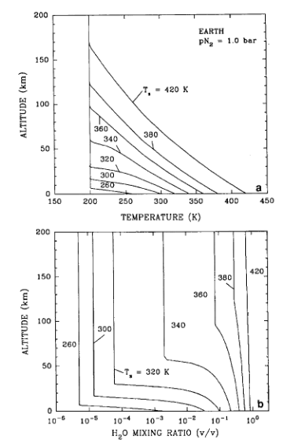

<html>
<head>
    <title>Habitable Zones Around Main Sequence Stars</title>
    
    
</head>

    <h1>主序星周围的宜居带</h1>
    
作者：<strong>James F. Kasting</strong>, <strong>Daniel P. Whitmire</strong>, <strong>Ray T. Reynolds</strong>

    
作者单位：

    <ul>
        <li>Penn State University, Department of Geosciences, 211 Deike, University Park, Pennsylvania 16802</li>
        <li>University of Southwestern Louisiana, Department of Physics, Lafayette, Louisiana 70504-4210</li>
        <li>NASA Ames Research Center, Space Science Division, MS 245-3, Moffett Field, California 94035</li>
    </ul>
    
发表期刊：<em>Icarus</em>

    
卷号：<strong>Volume 101</strong>, 期号：<strong>Issue 1</strong>, 页码：<strong>Pages 108-128</strong>

    
发表日期：<strong>January 1993</strong>

    
在线日期：<strong>25 May 2002</strong>

    
DOI 链接：<a href="https://doi.org/10.1006/icar.1993.1010" target="_blank">https://doi.org/10.1006/icar.1993.1010</a>

    <h2>简介</h2>
    

        本文利用一维气候模型估算了太阳系及其他主序星周围宜居带（Habitable Zone, HZ）的宽度。研究的基础假设是这些行星具有类似地球的大气层（CO₂/H₂O/N₂），
        且宜居性的前提是行星表面存在液态水。
    

    

        模型中，HZ的内边缘由光解和氢逃逸造成的水损失决定，而外边缘由CO₂云的形成决定。CO₂云可以通过增加行星的反照率和降低对流层温度梯度来冷却行星。
        根据保守估计，太阳系中的HZ范围为0.95至1.37 AU；实际宽度可能更大。
    

    

        在此范围内，气候稳定性由一种反馈机制维持，即大气中CO₂浓度与行星表面温度成反比。
        对于比地球更大的行星或大气压力较高的行星，HZ的宽度会略大。随着时间推移，太阳光度的增加会使HZ向外扩展。
    

    

        对4.6亿年内持续宜居区域（Continuous Habitable Zone, CHZ）的保守估计范围为0.95至1.15 AU。
        中到早期的K型星被认为是寻找宜居行星的最佳候选者，其HZ宽度（以对数距离表示）更大且离主星较远。
    

    <h2>文章结构</h2>
    
本文的组织结构如下：

    <ul>
        <li>第二部分描述碳酸盐-硅酸盐循环如何稳定地球及其他类地行星的气候。</li>
        <li>第三部分讨论定义HZ边界的物理过程，并结合金星和火星的数据给出约束条件。</li>
        <li>第四和第五部分通过一维气候模型估算了主序星周围HZ和CHZ的范围。</li>
        <li>第六部分将分析扩展到其他主序星系统，并探讨潜在类地行星的位置。</li>
        <li>第七部分总结研究结果，并讨论其对NASA搜寻地外智慧生命（SETI）项目的意义。</li>
    </ul>

    <h2>碳酸盐-硅酸盐循环对气候的稳定作用</h2>
    

        我们不同意 Hart 悲观分析的主要原因在于，他的模型忽略了一个重要的负反馈机制，
        该机制有助于稳定行星气候，即 Walker 等人（1981年）首次提出的
        大气 CO₂ 浓度与地表温度之间的联系。
    

    

        [Hart 模型的其他问题已被 Schneider 和 Thompson（1980年）讨论过。]
        气候稳定性论点之前已经被提出过（例如 Kasting 等人 1988年，Kasting 和 Toon 1989年），
        我们在此重申它，因为它是讨论行星宜居性的基础。
        在长时间尺度（>10⁸ 年）上，地球大气中的 CO₂ 浓度受与地壳岩石储库缓慢相互作用的控制，
        这一过程被称为碳酸盐-硅酸盐循环。
    

    

        CO₂ 通过岩石中钙镁硅酸盐的风化反应被从大气中移除，并通过碳酸盐沉积物的沉淀和埋藏过程被固定。
        如果用矿物硅灰石（CaSiO₃）代表所有硅酸盐岩石，其初始风化反应可表示为：
    

    风化反应可以通过以下公式表示：

    \[
    \text{CaSiO}_3 + 2\text{CO}_2 + \text{H}_2\text{O} \rightarrow \text{Ca}^{2+} + 2\text{HCO}_3^- + \text{SiO}_2
    \]

    风化产物通过河流进入海洋，海洋生物利用它们生成碳酸钙壳体，反应如下：

    \[
    \text{Ca}^{2+} + 2\text{HCO}_3^- \rightarrow \text{CaCO}_3 + \text{CO}_2 + \text{H}_2\text{O}
    \]

    尽管如今大多数碳酸钙的沉淀是生物驱动的，但即使没有生物，这一反应也会发生。
    当这些生物死亡后，壳体沉降到海底。大部分壳体会在沉降过程中溶解，
    但部分（尤其是埋藏在较浅深度的部分）保留下来并形成碳酸盐沉积物。

    结合上述两步反应，总反应可表示为：

    \[
    \text{CaSiO}_3 + \text{CO}_2 \rightarrow \text{CaCO}_3 + \text{SiO}_2
    \]

    

        这一反应形式类似于 Urey（1952年）认为控制大气 CO₂ 含量的平衡反应，
        但在这里，它代表的是一个非平衡地球化学循环的一部分。
    

    

        虽然风化反应较慢，但估算的硅酸盐风化速率足以在约4亿年内清除大气和海洋系统中的全部碳。
        因此，必须有某种机制将碳重新引入系统以维持稳态。
        这一机制是碳酸盐变质作用，当海底被俯冲到高温高压区域时发生。
    

    

        在此条件下，反应方向逆转，重新形成硅酸盐并释放出气态 CO₂，通过火山活动排放回大气。
    

    

        气候系统中的负反馈作用体现在风化反应中（反应1）。
        风化反应仅在存在液态水的条件下以显著速率进行。
        如果地球变冷到海洋冻结的程度，硅酸盐风化几乎完全停止，CO₂ 将在大气中积累。
    

    

        在较短的地质时间内，高浓度的 CO₂ 会形成稠密的大气层，随之而来的温室效应将融化冰层。
        此反馈机制可以解释地球气候相对于年轻太阳的稳定性（Walker 等人 1981年，Kasting 1989年）。
    

    

        根据这一理论，太阳系 CHZ 的外边界可能远远超出火星轨道。
        Kasting 和 Toon（1989年）认为，木星的引力影响最终限制了外边界的形成。
    

    <h3>3. 宜居带内外边界的气候限制</h3>
    

        我们对这个主题的思考集中在当一个行星冷到足以使 CO2 凝结时，
        CO2/气候缓冲机制将会失效（Whitmire 等人，1991）。后续计算表明，
        CO2 凝结是一个严重的限制；实际上，这似乎排除了早期火星上存在温暖的
        CO2/H2O 温室的可能性（Kasting 1991）。其原因有两点：
    

    <ul>
        <li>
            CO2 凝结会产生 CO2 云，这些云通过反射入射的太阳辐射而增加行星的反照率。
        </li>
        <li>
            凝结释放的潜热会减少对流区域的大气温度梯度，从而降低温室效应的强度。
        </li>
    </ul>
    

        第一个效应难以量化，部分原因是云层覆盖和云层特性本身很难预测，
        部分原因是 CO2 云对外辐射的影响只能通过一个包括这些波长散射的模型来计算。
        我们的一维辐射-对流气候模型和大多数其他地球气候模型一样，忽略了红外散射。
    

    

        第二个效应可以通过假设对流温度梯度遵循潮湿 CO2 绝热线来量化。
        在 CO2 凝结的区域，这种对流温度梯度不会明显超过潮湿绝热线。
        使用潮湿绝热线计算出的温室效应是给定条件下可能达到的最大值。
    

    

        在这种背景下，我们可以利用气候模型和太阳系历史的知识，确定围绕太阳的宜居带外边界的三个可能限制：
    

    <ul>
        <li>
            <b>第一限制：</b>CO2 云首次在模型中形成的距离（假定地表温度为273K）。我们称之为“第一次凝结”限制。
        </li>
        <li>
            <b>第二限制：</b>在无云 CO2 大气中能维持地表温度273K的最大距离，我们称之为“最大温室”限制。
        </li>
        <li>
            <b>第三限制：</b>假设早期火星足够温暖以维持液态水体。这种推断受到一些人的质疑（Kasting 1991）。
        </li>
    </ul>
    

        如果假设谷地网络的形成时间为38亿年前（Pollack 等人，1987），当时太阳的光度为当前值的75%（Gough 1981），
        则早期火星的有效太阳光度约为当前地球轨道光度的32%。对应的今天宜居带外边界限制为 1AU / 0.32 ≈ 1.77AU。
        由于该限制基于太阳系早期的气候条件，因此它比火星轨道（1.52AU）更远。
    

    

        至于宜居带的内边界，Kasting（1988）的气候模型提供了估算基础。
        在这个模型中，假设对流区域遵循潮湿 H2O 绝热线，并计算地表温度与有效太阳光度的关系。
        两个关键的光度值被标记：
    

    <ul>
        <li>
            S ≈ 1.1：平流层变得潮湿，水蒸气光解产生的氢气可以迅速逃逸到太空。
        </li>
        <li>
            S ≈ 1.4：海洋完全蒸发。
        </li>
    </ul>
    

        两个限制都忽略了 H2O 云的辐射效应，因此是保守的估计。潮湿温室大气中的 H2O 云应会降低地表温度，
        因为它们对行星反照率的影响大于其对红外辐射的影响（Kasting 1988）。
    

    

        如果假设金星曾经富含水，我们可以利用今天金星上缺乏水的现象来推导宜居带内边界的另一个估算。
        金星轨道上的太阳通量约为地球当前值的 1.76 倍（Gough 1981）。对应的宜居带内边界估计为 0.75AU。
    

    

        综上所述，我们为太阳系的宜居带内外边界提供了三个不同的估算值，其中两个是完全理论的，一个部分基于观测。
    

    <h4>4. 气候模型描述</h4>
    
本文中使用了两种气候模型，这些模型已在先前的研究中详细描述，因此这里只提供基本信息。内边缘的计算使用了一种一维辐射-对流气候模型，该模型类似于 Kasting（1988）中所使用的模型，该模型本身来源于 Kasting 等人（1984）和 Kasting 和 Ackerman（1986）。

    
太阳能量的沉积通过一个双向散射计算程序计算；红外吸收则通过带模型计算。红外计算的波长范围延伸至短波（0.39 μm），以准确模拟非常热的大气。水蒸气的非理想行为也被考虑在内，以确保在高表面压力下的计算精确性。模型中未显式包含云的影响，但通过假设一个较高的地表反照率 \( A_s = 0.22 \) 参数化其影响。该值可以使模型再现地球当前的平均表面温度 288 K，并在计算中保持 \( A_s \) 恒定，相当于假设云反馈为零，这在当前对该现象的有限了解下是最佳选择。

    
模型假设平流层温度为 200 K，这一假设对“失控温室效应”极限的影响可忽略（Kasting 1988, 图 3），但可能显著影响“水损失”极限（参见第 5 节(iv)）。对流层的温度递减率在顶部为湿绝热递减率，接近地表时取决于地表温度是否高于临界温度，分别使用干绝热或湿绝热递减率。这些递减率的表达式见 Kasting（1988）中的公式 (A4)、(A5)、(A11) 和 (A12)。模型假设对流层相对湿度为 1，生成了最大的温室效应，从而提供了宜居带内边缘的保守估计。

    
外边缘模型与 Kasting（1991）中模拟早期火星气候的模型类似，但包括了 \( N_2 \) 作为 \( CO_2 \) 的补充。辐射代码与内边缘模型类似，但红外波长网格被截短至 0.54 μm 以下。云的影响被忽略，\( A_s = 0.215 \)，该值能够再现当前火星的地表温度，也接近于模拟无云地球所需的值。

    
大多数计算假设类地行星具有 1 bar 的 \( N_2 \) 大气和可变的 \( CO_2 \) 分压。我们的工作假设是，这些行星冷却时，由于碳酸盐-硅酸盐循环提供的反馈，大气中的 \( CO_2 \) 会积累。

    
计算是为 273 K 的全球平均地表温度执行的，使用的方法与 Kasting（1991）指定的“方法 2”相似。在此方法中，我们指定地表温度，然后计算维持该温度所需的太阳辐射通量。平流层被假设为等温，其温度通过以下公式迭代计算：

    

    \[
    T_{\text{strat}} = 167 K \left( \frac{S_{\text{eff}} (1 - A_s)^{0.25}}{0.316} \right)^{0.25}
    \]
    

    
此公式成功再现了假设中火星致密大气下的 \( CO_2 \) 首次凝结的冷阱温度（Kasting 1991, 图 2）。宜居带外边缘的最大温室效应极限对 \( T_{\text{strat}} \) 相对不敏感；然而，第一个凝结极限，毫不意外地，对此参数非常依赖。

    
在 \( CO_2 \) 未饱和的对流层部分，温度递减率由以下公式给出（Kasting 1991 的公式 (A18)）：

    

    \[
    \frac{d \ln P}{d \ln T} = \frac{d \ln P_v}{d \ln T} - \frac{(1 + \alpha_v m_v / \beta m)}{1 + \alpha_v m_v / \beta m} \frac{d \ln \alpha_v}{d \ln T}
    \]
    

    
其中，\( P \) 和 \( T \) 分别为大气压强和温度；\( P_v \) 是 \( CO_2 \) 的饱和蒸气压；\( m \)（=28）和 \( m_v \)（=44）分别为 \( N_2 \) 和 \( CO_2 \) 的分子量；\( \alpha_v \)（=\( \rho_v / \rho \)）是 \( CO_2 \) 的质量密度与 \( N_2 \) 的密度比；\( \beta \)（= \( RT/P_v \)）是 \( CO_2 \) 的压缩因子倒数；\( R \) 是通用气体常数。

    
该公式从 Kasting（1988）的公式 (A5) 推导而来。它的优点是右侧第一项可直接从 \( CO_2 \) 的饱和蒸气压公式（Kasting 1991 的公式 (A5) 和 (A6)）计算得出。

    <h4>5. 太阳型恒星周围的宜居带</h4>
    
在本节中，我们估算了类似太阳的恒星周围宜居带（HZ）和持续宜居区（CHZ）的宽度。

    
第一部分描述了气候模型的结果，接下来的三部分讨论了各种不确定性，最后一部分考虑了时间演化的影响。

    
    <h5>(i) 标准地球模型</h5>
    
<strong>内边缘：</strong>使用该模型进行的第一组计算是估算标准地球模型的宜居带内外边缘位置。

    
内边缘的计算结果如图1-3所示。这些计算与Kasting (1988) 的计算相同，但排除了大气中的氧气。

    
计算过程如下：

    
将模型地球的地表温度 \( T \) 从220 K逐步增加到2000 K，同时使用辐射模型计算大气顶部的净入射太阳通量 \( F_s \) 和净向外红外通量 \( F_i \)（图1a）。

    
太阳通量的计算假设在大气顶部的通量等于地球轨道上的当前太阳常数 \( S_0 = 1360 \, \text{W/m}^2 \)。

    
行星反照率（图1b）由以下公式表示：

    

    \[
    A = 1 - \frac{F_s}{S}
    \]
    

    
有效太阳通量（图1c）由以下公式计算：

    

    \[
    S_{\text{eff}} = \frac{F_s}{F_i}
    \]
    

    
请记住，\( S_{\text{eff}} = S / S_0 \) 是维持给定地表温度所需的归一化太阳通量。

    
公式(7)简单地表达了行星能量平衡的要求：净入射太阳辐射必须等于净向外的红外辐射。

    
    

        
        
<strong>图1：</strong>标准内边缘模型中各种物理量与地表温度的关系。(a) 向外红外通量 \( F_i \) 和净入射太阳通量 \( F_s \)，(b) 行星反照率，(c) 有效太阳通量。注意700到1300 K之间的比例尺断点。(b) 中的虚线曲线显示了假设的地表反照率。

    

    
    
从物理角度来看，图中的结果可以这样解释：随着地表温度增加，\( F_i \) 在 \( T \approx 360 \, \text{K} \) 时达到平稳，因为大气在所有红外波长上变得光学厚。

    
只有在 \( T > 1400 \, \text{K} \) 时，地表才开始在可见光波段辐射。然而，\( F_s \) 在初始阶段由于水蒸气吸收太阳辐射而增加，随后由于瑞利散射的增强而减少。

    
（地表压力在此过程中从低温下的1 bar增加到高温下的约270 bar。）

    
行星反照率与 \( F_s \) 呈相反趋势。因此，由于 \( F_i \) 和 \( F_s \) 的综合效应，\( S_{\text{eff}} \) 单调增加，直到在647 K的临界点达到最大值1.41。相应的轨道距离（\( d = 1 \, \text{AU} / S_{\text{eff}} \)）为0.84 AU。

    
    

        
        
<strong>图2：</strong>标准内边缘模型中选定地表温度下的温度 (a) 和水蒸气混合比 (b) 的垂直分布。

    

    
    
水损失极限出现在一个较低的 \( S_{\text{eff}} \) 值，因为随着地表温度的升高，水蒸气的垂直分布发生显著变化。

    
在从280 K增加到420 K的过程中，对流层顶从10 km上升到170 km（图2a）。

    
与此同时，平流层水蒸气的混合比从约 \( 10^{-5} \) 增加到接近1（图2b）。

    
在 \( T \approx 340 \, \text{K} \) 附近，平流层水蒸气从低浓度迅速过渡到高浓度。原因是此时水蒸气约占下层大气的20%。

    
    
氢原子的扩散极限逃逸率可表示为（Hunten 1973，Walker 1977）：

    

    \[
    \phi(H) = 2 \times 10^{13} f(H) \, \text{cm}^{-2} \, \text{s}^{-1}
    \]
    

    
    
其中，\( f(H) = 2 f(H_2O) \) 是平流层中的总氢混合比。

    
由于地球海洋中约有 \( 2 \times 10^{23} \, \text{H} \) 原子，水损失的时间尺度在 \( f(H_2O) = 3 \times 10^{-3} \) 时接近地球的年龄。

    
因此，水损失极限出现在 \( S_{\text{eff}} = 1.1 \)（对应的轨道距离为0.95 AU）。

    
如前所述，这个数值以及失控温室效应极限的数值是保守的，因为它们忽略了云层可能的负反馈效应。

    
    

        
        
<strong>图3：</strong>标准内边缘模型中平流层水蒸气混合比与有效太阳通量的关系。

    

    
    
围绕太阳的宜居带内边缘的实际位置可能出现在更高的 \( S_{\text{eff}} \) 值处。

