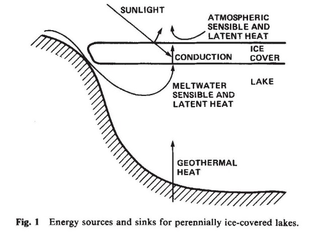
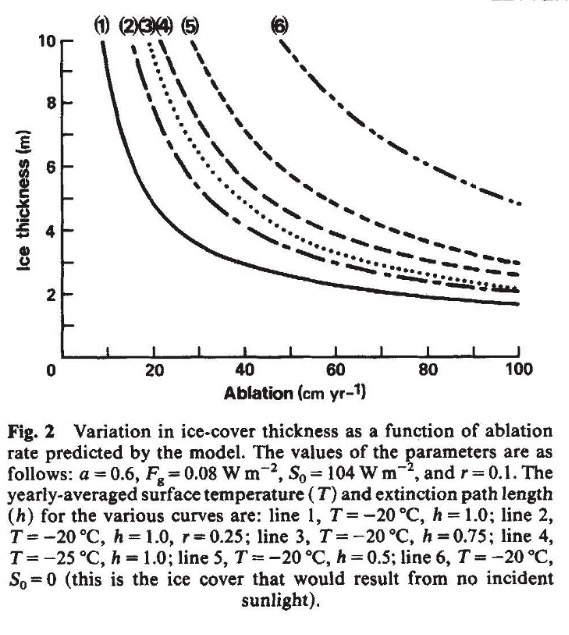

<html lang="zh">
<head>
    <meta charset="UTF-8">
    <meta name="viewport" content="width=device-width, initial-scale=1.0">
    
    <title>永冻湖泊冰层厚度</title>
</head>
<body>
    <h1>永冻湖泊冰层厚度</h1>
    
<strong>作者：</strong>Christopher P. McKay, Gary D. Clowt, Robert A. Wharton Jr, Steven W. Squyres

    
<strong>机构：</strong> 
        * 美国国家航空航天局（NASA）艾姆斯研究中心，太阳系探索办公室，莫莱特场，加利福尼亚州94035，美国 
        t 美国地质调查局，门洛帕克，加利福尼亚州94025，美国 
        :j: 美国国家航空航天局（NASA）艾姆斯研究中心，莫莱特场，加利福尼亚州94035，美国
    

    
南极维多利亚地的干谷是南极最大无冰区域，其中包含许多湖泊，这些湖泊的永冻冰盖赋予了它们一些独特的物理和生物学特性【1-3】。

    
尽管湖泊中的液态水的深度、温度和盐度在不同湖泊之间差异显著，但冰盖的厚度却惊人地一致，范围在3.5到6米之间，这主要是由冰层外部的能量传导和冰水界面处潜热的释放之间的平衡决定的，同时也受到阳光的传输和吸收的影响。在稳态下，冰底部潜热的释放由冰表面的消融控制。本文提出了一个简单的能量平衡模型，使用测得的消融率为每年30厘米（cm yr-1），可以解释观察到的冰层厚度。

    
冰形成的热力学过程已被广泛研究，尤其是在季节性冰覆盖水域的冻结开始以及北极海冰条件方面的应用【4】。消融在冰盖形成中的作用已经在北极湖泊中进行了研究【6】并且在南极也有类似的研究【7】。

    
南极湖泊在多个方面呈现出一个简化的物理问题： 
        （1）厚重的永冻冰盖允许对热源和热汇进行年度平均； 
        （2）湖泊是封闭的，便于简单量化液态水所携带的潜热和显热； 
        （3）几乎没有降雪，简化了水质量平衡、光穿透以及上边界热传导的处理。

    
湖泊冰盖的热量预算如图1所示。如果湖泊较大，则来自岸边的横向热传导可以忽略不计。热量通过地热流从湖底传递至湖泊，并且通过冰水界面释放的冰水潜热在冰层下部形成新冰。然而，由于融水进入湖泊时几乎接近冰点【8】，因此显热输入较小。通过冰层的热传导是液态水与表面之间唯一的热交换方式；因此，冰下方的能量供应速率和大气热流必须分别等于导热流。

    
尽管太阳能输入、大气热交换量和融水流入都会随季节发生显著变化，但厚重的冰盖有效地对这些热源进行了平均。这一结论得到了小消融率【9, 10】（每年30厘米，cm yr-1）的支持，这意味着季节性冰层厚度的最大变化为-10%。忽略季节性变化的有效性也得到了冰层厚度大于年温度波的e折深度的观察结果的支持【11】。湖泊的热剖面测量还表明，存在一个稳态特征，其由年度平均条件描述【2】。

<body>
  
在冰层的给定深度处，冰层的向上热传导和该深度以下的能量输入的平衡，假设稳态条件并对全年进行平均，得到如下方程：

  
  
\( \frac{dT}{dz} = S(z) + L + F_g \)

  
  
其中，k 是冰的热导率，\( \frac{dT}{dz} \) 是年均温度梯度（T）与深度（z）的变化，S(z) 是年均太阳能通量，\( F_g \) 是地热热流。

  
  
由于冰水界面的潜热释放（L）可以表示为：

  
  
\( L = v p l \)

  
  
其中 v 是新冰的形成速率（全年平均），等于消融率，p 是冰的密度，l 是水的潜热熔化值。

  
  
为了求解方程（1）中冰层温度与深度的关系，我们将 S(z) 写为：

  
  
\( S(z) = (1 - a)(1 - r) S_0 \exp\left(-\frac{z}{h}\right) \)

  
  
其中，a 是湖泊的反照率，r 是被黑色吸光物质（如沙子和泥土）覆盖的湖泊面积的比例，\( S_0 \) 是入射到湖泊表面的太阳辐射，指数项给出了冰层深度衰减的情况，其中 h 是衰减路径长度（定义为太阳天顶角的余弦除以消光系数）。

  
  
冰的热导率可以近似为：

  
  
\( k = \frac{b}{T} - c \)

  
  
其中，b 和 c 分别取为常数 780 W m-1 和 0.615 W m-1 K-1。

  
  
将这些替代项代入方程（1）并从冰水界面积分到表面，得到：

  
  
\[
Z \;=\; \frac{
b \,\ln\!\bigl(\tfrac{T_{0}}{T_{s}}\bigr)
\;+\; c\,\bigl(T_{s} - T_{0}\bigr)
\;-\; S_{0}\,\bigl(1 - a\bigr)\bigl(1 - r\bigr)\,h\;\Bigl(1 - \exp\!\bigl(-\tfrac{Z}{h}\bigr)\Bigr)
}{
v\,p\,l \;+\; F_{g}
}
\tag{2}
\]

 

  其中 T0 表示冰-水界面的温度，Ts 表示地表的年平均温度（两者均以开尔文为单位），而 Z 则是冰盖的平衡厚度。方程 (2) 给出了冰盖年平均厚度的隐式表达式。当冰盖厚度远大于衰减路径长度（Z &raquo; h），并且假设热导率不随温度变化（k = 常数）且地热流很小的情况下，该方程可简化为：

  
  \( 
  Z \;=\; \frac{
    k\,\bigl(T_{0} - T_{s}\bigr)\;-\;S_{0}\,\bigl(1-a\bigr)\bigl(1-r\bigr)\,h
  }{
    v\,p\,l
  } 
  \quad (3)
  \)
  

  接下来，我们考虑出现在方程 (2) 中的环境参数。冰-水界面的温度几乎为 0&nbsp;&deg;C，这是因为所有湖泊的上层水体盐度都非常低。根据目前的记录，只有万达湖（Lake Vanda）区域的年平均地表温度被测量过，约为 -20.0&nbsp;&deg;C；而在距此约 100 公里、靠近海岸的 Scott Base 进行的观测也得到了相似的结果[14]。

</body>

湖面年均太阳辐射通量 S0 已在万达湖（Lake Vanda）测量得到，为 104 W m-2，并且在万达湖和博尼湖（Lake Bonney）上测得的反照率（a）分别为 0.5 和 0.65【8】。

万达湖和博尼湖的湖冰和湖水的光学性质表明，反照率随季节变化，且强烈依赖于太阳天顶角，在较低的太阳天顶角下，反照率较高。这一效应来自于颗粒物或光学粗糙表面的非均匀散射【16】，预计在典型的南极低太阳天顶角下，影响尤为重要。

图 2：模型预测的冰盖厚度随消融速率的变化

  本图展示了模型所预测的冰盖厚度如何随消融速率（ablation rate）而变化。所用参数如下： 
  a = 0.6，Fg = 0.08 W m-2，S0 = 104 W m-2，以及 r = 0.1。

  各曲线所采用的年均表面温度（T）和衰减路径长度（h）如下： 
  第 1 条曲线：T = -20°C，h = 1.0； 
  第 2 条曲线：T = -20°C，h = 1.0，r = 0.25； 
  第 3 条曲线：T = -20°C，h = 0.75； 
  第 4 条曲线：T = -25°C，h = 1.0； 
  第 5 条曲线：T = -20°C，h = 0.5； 
  第 6 条曲线：T = -20°C，S0 = 0（即无阳光照射时形成的冰盖）。

南极干谷的地热流已经在多个地点测量得到，大约为 +0.08 W m-2【19】，一些湖泊底部的温度梯度测量也给出了相似的小值【2, 20, 21】。

冰盖的衰减路径长度（h）已通过测量冰盖下表面总光照水平间接估算出来【15】。报告中提到的冰层衰减路径长度为 1 米及更长【15】。通过测量湖泊冰层的总透过率，也可以推算出类似的数值【17】。为了简化计算，我们使用了 1 米的名义值来表示衰减路径长度（h），但也计算了 0.75 米和 0.5 米的冰盖厚度。

目前没有直接测量不同湖泊上不透明物质（r）覆盖面积的研究，r 的值可能因湖泊而异。我们将 r 设为 0.1，但也考虑了 r = 0.25 的情况。

图 2 显示了冰盖的平衡厚度与消融速率之间的关系。该模型的预测结果与测量值一致，干谷湖泊的冰盖厚度范围为 3.6 米到 6.5 米。一个例外是维达湖（Lake Vida），它的冰层深度达到了 11 米【24】，这可以通过冰层锚定在湖底来解释。因为在这种情况下，冰层下部的消融不再由下方的再冻结来平衡，从而消除了这一部分对冰盖热流的贡献。

消融对冰层厚度的影响依赖于冰下方液态水的可用性，作为新冰的来源，以及在冰盖下方冻结时释放的潜热。应用 Barnes【6】提出的消融厚度公式来计算南极湖泊的冰层厚度，预测值为 15.8 米。

有趣的是，假设火星赤道地区曾经有过湖泊，那么这些湖泊的冰盖可能与我们模型中的情况相似。火星瓦列斯·马里内里斯峡谷系统的下部包含有节奏的水平层理沉积物，展现出大面积的横向连续性【25】。这些沉积物的出现暗示着沉积是在静止水体中形成的，这一假设与其他关于火星早期液态水存在的证据是一致的。根据我们的模型，火星上的湖泊冰层的厚度可能会受到消融的限制。

当然，火星的消融率未知，但通过简单的边界层理论可以得到 1-10 cm yr-1 的合理范围，从而得出冰层厚度在 65 米到 650 米之间。这一讨论是基于目前火星的气候条件：赤道地区的平均温度为 -60°C，使用反照率为 0.5，r = 0，S0 = 180 W m-2，Fg = 0.0 和 h = 1 米的假设，并假定火星湖泊可以通过地下水补充【28】。

C.P.M. 和 R.A.W. 感谢美国国家科学基金会（NSF）极地计划支持南极的研究。G.D.C. 和 S.W.S. 感谢 NASA 行星地质计划的资助。

</body>
</html>
