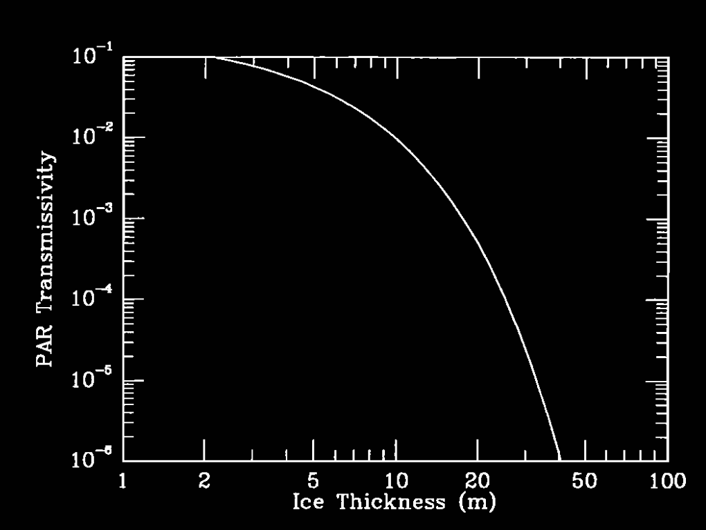

<!DOCTYPE html>
<html>
<head>
  <meta charset="UTF-8">
  <title>永久冰覆盖的南极洲霍尔湖中光的透射与反射</title>
  <!-- 需要使用 MathJax 加载数学公式支持 -->
  
</head>
<body>

<h1>永久冰覆盖的南极洲霍尔湖中光的透射与反射</h1>

<strong>作者：</strong> P. McKay、G. D. Clow 等

<strong>摘要：</strong>我们对南极霍尔湖（Lake Hoare）永久冰盖的透射率和反照率进行了研究。我们的数据库包含了全年在冰下测量的光合有效辐射（<em>photosynthetically active radiation</em>，下称 PAR，波段范围为 400–700 nm）、夏季中期对冰下光照空间变化的测量，以及在初夏（11 月）和夏季中期（1 月）对冰盖 400–700 nm 范围内反照率和透射率的光谱测量。我们的结果显示，冰盖的透射率在夏季开始时显著降低，从 11 月到 1 月下降了约 4 倍。我们推测这是由于冰盖上层受热以及形成廷德尔（Tyndall）结构所致。随后在夏季，当冰盖中出现了显著的液态水含量后，透射率又有所回升。而到秋季，冰盖重新完全冻结时，透射率再次显著降低。根据 400–700 nm 范围内的光谱测量结果，大约有 2–5% 的入射光能够穿透厚度约 3.5 米的冰盖。我们利用三层垂直结构的双流散射（two-stream scattering）辐射传输方程对这些光谱数据进行了分析：一个约 1 cm 厚、含有大量散射性气泡的表层冰层覆盖在含沙且有气泡的约 1 m 厚冰层上；而在此之下则是一层厚实的、不含沙但仍含气泡的冰层。我们发现，当波长超过 800 nm 时，冰盖几乎是不透光的；透过冰盖的太阳辐射总量约占 2%。观测资料还显示，霍尔湖的冰盖厚度出现了显著变化。这主要是由于底层冰厚度的变化所致。因为底层冰相对更加清澈，与假定冰盖呈均质分布相比，底层冰厚度变化对整体光透射率的影响要小一些。

<h2>引言</h2>

南极地区终年覆盖冰层的湖泊相当独特，因为它们是已知唯一能在全年都保持厚冰层且拥有相当深水柱的湖泊生态系统。其中，主要的一批此类湖泊位于南极洲维多利亚地南部的麦克默多干旱山谷（McMurdo Dry Valleys，地理范围约为 160°E–164°E, 76°30′S–78°20′S）。这些湖泊的冰盖厚度可达 3–6 米（$$3\text{–}6\,\text{m}$$），是由夏季虽不算太高但能高于冰点的气温，以及漫长而寒冷的冬季共同维持的；年平均气温大约为 $$-20^\circ\text{C}$$。这一点在文献 [Wilson, 1981; McKay et al., 1985; Clow et al., 1988] 中皆有报道。

对于一个湖泊来说，常年存在的冰盖会对其物理与生物特性产生深远影响 [Parker et al., 1982; Wharton et al., 1989; 1993]：它不仅会限制湖水的混合，也会显著改变水体及湖底可用于光合作用的光照强度与光谱分布。值得一提的是，在这些湖泊中研究最深入的霍尔湖（Lake Hoare），其冰盖在过去二十年里平均每年变薄约 $$0.2\,\text{m yr}^{-1}$$ [Wharton et al., 1992]，这可能与麦克默多地区各个湖泊水位的普遍上升现象相关 [Chinn, 1982, 1993]。

关于霍尔湖冰盖的质量平衡，G.D. Clow 等人的研究（手稿撰写中，1994 年）给出了更详细的说明。根据他们的估算，每年约有 $$35\,\text{cm}$$ 的冰从冰盖顶部直接升华 [Clow et al., 1988]，另有约 $$60\text{–}70\,\text{cm}$$ 会在夏末融化（在近年来某些夏季里，该数值甚至更高）[Wharton et al., 1993]。与此同时，每到冬季会有约 $$1\,\text{m}$$ 新的冰在冰盖底部冻结，从而补偿了前述的质量损失。这意味着霍尔湖的冰盖整体呈动态平衡，每隔四年左右就可更新一次。

Palmisano 和 Simmons [1987] 曾经测量了霍尔湖冰盖及冰下水体的光谱透射特性；Lizotte 和 Priscu [1992] 也在邦尼湖（Lake Bonney）开展了类似的研究。这些作者指出，了解冰盖的光学性质对于预测水体中可供光合作用的光强与光谱随季节及更长期变化的响应至关重要。这些南极湖泊的一大关键之处在于：尽管它们冰盖厚重，湖水中仍有依赖光合作用生长的生命。要弄清这些生命如何适应极地地区在厚冰层下极度衰减的光照，是对其独特生态系统的重要挑战。此外，也只有充分了解冰盖的光学特性，才能准确估算湖冰内由太阳辐射引起的加热速率，从而认识冰盖内部在不同季节下的温度分层机制。冰盖的许多重要物理性质都强烈依赖温度，尤其是在接近融点时。例如，只有当冰盖接近融点且温度场基本均匀时，沙粒才能够通过冰层裂缝进入水体；此外，冰盖底部的冻结速率也取决于其底层的温度梯度。

<h1>在霍尔湖冰盖中的额外光谱测量及其散射模型研究</h1>

  在本文中，我们报告了对霍尔湖（Lake Hoare）冰盖的额外透射率光谱测量，以及该湖冰层的光谱反照率测量。基于这些测量，我们构建了一个冰盖内光传输与吸收的散射模型。我们还报告了对光合有效辐射（<em>photosynthetically active radiation</em>, 下称 PAR，400–700 nm）进行平均后，湖冰层下光照空间差异的研究结果；并给出了多个季节中在此波段范围内对冰盖透射率的测量。我们的目标并不是开发一个最先进的辐射传输模型，而是提供一个可用于今后进一步生物学和物理学研究的工具。

<h2>霍尔湖的冰盖</h2>

  在为潜水作业钻探访问孔的过程中，霍尔湖的冰盖已经被广泛研究 [Love et al., 1982]。其冰面在水平方向上（大约 10 m 的尺度）展现出相当明显的变化：包括透明冰、块状升起的白冰以及沙质斑块等不规则分布（参见下方图片）。与麦克默多地区的其他湖泊相比，霍尔湖冰盖中的含沙量更高，可能是由于加拿大冰川（Canada Glacier）阻挡了湖泊东侧，这座冰川阻止了从西侧刮来的足以移动沙粒的焚风（f6hn winds）[Clow et al., 1988]，因而湖面会沉积更多沙子。

  Wharton 等 [1992] 通过在 37 个钻孔处测量冰厚后指出，霍尔湖的冰盖在横跨整片湖面时平均厚度约为 <em>4 ± 0.34 m</em>，且基本均匀。人们还曾切割并收集过冰盖的大块样本加以研究 [Nedell et al., 1987; Squyres et al., 1991; Craig et al., 1992]。如图 2 所示，其照片展示了冰盖的地层结构。Squyres 等 [1991] 对我们进行测量期间的冰盖地层做了更加详细的描述。下面仅简要介绍与光学性质关系密切的冰盖结构。

  了解冰盖中不同深度处沙子和气泡的分布，对认识冰盖中的光照环境至关重要。冰盖内沙子的含量大约介于 
  $$0.2\,\text{gm cm}^{-2} \text{ 到 } 2\,\text{gm cm}^{-2}$$
  [Wharton et al., 1989] 之间。研究发现，几乎所有沙子都集中在冰盖上部 1 米范围内 [Nedell et al., 1987]。这些沙粒对冰盖的光学特性有重要影响：夏季时，冰盖上表层会因为沙粒吸收太阳能量而发生局部融化，冬季再度结冰。此外，夏季的部分升华和融化作用也使得这层结构经常凹凸不平，并带有大量沙粒 [Henderzen et al., 1965; Palmisano and Simmons, 1987; Wharton et al., 1992]。总体看来，这上层 1 米的冰层经过反复重塑和混合，内部原有的层状结构大多消失，也含有一定量气泡，但气泡形态也已被改变。人们通过在干式钻孔里直接观察冰层可以发现，大部分光的衰减就发生在这近表层约 1 米厚度内。

  在此之下，从离表面约 1–2 米处直到冰盖底部，冰的性质有了极大的变化。这里的冰非常清澈，并且不含沙粒 [Wilson, 1981]。这部分冰包含具有数平方厘米截面、并在冰层中延伸数米的大晶体，其中“c 轴”大多是垂直朝向 [Walker, 1986]；这些大晶体能起到类似“光导”的作用 [Wilson, 1981]，有助于将光在此厚层中有效地传递。冰层的年层结构和最初晶体形态在这部分冰里也被较好地保存。该清澈冰层中分布有成串的细长气泡（长可达数十厘米），其间穿插了一些基本不含气泡的薄冰层（见图 2 和图 3）。

  虽然在湖面上分布有各种沙质、白色和透明的冰区，但正如我们后文会讨论到的，大量散射作用在一定程度上“均质化”了冰下光场，让其只在 2–3 倍的范围内出现差异。基于这一点以及研究上的简化考虑，我们将整个冰盖视为各种表面类型的“平均混合”状态，假设仅在垂向上存在差异（即一维问题）。

  在每年初夏，由于太阳辐射对表层加热逐渐明显，冰面常常出现浑浊区域；随后在夏季中后期，冰面及冰层内会形成小型融化通道，一定量的液态水将出现；到了夏末气温下降时，冰盖会重新冻结。这些现象会直接影响冰盖的透射率和反照率。

  下图（图 1）是 1985 年 11 月研究期拍摄的霍尔湖冰盖照片，前景中可以看到用于参照的米尺。

<!-- 直接插入图片，而不是超链接 -->

  从图片可以看出，冰面确实存在水平分布上的差异。也如上文所述，这些高低起伏并带有沙粒或白色冰的表层，会对光的吸收和散射产生明显影响。

</body>
</html>
