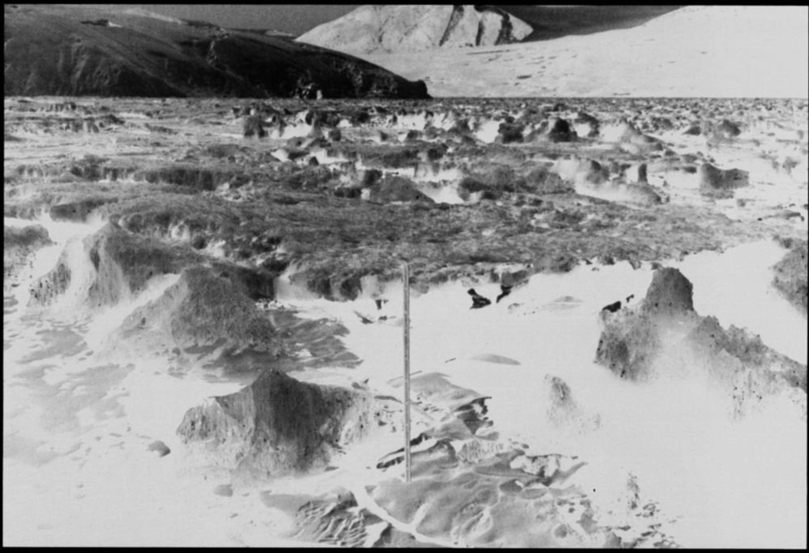
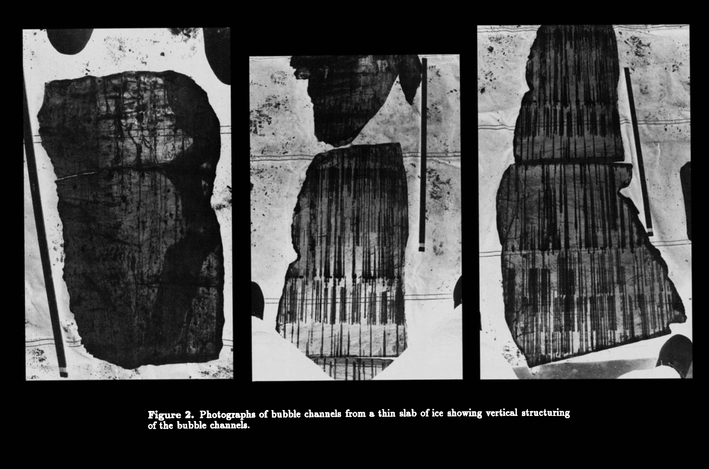

<html>
<head>
  <meta charset="UTF-8">
  <title>永久冰覆盖的南极洲霍尔湖中光的透射与反射</title>
  <!-- 需要使用 MathJax 加载数学公式支持 -->
  
</head>
<body>

<h1>永久冰覆盖的南极洲霍尔湖中光的透射与反射</h1>

<strong>作者：</strong> P. McKay、G. D. Clow 等

<strong>摘要：</strong>我们对南极霍尔湖（Lake Hoare）永久冰盖的透射率和反照率进行了研究。我们的数据库包含了全年在冰下测量的光合有效辐射（<em>photosynthetically active radiation</em>，下称 PAR，波段范围为 400–700 nm）、夏季中期对冰下光照空间变化的测量，以及在初夏（11 月）和夏季中期（1 月）对冰盖 400–700 nm 范围内反照率和透射率的光谱测量。我们的结果显示，冰盖的透射率在夏季开始时显著降低，从 11 月到 1 月下降了约 4 倍。我们推测这是由于冰盖上层受热以及形成廷德尔（Tyndall）结构所致。随后在夏季，当冰盖中出现了显著的液态水含量后，透射率又有所回升。而到秋季，冰盖重新完全冻结时，透射率再次显著降低。根据 400–700 nm 范围内的光谱测量结果，大约有 2–5% 的入射光能够穿透厚度约 3.5 米的冰盖。我们利用三层垂直结构的双流散射（two-stream scattering）辐射传输方程对这些光谱数据进行了分析：一个约 1 cm 厚、含有大量散射性气泡的表层冰层覆盖在含沙且有气泡的约 1 m 厚冰层上；而在此之下则是一层厚实的、不含沙但仍含气泡的冰层。我们发现，当波长超过 800 nm 时，冰盖几乎是不透光的；透过冰盖的太阳辐射总量约占 2%。观测资料还显示，霍尔湖的冰盖厚度出现了显著变化。这主要是由于底层冰厚度的变化所致。因为底层冰相对更加清澈，与假定冰盖呈均质分布相比，底层冰厚度变化对整体光透射率的影响要小一些。

<h2>引言</h2>

南极地区终年覆盖冰层的湖泊相当独特，因为它们是已知唯一能在全年都保持厚冰层且拥有相当深水柱的湖泊生态系统。其中，主要的一批此类湖泊位于南极洲维多利亚地南部的麦克默多干旱山谷（McMurdo Dry Valleys，地理范围约为 160°E–164°E, 76°30′S–78°20′S）。这些湖泊的冰盖厚度可达 3–6 米（$$3\text{–}6\,\text{m}$$），是由夏季虽不算太高但能高于冰点的气温，以及漫长而寒冷的冬季共同维持的；年平均气温大约为 $$-20^\circ\text{C}$$。这一点在文献 [Wilson, 1981; McKay et al., 1985; Clow et al., 1988] 中皆有报道。

对于一个湖泊来说，常年存在的冰盖会对其物理与生物特性产生深远影响 [Parker et al., 1982; Wharton et al., 1989; 1993]：它不仅会限制湖水的混合，也会显著改变水体及湖底可用于光合作用的光照强度与光谱分布。值得一提的是，在这些湖泊中研究最深入的霍尔湖（Lake Hoare），其冰盖在过去二十年里平均每年变薄约 $$0.2\,\text{m yr}^{-1}$$ [Wharton et al., 1992]，这可能与麦克默多地区各个湖泊水位的普遍上升现象相关 [Chinn, 1982, 1993]。

关于霍尔湖冰盖的质量平衡，G.D. Clow 等人的研究（手稿撰写中，1994 年）给出了更详细的说明。根据他们的估算，每年约有 $$35\,\text{cm}$$ 的冰从冰盖顶部直接升华 [Clow et al., 1988]，另有约 $$60\text{–}70\,\text{cm}$$ 会在夏末融化（在近年来某些夏季里，该数值甚至更高）[Wharton et al., 1993]。与此同时，每到冬季会有约 $$1\,\text{m}$$ 新的冰在冰盖底部冻结，从而补偿了前述的质量损失。这意味着霍尔湖的冰盖整体呈动态平衡，每隔四年左右就可更新一次。

Palmisano 和 Simmons [1987] 曾经测量了霍尔湖冰盖及冰下水体的光谱透射特性；Lizotte 和 Priscu [1992] 也在邦尼湖（Lake Bonney）开展了类似的研究。这些作者指出，了解冰盖的光学性质对于预测水体中可供光合作用的光强与光谱随季节及更长期变化的响应至关重要。这些南极湖泊的一大关键之处在于：尽管它们冰盖厚重，湖水中仍有依赖光合作用生长的生命。要弄清这些生命如何适应极地地区在厚冰层下极度衰减的光照，是对其独特生态系统的重要挑战。此外，也只有充分了解冰盖的光学特性，才能准确估算湖冰内由太阳辐射引起的加热速率，从而认识冰盖内部在不同季节下的温度分层机制。冰盖的许多重要物理性质都强烈依赖温度，尤其是在接近融点时。例如，只有当冰盖接近融点且温度场基本均匀时，沙粒才能够通过冰层裂缝进入水体；此外，冰盖底部的冻结速率也取决于其底层的温度梯度。

  在本文中，我们报告了对霍尔湖（Lake Hoare）冰盖的额外透射率光谱测量，以及该湖冰层的光谱反照率测量。基于这些测量，我们构建了一个冰盖内光传输与吸收的散射模型。我们还报告了对光合有效辐射（<em>photosynthetically active radiation</em>, 下称 PAR，400–700 nm）进行平均后，湖冰层下光照空间差异的研究结果；并给出了多个季节中在此波段范围内对冰盖透射率的测量。我们的目标并不是开发一个最先进的辐射传输模型，而是提供一个可用于今后进一步生物学和物理学研究的工具。

  在为潜水作业钻探访问孔的过程中，霍尔湖的冰盖已经被广泛研究 [Love et al., 1982]。其冰面在水平方向上（大约 10 m 的尺度）展现出相当明显的变化：包括透明冰、块状升起的白冰以及沙质斑块等不规则分布（参见下方图片）。与麦克默多地区的其他湖泊相比，霍尔湖冰盖中的含沙量更高，可能是由于加拿大冰川（Canada Glacier）阻挡了湖泊东侧，这座冰川阻止了从西侧刮来的足以移动沙粒的焚风（f6hn winds）[Clow et al., 1988]，因而湖面会沉积更多沙子。

  Wharton 等 [1992] 通过在 37 个钻孔处测量冰厚后指出，霍尔湖的冰盖在横跨整片湖面时平均厚度约为 <em>4 ± 0.34 m</em>，且基本均匀。人们还曾切割并收集过冰盖的大块样本加以研究 [Nedell et al., 1987; Squyres et al., 1991; Craig et al., 1992]。如图 2 所示，其照片展示了冰盖的地层结构。Squyres 等 [1991] 对我们进行测量期间的冰盖地层做了更加详细的描述。下面仅简要介绍与光学性质关系密切的冰盖结构。

  了解冰盖中不同深度处沙子和气泡的分布，对认识冰盖中的光照环境至关重要。冰盖内沙子的含量大约介于 
  $$0.2\,\text{gm cm}^{-2} \text{ 到 } 2\,\text{gm cm}^{-2}$$
  [Wharton et al., 1989] 之间。研究发现，几乎所有沙子都集中在冰盖上部 1 米范围内 [Nedell et al., 1987]。这些沙粒对冰盖的光学特性有重要影响：夏季时，冰盖上表层会因为沙粒吸收太阳能量而发生局部融化，冬季再度结冰。此外，夏季的部分升华和融化作用也使得这层结构经常凹凸不平，并带有大量沙粒 [Henderzen et al., 1965; Palmisano and Simmons, 1987; Wharton et al., 1992]。总体看来，这上层 1 米的冰层经过反复重塑和混合，内部原有的层状结构大多消失，也含有一定量气泡，但气泡形态也已被改变。人们通过在干式钻孔里直接观察冰层可以发现，大部分光的衰减就发生在这近表层约 1 米厚度内。

  在此之下，从离表面约 1–2 米处直到冰盖底部，冰的性质有了极大的变化。这里的冰非常清澈，并且不含沙粒 [Wilson, 1981]。这部分冰包含具有数平方厘米截面、并在冰层中延伸数米的大晶体，其中“c 轴”大多是垂直朝向 [Walker, 1986]；这些大晶体能起到类似“光导”的作用 [Wilson, 1981]，有助于将光在此厚层中有效地传递。冰层的年层结构和最初晶体形态在这部分冰里也被较好地保存。该清澈冰层中分布有成串的细长气泡（长可达数十厘米），其间穿插了一些基本不含气泡的薄冰层（见图 2 和图 3）。

  虽然在湖面上分布有各种沙质、白色和透明的冰区，但正如我们后文会讨论到的，大量散射作用在一定程度上“均质化”了冰下光场，让其只在 2–3 倍的范围内出现差异。基于这一点以及研究上的简化考虑，我们将整个冰盖视为各种表面类型的“平均混合”状态，假设仅在垂向上存在差异（即一维问题）。

  在每年初夏，由于太阳辐射对表层加热逐渐明显，冰面常常出现浑浊区域；随后在夏季中后期，冰面及冰层内会形成小型融化通道，一定量的液态水将出现；到了夏末气温下降时，冰盖会重新冻结。这些现象会直接影响冰盖的透射率和反照率。

  下图（图 1）是 1985 年 11 月研究期拍摄的霍尔湖冰盖照片，前景中可以看到用于参照的米尺。

  从图片可以看出，冰面确实存在水平分布上的差异。也如上文所述，这些高低起伏并带有沙粒或白色冰的表层，会对光的吸收和散射产生明显影响。

<h1>数据（Data）</h1>

  我们使用一台带余弦校正接收器的光谱辐照度计（MER 1000，Biospherical Instruments，圣地亚哥）测量了光谱辐照度（spectral irradiance）。该设备可以测量光合有效辐射（<em>photosynthetically active region</em>, 波长范围 400–700 nm）中的上行或下行辐照度，以及由 12 个带有窄带滤光片的单色通道记录的辐照度，具体波段包括：
  $$\,400\,\text{nm},\,\, 410\,\text{nm},\,\, 440\,\text{nm},\,\, 465\,\text{nm},\,\, 490\,\text{nm},\,\, 520\,\text{nm},\,\, 570\,\text{nm},\,\, 589\,\text{nm},\,\, 625\,\text{nm},\,\, 656\,\text{nm},\,\, 671\,\text{nm},\,\, 694\,\text{nm}.$$
  该仪器可以自动扫描并记录数据，也允许进行预编程操作。

  为了测量冰盖的反射光，我们将仪器倒置并将其悬挂在一根约 3 米长的支杆上，距冰面约 1.5 米，支杆由两人扶持。水下的测量则由潜水员携带该设备在距潜水孔数十米处进行，他们会将设备保持固定方向足够长的时间（几分钟），以获取 3–5 组完整扫描。我们所有数据都以冰盖表面的太阳辐照度为标准进行归一化，该表面辐照度在每次测量序列开始前与结束后（约相隔 0.5 小时）都会重新测定。通常来说，我们会将 3–5 次扫描结果平均后得到一组测量值。

  根据仪器的技术规格，如果在水下测量，需要对测得的数值乘以一个波长相关的修正因子（平均约为 1.4）。此外，仪器在垂直方向上的姿态也并非总能精准保持，可能会出现最多约 10° 的偏差；这将带来不到
  $$2\% \text{（}1/\cos(10^\circ)\text{）}$$
  的测量误差，并且此类误差通常会使透射率被略微低估。

  我们在两个不同的时间段进行了光谱测量。第一个时间段是 1986 年 10–11 月，当时冰盖仍处于完全冻结的状态（即夏季融化尚未开始），观测得知冰盖厚度约为 3.5 米。第二个时间段是 1987 年 1 月，即夏季融化最强烈的时期。彼时湖面上出现许多小水塘，且冰盖本身孔隙度也较高，使得表层融水可以通过一些离散孔道渗透到水体中。

  所得数据汇总在表 1 中，并根据各光谱带的入射太阳辐照度进行了归一化。另外，图 4 和图 5 中也展示了这些数据。需要注意的是，若仅关注平均的 PAR 波段，其在 11 月 11 日的透射率约为 3.9%，而到了 1 月 11 日则降至 1.9%。所有透射率测量均已根据上述的水下修正因素进行了校正。

  1986 年 10 月 31 日是一个云层极为厚实、光学上“浓云”覆盖的阴天。因此，当天没有直接的太阳光束照射到湖面，湖面仅接受到漫射的天空辐射。因为漫射光的缘故，冰盖表面的明暗对比度显著降低；我们仅使用了一组测量扫描来刻画冰盖的反照率。

  相比之下，1986 年 11 月 11 日则没有云层，天气晴朗；我们在当地太阳正午前后约 2 小时内测量了冰盖对太阳辐射的透射率，以及分别测量了清澈冰、沙质冰和白色冰的反照率。直射阳光的存在使得冰面的不同区域（清冰、沙冰、白冰）在反照率上差异更为明显，因此我们分开测量。那天测量时的平均太阳天顶角约为 54°。我们还在同一天测定了蓝天漫射辐照度占下行辐照度的比例——方法是用一块放置在 3 米立杆顶部的遮板（只遮挡最小范围的天空）来挡住直接阳光（参见图 5）。

  理论上，纯净冰在约 470 nm 处有一个相对的吸收极小值，据此人们或许会认为对较厚冰层的透射率会在此波长达到峰值。然而，从图 4 可见，我们在 400–550 nm 范围内的三组光谱测量都呈现相对平坦的响应曲线。Buckley 和 Trodahl [1987]、SooHoo 等 [1987]、以及 Palmisano 等 [1987] 对海冰透射率的测量结果则与冰本身的吸收谱更加吻合，这与我们的观察有所不同。正如后文所讨论的，这种差异很可能是由冰中的沙粒造成的。

  我们测量中所遇到的误差主要有两类：仪器误差与随机误差。由于测量时的光强远高于探测器的噪声水平，仪器误差通常相对较小。我们对暗电流进行了测定，发现其在各波段都比所测到的实际太阳辐照度小了至少 5 个数量级。因此，我们认为随机误差在总误差中占主导地位；这类误差来源包括：观测过程里入射光照随时间的自然变化、仪器在垂直方向上的姿态偏差，以及人员和支撑装置带来的部分遮光等。我们可以通过比较多次扫描（一般 3–5 次）在合并平均前的差异来估算这些随机误差的大小。对于数据质量最好的情形，扫描间的标准差小于 1%，但在某些情况下可达 5%。较为保守地估计，我们一般认为典型误差在 4–5% 左右，并将 4–10% 视为测量误差的上限。这与 Palmisano 等 [1987] 使用同样设备在相似甚至更暗光强条件下报告的误差相似。

  由于霍尔湖表面地形起伏不平，人们通常会预期冰盖透射的光照在水平方向上也存在明显差异。为探明霍尔湖冰盖对光穿透率的水平变化是否显著，我们在 1987 年 1 月 11 日使用一台带余弦校正功能的 Li-Cor 水下 PAR 光量子传感器（Lincoln, Nebraska），在无云晴朗的天气条件下测定了 400–700 nm 波段光的强度。测量开始前和结束后分别在湖面进行基准测量；随后，潜水员从钻孔向外游约 25 m，围绕钻孔形成一个大致环形路线，并在水下通讯指导下，将传感器放置于冰下 12 点、3 点、5 点、7 点、10 点与 11 点这六个位置进行测量。地面人员通过一台 Li-Cor LI-189 光量子计监测这些读数。Wharton 等 [1989] 对这些观测进行了汇总，详细数据见表 2，并进行了归一化（相对于湖面光强）。结果显示，冰下光照水平最大可相差 3 倍左右，这可能是冰面及近表层沙分布不均，以及大尺度表面凹凸变化共同导致的。不过，与冰层本身对光照超过 30 倍的整体衰减相较，这样的水平差异要小得多，表明将冰层视为“近似均质”并不算过于失真 [Wharton et al., 1989]。此外，这样的空间差异量级（约 2–3 倍）与我们在图 4 和图 6 中所看到的冰盖透射率全年变化（3–5 倍）处于相近水平。

  为了监测冰盖在不同季节的透射率变化，我们在冰盖上钻出一个直径约 15 cm 的孔，将一个球面集光的水下光量子传感器（LI-193SB）放在 5 m 深处。该传感器每分钟采样一次，我们记录其每日的平均值与最大值。这套系统从 1986 年 12 月一直运行到 1988 年 12 月，但由于设备出现一些故障，部分数据遗失，不巧的是，光谱测量所对应的时间段也在遗失之列。图 6 中呈现了我们所保留的数据，包含了连续两年的夏季与秋季（12 月–次年 3 月）观测，以及一次春季（9 月–12 月）透射率上升过程的例子。值得注意的是，1985 年 12 月刚将传感器放入冰层不久，钻孔重新结冰导致最初几天测得的光强有明显下降。

  对于 PAR 传感器（包括 LI-193SB 和 LI-189），我们认为测量误差小于 10%。不过，对于图 6 中 1985–1986 年那个冬季较暗时段的数据，数字化过程带来的
  $$\pm 0.5\,\text{microeinsteins}\,\text{m}^{-2}\,\text{s}^{-1}$$
  偏差会对 5 以下的值产生显著影响。相较之下，用于比较不同时间测量值的相对精度则要好得多，我们估算其可达 1%，这与对电子系统稳定性和多年光照读数可重复性分析的结果一致 [Clow et al., 1988，手稿准备中，1994]。因此，对于 1985–1986 年透射率的计算，一旦光强低于
  $$1\,\text{HE}\,\text{m}^{-2}\,\text{s}^{-1}$$
  附近时，图中结果就会受到显著噪声影响；在所有情形中，当光照水平接近传感器误差极限时，透射率的数据也就相应变得不确定。

  图 6 中还给出了基于湖岸观测站对每日平均 PAR 测值进行比对后所得的透射率（该观测点与冰下传感器相距约 500 m；相关数据由 G.D. Clow 等人在手稿中报告）。由于地形因素，两个观测点收到的辐射略有差异，但从日均值看，两者还是足够接近，具有可比性。不同之处还在于：水下传感器为球面接收方式，可在安装角度略有偏差的情况下稳定测量；湖岸上的传感器则是平面余弦校正接收器。我们计算透射率的方式是简单地将两侧观测数据相除，这在直射成分占主导时效果较好；对于漫射成分占比较高的情况，则可能会略微高估透射率。鉴于传感器类型和地形差异的存在，我们主要关注透射率随时间的相对变化，不执着于其绝对数值。比较我们在 1987 年 11 月 11 日与 1988 年 1 月 11 日测得的 PAR 值，以及前后相邻年份中水下 PAR 传感器给出的对应日期读数后可推断，图 6 中列出的透射率或许需要整体乘以
  $$\sim1.5$$
  这一修正系数才更符合实际。

</body>
</html>