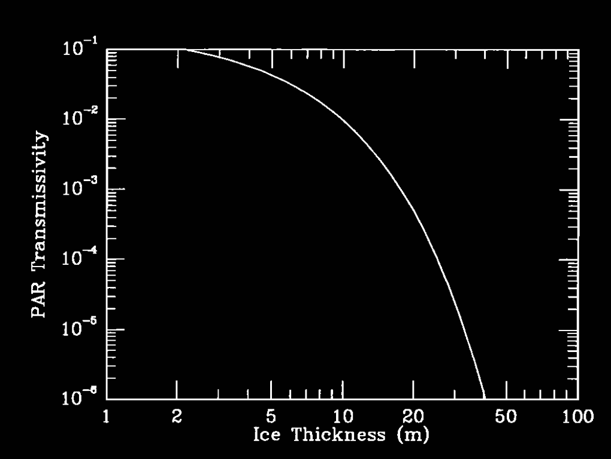
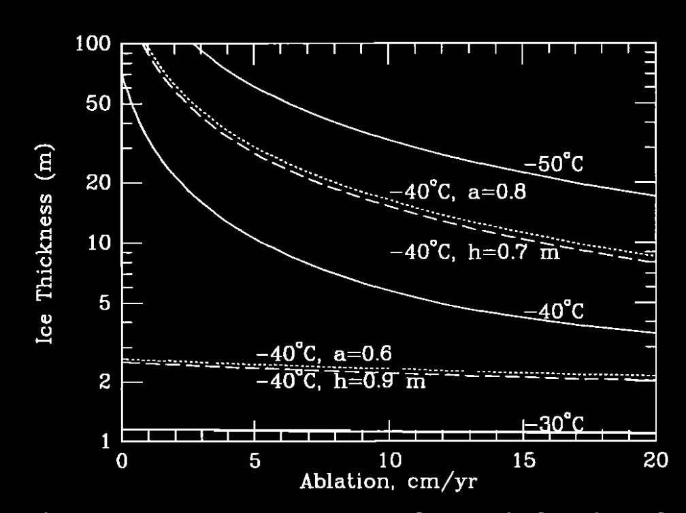
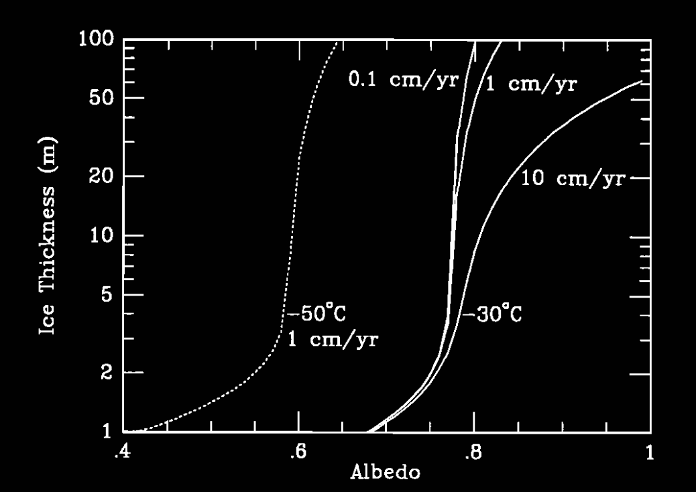
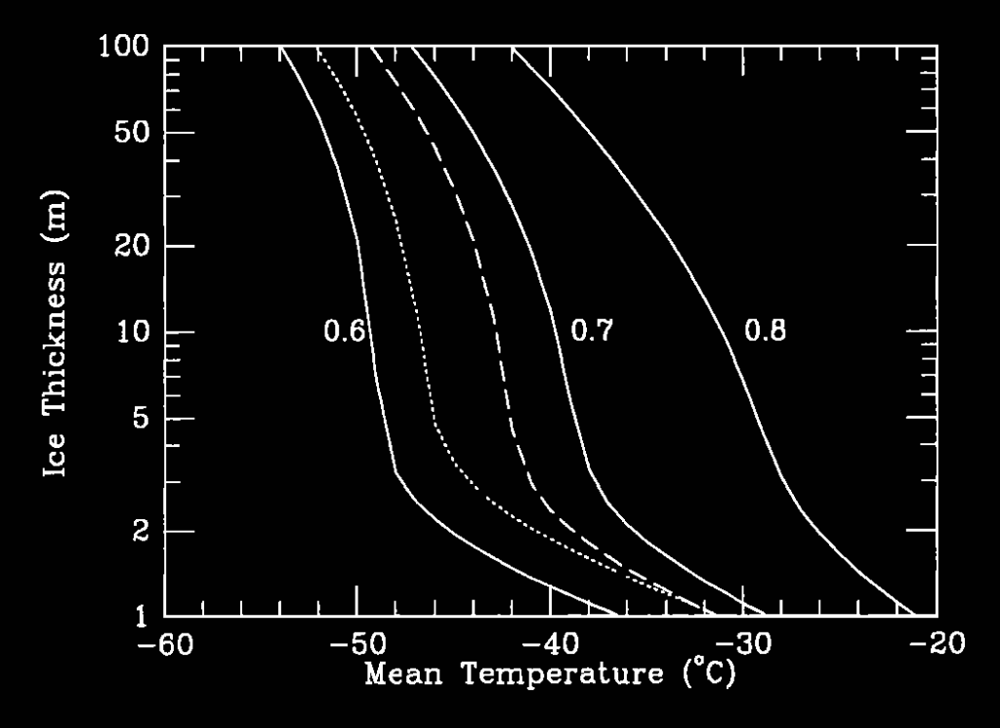

<html>
<head>
  <meta charset="UTF-8" />
  <title>雪球地球上的热带冰层厚度和光合作用</title>
</head>
<body>

<h2>雪球地球上的热带冰层厚度和光合作用</h2>

<strong>作者：</strong>Christopher P. McKay 
<strong>机构：</strong>美国NASA艾姆斯研究中心空间科学部（Space Science Division, NASA Ames Research Center, Moffett Field, CA）

<h3>摘要</h3>

在一个完全被冰覆盖的“雪球地球”上，热带地区冰层的厚度将受到穿透冰层的阳光以及冰底部结冰所产生的潜热通量的共同限制——冻结速率会平衡冰层顶部的升华速率。将研究南极干谷湖泊（这些湖泊常年被冰覆盖）的热传输模型应用到雪球地球情景表明，热带冰层的厚度可能不超过10米，并且对应的透射率超过0.1%。这样的光照强度足以支持光合作用，从而可以解释真核藻类仍能存活的原因。

<h3>引言</h3>

基于地质学证据，有研究者提出
[Kirschrink, 1992; Hoffman et al., 1998; Hoffman and Schrag, 2000]，
地球在新元古代（约5.50亿年至8.29亿年前）可能处于完全被冰覆盖的状态。碳酸盐岩中出现的负碳同位素异常表明，厚厚的冰层几乎完全消除了海洋光合作用
[Hoffman et al., 1998; Hoffman and Schrag, 2000]。此前的假设认为，这层冰盖厚度可达到千米级，仅由地热通量来限制
[Gaidos et al., 1999]。同时，气候模型
[Caldeira and Kasting, 1992]
以及地质学数据
[Hoffman et al., 1998; Hoffman and Schrag, 2000]
都暗示，全球冰封状态大约会持续500万年。在这样的条件下，令人困惑的是，许多真核藻类（包括红藻、绿藻和色素藻门藻类）却依然在这一时期存活
[Knoll, 1992; Williams et al., 1998]。Gaidos等人
[1999]
则讨论了在约千米厚的冰层下生存的挑战。

如果在热带地区的冰层并不像想象中那样厚，就可能解释这一悖论。来自南极干谷湖泊的证据可支持这一点
[Parker et al., 1982; McKay et al., 1985]。在南极干谷地区，年平均气温约为-20℃，地热能使冰底融化的深度超过300米。然而，这些封闭湖泊中的冰层厚度却只有大约5米
[McKay et al., 1985]。原因在于，通过这些冰盖的主要热通量来自穿透冰层的阳光以及冰底结冰过程中释放的潜热。相比之下，地热量要小得多，只有前两者的大约1/50
[McKay et al., 1985]。在稳态条件下，冻结速率与消融量保持平衡；消融过程每年约会从湖面移除
35&nbsp;cm&nbsp;yr-1
的冰
[Hendersen et al., 1965; McKay et al., 1985; Clow et al., 1988]，而湖泊在气温短暂高于冰点时，由进水融化补充这部分流失
[Clow et al., 1988]。

假定地球自转轴倾角（斜率）的显著变化并不是导致新元古代大冰期的原因，那么即便在那时太阳常数比现在低约6%，到达热带冰面上的平均阳光依然可能达到南极干谷湖泊接收量的4倍。因此，阳光与潜热释放共同限制了雪球地球热带区域的冰层厚度。如果地球自转轴倾角曾经发生巨大改变，那么仅凭低纬度冰川的出现就难以推断全球冰封，新元古代大冰期是否为雪球地球状态的矛盾也就不复存在
[Williams et al., 1998]。

假如雪球地球的赤道地区比极地获得更多辐射，那么从赤道到极地的一些热量输运将会发生。由此产生的大气环流或许会在赤道地区形成一定的降水，但在一般的热带沙漠区（该区域由环流下沉运动主导），海面冰层仍会因升华而不断损失。在稳态情况下，热带冰层顶端的损失与冰底形成的海水冻结相平衡。要使这种冻结过程发生所需的潜热向外散失，需要在冰层内部形成更为陡峭的温度梯度。将阳光在冰层内沉积的能量和冻结潜热共同向外传导的需求，最终决定了冰层温度梯度的大小，并限制了冰层可达到的厚度。

<h3>能量平衡模型</h3>

对于一个厚冰层，其能量平衡方程可用于求解冰层的平衡厚度 
[McKay et al., 1985]。系统的能量输入包括地热流、太阳能以及冰层底部水结冰时释放的潜热。

在稳态条件下，并对全年进行平均，冰层唯一的能量损失来自于从温暖的冰－水界面向冷空气的向上传导，因此有：

</h2>

热传导方程如下：

\[
k \frac{dT}{dz} = S(z) + L + F_g
\]

其中，\( k \) 是热导率，\( T \) 是平均年温度，\( z \) 是冰面以下的深度，\( S(z) \) 是穿透到深度 \( z \) 的净太阳通量，\( F_g \) 是地热通量，\( L \) 是潜热释放率，给定如下：

\[
L = v \rho l
\]

其中，\( v \) 是消融速率，\( \rho \) 是冰的密度，\( l \) 是冰的升华潜热。能量通过冰的上升运动传输已被忽略。

根据 <em>McKay et al.</em> [1985]，冰层内的太阳光衰减可表示为指数形式：

\[
S(z) = (1 - \alpha)(1 - r) S_0 \exp(-Z/h)
\]

其中，\( \alpha \) 是冰层对整个太阳光谱的平均反照率，\( r \) 表示被暗色吸收物质（如沙子或淤泥）覆盖的冰表面部分，\( S_0 \) 是太阳辐射通量，\( h \) 是有效衰减系数，该系数包括平均太阳天顶角的余弦。

冰的热导率可近似表示为：

\[
k = \frac{b}{T} - c
\]

其中，\( b \) 和 \( c \) 是常数，分别取 780 W m\(^{-1}\) 和 0.615 W m\(^{-1}\) K\(^{-1}\)。

利用这些关系，并对方程 (1) 从冰-水界面积分到表面，得到 <em>McKay et al.</em> [1985] 形式的平衡冰层厚度：

\[
Z = \frac{c(T_s - T_0) - b \ln(T_s / T_0)}{v \rho l + F_g}
- \frac{S_0 h (1 - \alpha)(1 - r)(1 - \exp(-Z/h))}{v \rho l + F_g}
\]

其中，\( T_0 \) 是与海水平衡的冰温度，\( T_s \) 是表面的年平均温度（均为 K），\( Z \) 是冰盖的平衡厚度。

在极冷条件下（\( T_s < -20^\circ C \)），热导率的不稳定性是显著的。

<h3>结果</h3>

在本研究中，我们关注的问题是冰盖是否过厚，以致于阻碍了下方水体中的光合作用。图1展示了穿过冰盖的光合有效辐射 (PAR, 400–700 nm) 的透射率。该计算基于 McKay 等人 [1994] 针对南极干谷湖泊开发的多层辐射散射模型。为了模拟比干谷湖泊中观测到的更厚冰盖，在冰盖底部额外增加了厚度，并假定这部分冰的光学性质与冰盖最低层相同。该层冰由冰－水界面处水体的缓慢冻结形成，因而较为清澈 [McKay et al., 1994]。

    

        
        
<strong>图1：</strong>标冰层对光合作用有效辐射（PAR）区域（400 至 700 nm）太阳辐射的透射率。

    

    
    
<strong>图2：</strong>热带地区雪球地球的冰层厚度作为消融率的函数。实线曲线使用方程 (2) 计算，参数设定为 a = 0.7、r = 0.1、h = 0.8 m。虚线曲线对应温度为 -40℃，其中 a = 0.6（较低曲线）和 a = 0.8（较高曲线）。点线曲线对应温度为 -40℃，其中 h = 0.9（较低曲线）和 h = 0.7（较高曲线）。

较低的消融/冻结速率通常会导致形成清澈的冰，而非季节性海冰中常见的混浊冰。在海冰冻结过程中，盐分被排出，形成无数盐水通道。我们在此假设，对于较厚的冰盖，冻结速率非常缓慢（小于 $10\,\mathrm{cm}\,\mathrm{yr}^{-1}$），以致于排出的盐分被带走而不会形成盐水通道，从而形成类似湖冰的清澈冰层；然而，对于与薄冰盖相关的快速冻结情况，则不适用这一假设。

我们并不打算模拟那些薄冰情况，因为在这些情况下光照供应并非问题。类似于干谷湖泊的永久冰盖，也存在于南极 Bunger Hills Oasis 峡湾覆盖海水的区域 [A•derse• et al., 1995]。

冰的这种清澈性解释了图1中的结果：在冰层厚度达到 30 米以内时，透射的光照水平依然保持在超过 $10^{-5}$ 的水平。已有研究表明，即便只有全日照的 $5 \times 10^{-4}$ 光照水平，也足以支持光合作用
[Berner and Evenari, 1978; Littler et al., 1985; Robinson et al., 1995]。从图1可以明显看出，当冰盖厚度超过约 30 米时，几乎没有足够的光线穿透，这样的厚冰情况就失去了研究意义。

利用公式 (2) 已经计算出了雪球地球上的冰层厚度。图2展示了在表面温度为 -30°C、-40°C 和 -50°C 条件下，以 $a = 0.7$、$r = 0.1$ 和 $h = 0.8\,\mathrm{m}$（参数取值与南极干谷湖泊中明亮冰层相近）的情况下，冰层厚度与消融率之间的关系。此外，在 -40°C 条件下，还以虚线和点线分别展示了 $a = 0.8$ 与 $a = 0.6$，以及 $h = 0.7\,\mathrm{m}$ 与 $h = 0.9\,\mathrm{m}$ 的情况。在该方程中，反照率 $a$ 与表面尘埃负载 $r$ 以数学上相同的方式出现，它们均减少了进入冰盖的光量。因此，本研究仅探讨了 $a$ 的变化，而我们的标称反照率取值为 0.73。

有趣的是，在温度接近 -30°C 时，无论消融率如何，冰层厚度都不足几米——此时冰层厚度完全由太阳光的穿透所决定。通过比较 -40°C 下的曲线可以看出，增加 $a$ 或减小 $h$（从而减少穿透的太阳光）会显著增加冰层厚度，这凸显了太阳光穿透的重要性。

反照率是公式 (2) 中的关键参数。图3展示了在 -50°C 和 -30°C 条件下，基于与图2相同参数 ($a$, $r$, $h$) 下冰层厚度与反照率之间的关系，并显示了不同的消融率。对于南极干谷湖泊，McKay 等人 [1994] 在可见光波段测得清澈冰区的最大反照率为 0.6，而 Galderia 和 Kasting [1992] 则采用了类似的反照率值来描述冰覆盖的地球。

在裸露海冰上，Allison 等人 [1993] 报告的反照率低至 0.2。不含积雪的海冰在光合有效辐射 (PAR) 波段的反照率通常不超过 0.6，且太阳平均反照率通常不超过 0.5
[Allison et al., 1993; Greenfell and Perovich, 1984; Brandt et al., 1999]。清澈且厚实的冰层可能具有比南极湖泊更高的反照率，因此我们采用 0.7 作为标称值；而雪的存在则会使反照率升高到 0.8 或更高
[Brandt et al., 1999]。此处忽略了雪的积累，因为我们考虑的是热带地区——在这些区域，下沉气流创造了干燥条件。

    
    
<strong>图3：</strong>与图 2 相同，但针对不同的反照率值进行计算，设定参数为 a = 0.7、r = 0.1、h = 0.8 m。消融率数值如图所示。

图3还显示，在温度高于 -30°C 且反照率低于 0.75 的情况下，仅靠太阳光就足以限制冰层厚度。

    
    
<strong>图4：</strong>与图 2 相同，但针对不同温度范围进行计算，并根据平均温度确定消融率（详见正文）。  
    实线曲线对应参数 a = 0.6、0.7 和 0.8，r = 0.1，h = 0.8 m。  
    点线曲线对应参数 a = 0.7，r = 0.1，h = 1。  
    虚线曲线对应参数 a = 0.7，r = 0，h = 0.8 m。

将结果以平均温度为变量来表达也颇具意义，因为平均温度比消融率更常被气候模型预测。消融速率与温度的关系主要由冰的蒸气压决定
[Glory et al., 1988; Moore et al., 1995]，在本计算中通过以南极干谷中测得的值（-20°C 时为 $35\,\mathrm{cm}\,\mathrm{yr}^{-1}$）进行比例缩放来确定。因此，在 -40°C 时消融速率为 $4\,\mathrm{cm}\,\mathrm{yr}^{-1}$，而在 -60°C 时为 $0.4\,\mathrm{cm}\,\mathrm{yr}^{-1}$。标称情况的结果显示在图4中，其中以实线标示，反照率取值为 0.7。有趣的是，当温度高于约 -40°C 时，冰层厚度迅速降低。然而，干谷湖泊与雪球地球热带区域之间存在一个重要差异：干谷湖泊周围是干燥的陆地，水汽易于被带走蒸发；而在雪球地球上，部分水汽可能滞留，从而降低了蒸发速率。

<h3>讨论</h3>

雪球地球的赤道平均温度存在较大不确定性。Jenkins 和 Smith [2000] 提出，全球平均温度约为 -52°C，对应的冰层厚度可达 60 米，并且其相关的光照水平低于 $10^{-6}$，即使在反照率为 0.6 的情况下也是如此。然而，这只是全球平均温度，赤道地区的温度预计更接近 -30°C——这温度过高，即使冰的反照率达到 0.8，也不足以形成持续且光学上厚实的冰盖。

本分析表明，即使在新元古代地球大部分地区被冰覆盖的情况下，热带地区仍可能存在冰层较薄（小于 10 米）的区域，从而允许光合作用发生。由于初级生产所能获得的总太阳光通量相比无冰状态大为减少，这一结论与地质数据并不矛盾——地质数据表明，在冰川期前全球有机碳与总碳埋藏的比例接近 0.5，而在冰川期间几乎降为零 [Kirschrink, 1992]。然而，在局部区域，通过薄冰进行的光合作用仍可能使得海洋中的光合藻类和细菌在一个较为简化但完整的营养链中存活，从而使生命在此事件后能够迅速恢复。

<strong>鸣谢：</strong>本研究作为 NASA 天体生物学研究所项目的一部分开展。

</body>
</html>
