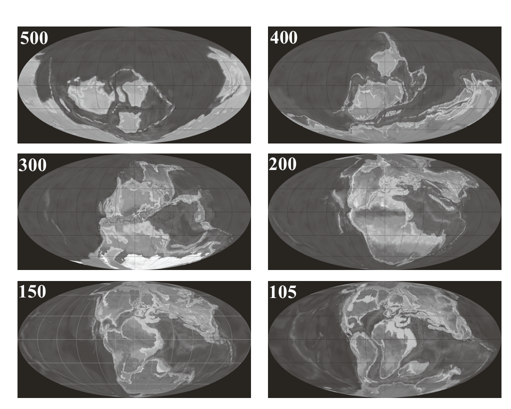
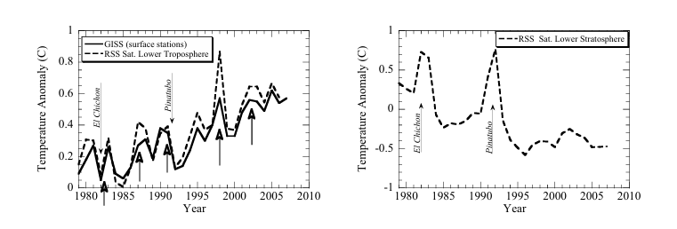

<html lang="zh-CN">
<head>
  <meta charset="UTF-8">
  <meta name="viewport" content="width=device-width, initial-scale=1.0">
  <title>气候与地球历史章节导航</title>
  
</head>
<body>

  <h2>目录</h2>
  <ul>
    <li><a href="#section1">概述</a></li>
    <li><a href="#section2">近距离观察</a></li>
    <li><a href="#section3">深入远古：微弱的年轻太阳与地球的宜居性</a></li>
    <li><a href="#section4">太空中的“金发姑娘”：地球、火星和金星</a></li>
    <li><a href="#section5">太阳系中的其他行星和卫星</a></li>
    <li><a href="#section6">更遥远的领域：系外行星</a></li>
    <li><a href="#section7">关于气候代用指标的讨论</a>
      <ul>
        <li><a href="#section7.1">代用数据概述</a></li>
        <li><a href="#section7.2">同位素代用指标</a></li>
        <li><a href="#section7.3">海水与海洋沉积物中的氢氧同位素</a></li>
        <li><a href="#section7.4">有孔虫的贡献</a></li>
      </ul>
    </li>
    <li><a href="#section8">再探前寒武纪气候：雪球地球</a></li>
    <li><a href="#section9">温室与冰室的二分法</a>
      <ul>
        <li><a href="#section9.1">过去7000万年</a></li>
        <li><a href="#section9.2">显生宙的温室和冰室气候</a></li>
      </ul>
    </li>
    <li><a href="#section10">更新世的冰川-间冰期循环</a>
      <ul>
        <li><a href="#section10.1">海洋沉积物记录</a></li>
        <li><a href="#section10.2">冰芯记录</a></li>
      </ul>
    </li>
    <li><a href="#section11">全新世的气候变化</a></li>
    <li><a href="#section12">回到最初：全球气候变暖</a></li>
    <li><a href="#section13">地球的命运，生物圈的寿命</a></li>
    <li><a href="#section14">进一步阅读</a></li>
  </ul>

本文是我的学术祖师爷Pierrehumbet（我的导师的导师的导师），所著《Principles of Planetary Climate》教材的第一章中文翻译.适用于了解古气候与行星气候学入门者，我使用了GPT-4o进行翻译以自用。

该教材购买链接：<a href="https://users.physics.ox.ac.uk/~pierrehumbert/PrinciplesPlanetaryClimate/index.html" target="_blank" style="text-decoration: underline;">购买链接

网络试读版本（翻译版素材来源）：<a href="https://jvarekamp.web.wesleyan.edu/CO2/ClimateVol1.pdf" target="_blank" style="text-decoration: underline;">试读版本

  

    <h2>概述</h2>

本章将探讨由当前和过去地球以及行星气候的观察特征引发的一些重大问题。这些问题中，有些在某种程度上已经得到了回答，但许多仍然悬而未决。本章并不会对地球和行星气候演化进行全面的总结，而是会指出一些需要物理学解释的气候现象中的引人注目的事实。在随后的章节中，我们将发展必要的物理学知识来研究这些问题。

尽管我们希望本书不要过于以地球为中心，但在本章中，我们不得不花更多篇幅讨论地球的气候，而不是其他行星的气候，因为我们对地球过去气候的了解远胜于对其他行星气候历史的了解。对地球历史的深入研究可以提出适用于其他行星的普遍规律，同时也激发关于其他行星可能会如何有所不同的有趣问题。怀着这样的目标，我们开始这段探索之旅。
  

  

    <h2>近距离观察</h2>

1732年，年轻的卡尔·林奈（Carl Linnaeus）开始了他对拉普兰植物的发现之旅，他从家乡乌普萨拉出发，徒步踏上旅程。他并没有等到抵达目的地才开始观察，而是在途中，甚至在家门口的植物中，发现了许多值得思考的有趣现象。对气候的研究亦是如此。

对于一个眼光敏锐且充满好奇的观察者来说，仅仅是看一眼窗外、在森林或城镇中散步、或进行一次短暂的海上航行，就可以提出关于气候物理学的一些深刻问题。即使没有温度计，我们也可以通过观察周围物质的物理和化学变化来感知“热”或“温度”。例如，在夏天，阳光下的冰淇淋会融化，但钢制锅具不会；树木和草地不会每天自发燃烧，而在夏天将一杯水放在室外也不会沸腾。在热带地区以外的地方，冬天常常冷到可以让水结冰，但几乎不会冷到让酒精冻结。

是什么加热了地球？是太阳吗？这似乎符合我们在晴天感受到温暖的直觉。如果是这样，是什么阻止了地球每天从太阳中吸收越来越多的能量，直到被加热至熔化？再者，为什么每天晚上太阳下山后温度不会骤降至极寒的冬季水平？同样地，是什么限制了冬天的最低温度？

借助温度计，这些问题可以用定量的方式表达。最早且至今仍然最常见的温度计是基于温度对物质某些特定、可重复测量的效应的影响——例如物质加热时的膨胀。由于生物体主要由液态水构成，因此水的状态为建立温标提供了一个自然的参考。摄氏温标将纯水在海平面上的冰点和沸点之间的温度范围分为100等分，其中冰点为0℃，沸点为100℃。

通过对火焰和锻炉的观察，即使在古代，人们也意识到某些条件下的温度可以远高于正常气候中的温度范围。然而，他们对温度可以有多低几乎没有概念。这种认知直到19世纪热力学的发展以及卡尔·冯·林德（Carl von Linde）发明制冷技术后才有所改观。到了19世纪末，人类已经能够达到足够低的温度以液化空气。然而，这仍然不是温度的最低极限。理论和实验的发展巩固了早期关于温度绝对零点的推测——在这个温度下，分子的随机运动完全停止，理想气体的体积将收缩至零。在摄氏温标中，绝对零点是-273.15℃。

如果将温度相对于绝对零点表示，大多数热力学和辐射物理学原理会变得更加简洁明了。这促成了开尔文温标的建立，该温标将零点移动到绝对零点，同时保持每度的大小与摄氏温标相同。在开尔文温标中，绝对零点为0K，水的冰点为273.15K，沸点为373.15K。

从开尔文温标的角度看，地球气候的温度范围显得极其狭窄，其典型温度约为285K，波动范围约为±10%。如果地球的温度波动幅度达到±20%（以开尔文计算），这对我们所知的生命来说，将是灾难性的。这一现象可以用一句话概括：“物理学以开尔文为度量，但地球生命以摄氏为生存。”

气候不仅仅与温度有关。它还包括降水（如雨和雪）的量和分布，以及大气风和海洋洋流的模式。然而，温度是一个很好的出发点。在本书中，我们将对温度进行深入的讨论，并在稍小的范围内探讨决定降水量的因素。虽然我们不会过多地讨论风的模式，但其对温度分布的某些影响将在第10章中提及。

如果你居住在热带地区以外，你可能会好奇，为什么夏天比冬天更热？为什么夏季和冬季的温差具有特定的范围（例如芝加哥为30℃），而在同纬度的太平洋中部，这一温差仅为7℃？如果你与生活在北极或南极地区的朋友交流，同时也与居住在赤道附近的朋友交流，你会发现，平均而言，赤道附近的气温比极地高得多。为什么会有40℃的差异（例如赤道的年平均气温与北极的年平均气温之间的差异）？季节循环和从极地到赤道的温度梯度背后的物理学将在第8章和第10章中讨论。

如果你爬上一座高山（或者甚至只是从夏天的山谷地面观察被积雪覆盖的山峰），或者乘坐热气球升空，或搭乘飞机并观察其提供的室外温度，你会注意到，随着海拔的升高，空气变得更冷。这是为什么呢？事实证明，这是行星大气的一个普遍特征，其基本物理机制将在第2章中探讨。

围绕我们的空气本身就是一个值得关注的问题。我们知道空气的存在，因为它具有温度、施加压力，而且是我们呼吸维持生命所必需的。但空气由什么组成？为什么它具有现在的成分？我们可以看到水从空气中凝结，但为什么其他成分不会在自然天气和气候变化的过程中凝结？空气的总量有多少？它的组成一直不变吗？如果发生了变化，这种变化有多大，又有多快？

我们知道，我们的地球穿行在外层空间的真空中，被一层薄薄的空气——即我们的“大气层”包裹着。很自然地，我们会想知道，大气层如何影响地球的气候。同样围绕太阳运行的月球没有大气层，与地球距离太阳的距离相同，因此我们可以通过观察月球来了解如果地球没有大气层其气候会是什么样子。我们知道月球没有大气层，因为如果有一层足够厚的大气层，它会像游泳池表面那样使太阳和星星的光线发生弯曲，从而改变其位置。但我们如何测量月球的温度呢？

当然，可以带着温度计前往月球（后来人类确实这样做了），但在任何人类真正抵达月球之前，人们就已经对月球的状况充满了好奇。甚至在1308至1321年间写作《天堂篇》（Paradiso）的但丁·阿利吉耶里（Dante Alighieri）都用整整一百首诗篇，详细讨论了他与贝雅特丽齐（Beatrice）之间关于月光来源以及月球表面是否坚实的学术对话。

到19世纪中期，科学发展到可以更清晰地提出这些问题，并开始寻找答案的手段。1800年，威廉·赫歇尔爵士（Sir William Herschel）发现了红外光，这为研究行星和恒星的性质打开了一扇新窗。在接下来的几十年里，人们逐渐发现所有物体都会根据其温度发射辐射，这被称为黑体辐射（blackbody radiation），这一主题将在第3章详细讨论。1856年，查尔斯·皮亚齐·斯迈思（Charles Piazzi Smyth）探测到了来自月球的红外光，而1870年，第四代罗斯伯爵（The Fourth Earl of Rosse）首次尝试利用这些数据来估算温度。然而，当时的仪器并不适合完成这一任务。1878年，兰利（Langley）发明了测辐计（bolometer），使得对月球红外线的准确观测成为可能。然而，尽管兰利成功进行了精确的观测，当时的理论却不足以解释这些观测结果。这些问题大体上在1913年得到了解决，尽管兰利不太情愿地放弃了早期的估算。到1913年，人们已经很清楚，在太阳正对的月球表面，白天温度远高于373K（地球上海平面水的沸点温度）。夜晚的温度更难以准确测定，因为冷物体的红外发射较弱。然而，很明显，夜间温度相对于白天峰值下降了超过140K。

1927年，佩蒂特（Pettit）和尼科尔森（Nicholson）利用威尔逊山天文台（Mt. Wilson telescope）观测了月全食期间月球的温度。他们发现了更引人注目的现象：在月全食的短短几个小时内，月球温度从342K迅速下降到175K。现代测量显示，月球赤道的日平均温度约为220K，而85°N纬度的平均温度为130K。

显然，没有大气层或海洋，地球的昼夜温差将会极其剧烈。月球的“白天”长达28个地球日，因为月球总是以同一面朝向地球。因此，人们可能会想，昼夜温差大是因为漫长的夜晚提供了更多冷却时间，但月食期间的快速降温否定了这一假设。考虑到没有大气的天体在夜间迅速降温的情况，很可能地球在没有大气层的情况下，其夏冬温差将更加极端。此外，将地球的日均温度从极地到赤道的梯度与月球相比，可以看出，大气层显著减缓了这种梯度。那么，大气层或海洋是如何减少昼夜或夏冬温差的呢？这一主题将在第8章中详细探讨，届时我们也会学习为什么夏天比冬天更暖，为什么极地比赤道更冷。

在最热的时候，月球比地球要热得多；在最冷的时候，月球又比地球冷得多。那么月球的平均温度与地球相比如何呢？月球赤道的平均温度为220K，这比地球热带的平均温度（大约300K）低得多。如果地球的平均温度和月球一样低，那么海洋将完全冻结。月球的低平均温度并不是因为它比地球反射更多的阳光。尽管月球看起来像银色，但测量表明，它实际反射的阳光比地球少。那么，为什么地球的平均温度比月球高得多呢？这是否与我们的大气层有关？还是因为地球有某种月球所缺乏的内部热源？

对这一问题初步答案的探索可以追溯到1827年，当时傅里叶（Fourier）发表了他关于地球温度的开创性论文。傅里叶对月球的温度一无所知，但他对热传导非常了解——事实上，他几乎是这一学科的发明者。利用他的新固体热传导理论，傅里叶分析了随着地球表面以下深度增加的平均温度变化速率；他还分析了昼夜或夏冬温度波动在深度上的衰减。（傅里叶对后一个问题的解决方法将在第8章推导。）基于这些分析，傅里叶得出结论：从地球内部向外的热流相比于从太阳接收的热量微不足道。

我们很快会看到，这一结论也适用于其他岩质行星：干燥的岩石是很好的隔热体，不容易让内部热量向外流失。

如果地球不断吸收太阳能量，它必须有某种方式将这些能量散发出去。否则，数亿年来积累的能量会让地球变成一个炽热的、不适宜居住的星球（详见相关问题）——显然事实并非如此。傅里叶似乎知道行星轨道空间中几乎没有物质，因此他推测行星几乎完全通过红外辐射（当时称为“暗热”）散热。他还知道，“暗热”的发射速率随着温度升高而增加，这为行星达到平衡温度提供了一种机制：行星会加热到辐射红外能量的速率等于从太阳接收能量的速率。最后，傅里叶提到了实验显示，大气中的某些物质会向地面发射红外辐射，同时也吸收红外辐射。基于这些较为粗略的观察，傅里叶推断，地球的大气层减缓了红外辐射散失，使地球比没有大气层时更暖。

傅里叶的论文明确指出，红外光的热辐射不仅对天文学观测有用——它实际上是行星气候运行不可或缺的一部分。  
傅里叶还提到他所称的“空间温度”对加热的重要性。尚不清楚他是否认为空间中存在某种物质能够将热量传递到大气中，或者他指的是某种充满空间的不可见辐射。他关于这一因素重要性的推断是错误的——这是他在一篇卓越论文中唯一的实际错误。

在傅里叶的时代，人们对红外辐射的发射机制的理解尚未充分发展，因此他无法完成他所设想的计算。然而，他正确地将地球温度的问题表述为太阳辐射吸收率与红外辐射发射率之间达到平衡的问题。凭借这一伟大的见解，现代行星温度研究时代由此开启。然而，填补这些“细节”需要在多个基础物理学领域取得重大进展。行星能量平衡的基本原理以及大气如何增加行星温度的机制将在第3章介绍，并在第4章的前半部分详细阐述。

其中一个需要解决的关键问题是：大气中哪些成分会影响红外辐射的传输。1859年，廷德尔（Tyndall）发现，地球大气的主要成分——氮气和氧气——对红外辐射几乎完全透明。而实际上，两个相对次要的成分——水蒸气和二氧化碳——构成了地球大气中大部分红外辐射的吸收和发射。这类气体能够几乎不受阻碍地让太阳能量通过，但显著减缓了红外辐射的向外流失，被称为“温室气体”。它们对行星大气底层和表面（如果有的话）的增暖作用被称为“温室效应”。这个术语并非由傅里叶提出，并且在某些方面具有误导性，因为真正的温室并不是通过阻止红外辐射来发挥作用。然而，真实温室的玻璃或塑料外壳通过减少向环境的热量损失，同时允许太阳加热，从而使内部变暖。从能量平衡的更广泛隐喻来看，这个类比是恰当的。

除了二氧化碳和水蒸气，我们现在知道还有许多其他温室气体，包括甲烷（CH4），它可能在早期地球中发挥了非常重要的作用，并且即使在今天也发挥了一定作用。事实上，在一些非常稠密的大气层中（例如土卫六的大气层），甚至氮气也可以成为温室气体。是什么决定了某种分子是否是良好的温室气体？我们如何描述单个气体的效应，以及大气成分对气候的影响？这些问题将在第4章的后半部分讨论。

在思考温室气体对气候的影响时，重要的是区分长寿命温室气体和短寿命温室气体。长寿命温室气体在大气中以数千年或更长的时间尺度缓慢被移除，而短寿命温室气体则通过凝结或快速化学反应在数周到数年的时间尺度内被移除。短寿命温室气体主要作为一种反馈机制。它们的浓度会迅速适应气候的其他变化，从而放大或抵消由其他因素引起的气候变化——包括由长寿命温室气体引起的变化。长寿命温室气体也可以参与反馈机制，但只有在超过其典型大气调整时间的时间尺度上才会发生。某种温室气体是长寿命还是短寿命取决于环境条件。在地球上，二氧化碳是长寿命温室气体，而水蒸气是短寿命温室气体；然而，在火星上，由于其足够寒冷以使二氧化碳凝结，二氧化碳可以被认为是短寿命的。

温室气体大多是不可见的，但大气中还包含一个显而易见的成分，对我们星球的能量平衡有着深远的影响——云。地球上的云由悬浮的液态水或冰的凝结液滴组成。像水蒸气一样，云也会作为短寿命温室气体，影响红外辐射逃逸到空间的速率。云的红外不透明性在气象卫星中被常规使用，因为这种性质使得云层模式即使在地球的夜晚也能从太空中观察到。然而，云对能量平衡的另一面也有影响，因为云粒子可以有效地将阳光反射回空间。云的这两种竞争效应各自都非常大，但部分抵消，因此在其中一个效应或另一个效应上出现的小错误都会导致云对气候净效应的重大误差。

此外，云对能量预算的影响取决于决定云粒子大小以及有多少凝结水能够保持悬浮的所有复杂物理过程。因此，云对气候的理解提出了非常严峻的挑战。这不仅适用于地球，也几乎适用于所有有大气的行星。关于云对辐射平衡两方面影响的物理学将在第4章和第5章中详细讨论。
  

  

    <h2>深入远古：微弱的年轻太阳与地球的宜居性</h2>

太阳系并非一开始就是我们今天看到的模样。它是由一片星云在自身引力作用下塌缩形成的。当星云开始塌缩时，事情进展得非常迅速。太阳系形成的初始阶段大约在46亿年前完成。到那个时候，太阳已经通过热核聚变开始产生能量；外部气体巨行星及其冰卫星通过凝结形成，内部的类地行星通过较小岩石星子的碰撞也基本形成。地球形成过程中的最后一个重大事件是在45亿年前与一个火星大小的天体发生碰撞，形成了月球，并可能在此过程中融化了地球的原始地壳。所有这些碰撞释放了大量的热量，这些热量必须被散失，才能让地壳稳定下来。

要确定散失这些热量需要多长时间，我们必须了解行星如何失去能量的机制，以及能量散失的速率如何依赖于温度和大气成分。这将在第3章和第4章中讨论。研究表明，行星几乎完全通过向太空辐射红外光来散失能量。虽然确切的散热速率取决于大气的性质，但所有估算表明，地球表面迅速冷却到2000K，此时熔融的岩石开始固化；在没有大气的情况下，这一过程需要不到一千年，而在厚大气层的情况下可能需要两到三百万年。

一旦形成固体地壳，地球内部向表面传输的热量流量会显著减少，因为热量通过固体岩石的扩散非常缓慢。在这种情况下，来自地球内部的热量供应相较于来自太阳的能量变得微不足道，地球进入了一个由今天气候所决定的类似状态：太阳能量的接收速率与红外辐射向太空散失速率之间的竞争。这种情况很可能在44亿年前已经形成，如果不是更早的话。虽然没有岩石可以追溯到那个时候，但在西澳大利亚杰克山地层中发现了44亿年前的独立锆石晶体。类似年代的锆石也出现在邻近纳尔尔片麻岩复合体的37亿年地壳岩石中。

这些锆石提供了明确的证据，表明至少有一些非常类似于我们今天所见的大陆地壳的存在；它们还提供了令人信服但稍显不确定的证据，表明早期大陆地壳与液态水接触。液态水的存在本身并未对温度施加太多限制，因为只要大气中水蒸气的压力足够高，即使温度超过500K，水也可以保持液态。第2章将介绍解决这一问题所需的热力学知识。然而，锆石的某些化学组成特性表明，它们与接近地表且温度低于100℃的水发生了相互作用。由此看来，到44亿年前，地球已不再是熔融的火山炼狱。

从45亿年前到38亿年前之间的气候演化的具体性质目前尚不清楚。根据大气成分的不同，地表温度可能高达200℃，也可能低到足以使海洋（如果有的话）完全冻结，气候可能在两种极端之间剧烈摆动。此外，月球陨石坑的年代表明，地球很可能在41亿年前到38亿年前经历了一段由星际碎片带来的严重轰击时期；人们普遍认为，这一晚期重轰击也影响了内太阳系的其他部分，尽管这一点远未确定。这一时期撞击带来的能量很可能足以使地表温度阶段性地超过100℃，从而摧毁任何新生的生态系统。如果有生命存在，它可能在深海避难所中顽强生存并取得胜利。

到了38亿年前，神秘的面纱开始揭开。这是今天在格陵兰伊苏阿绿岩带发现的最古老完整岩石的年代。这些岩石的出现标志着冥古宙的结束和太古宙的开端。在伊苏阿地层中37亿年前的页岩遗迹中可以看到沉积物在开放水域中沉积的无可否认的迹象。更令人着迷的是，这些页岩富含有机碳，而这些碳保留了通常与微生物活动——生命——相关的化学特征。

南非巴伯顿地层和澳大利亚瓦拉乌纳地层中的沉积结构表明，35亿年前存在早期的层叠石，这些在后来的时间中被认为是由微生物席铺设形成的。这些迹象虽然并非生命的明确证据，但早期的层叠石至少需要开放水域蒸发至空气中。

通过进一步的化石和沉积物研究，我们可以继续探索地球宜居性的演化，这也将在接下来的章节中进行深入讨论。

当大气通过地球内部的气体逸出（outgassing）得到补充时，其他过程也会导致大气物质的损失。行星的大气层部分延伸至离地表非常远的地方，在那里高温快速运动的分子可以达到逃逸速度，从而逸入太空。除了由于分子随机运动引起的逃逸，太阳加热的稀薄外大气还能产生流体流动，导致大气质量系统性地喷涌进入太空。此外，太阳风甚至可以直接吹走大气的外层部分；这种情况的发生程度受行星磁场强度的影响，因为磁场可以保护大气免受太阳风的侵蚀。当大气外层被侵蚀时，下层大气中的新气体会上升以补充损失的物质，从而维持大气的逐步损失。

这三种质量损失机制优先移除较轻的分子，因为较轻的分子在相同温度下移动更快，或者因为外大气中富含分子量较小的气体。在相同密度下，较小的行星表面重力较低，因此对大气的束缚力较弱；因此，在小行星上大气逃逸到太空的过程更为迅速。高速大型天体的撞击可以为部分大气提供足够的能量，将其直接冲入太空。这种大气损失机制不区分分子量，但与其他机制一样，小行星更容易通过这种方式失去大气。

总体而言，月球或火星比地球或金星这样更大的天体更容易失去大气，更不用说木星或土星了。对于地球和金星来说，逃逸到太空的主要是氢气（H₂）和氦气（He）；其中，氦气的重要性更多地体现在作为行星历史的指示器，而不是作为大气的物理或化学活性成分。土星的卫星土卫六是一个有趣的案例，它保持着一个主要由氮气（N₂）组成的大气层，其单位表面积的大气质量甚至超过地球，尽管其表面重力低于月球。土卫六极低的温度帮助其保留了大气，但即便如此，大气的持久性很可能需要由行星内部以相当高的速率进行补充。

某些大气成分也可能通过与地球表面岩石的化学反应而损失。一个特别重要的例子是乌雷反应（Urey reaction），该反应从大气中移除二氧化碳（CO₂）。当CO₂溶解在水中时，会形成一种弱酸（碳酸），并与硅酸盐矿物（如CaSiO₃）反应生成碳酸盐矿物（如CaCO₃，或称石灰石）。该反应仅在存在液态水的情况下发生，因此如果一颗行星变得过热以至于液态雨水无法到达地表，或者完全失去了其水分，那么从行星内部释放的CO₂会在大气中积累，直到内部源枯竭或供应速率与逃逸速率达到平衡。在地球上，目前大气中所有的CO₂可以通过乌雷反应在5000年内完全移除，形成仅5毫米厚的石灰石层；如果所有储存在海洋水中的碳都作为CO₂逸出并反应形成石灰石，这一过程将需要50万年，并形成0.5米厚的石灰石层。

生命一旦出现，对大气成分的影响极其深远。尽管从地球内部直接逸出的甲烷（CH₄）很少，但被称为产甲烷菌的细菌可以通过H₂和CO₂，或由其他生物产生的有机物质合成甲烷。在地球前20亿年的生态系统中，产甲烷菌可能占主导地位，从而使甲烷占主导的大气逐渐建立起来。

生命的出现还对氮循环产生了深远影响。N₂分子之间的化学键非常牢固，在非生物世界中，只有闪电等罕见的高能事件才能形成氮化合物。事实上，尽管氮是所有生命物质的基本成分，高等生命形式（包括所有植物和动物）都无法完成使N₂可用于生物的化学转换。这一任务由固氮细菌完成，它们可以高效地将大气中的N₂转化为铵根离子（NH₄⁺），后者进一步转化为硝酸根离子（NO₃⁻），被其他生物用于合成生命物质。在缺氧条件下，其他细菌可以通过结合硝酸中的氧和碳来存活，同时将N₂返回大气。

直到1910年，人类通过哈柏法（Haber Process）才掌握了将大气中的N₂转化为氨（NH₃）的技术，这项创新对人类生存至关重要，因为工业化农业的需求远远超出了自然细菌生态系统供应硝酸盐的能力。这并不否认其他形式的农业可能可以依赖细菌的帮助在有限资源内生存。然而，固氮细菌在化学复杂性上仍遥遥领先于工业技术，因为哈柏法需要分子氢（由化石甲烷制成）、铁催化剂、超过400℃的高温，并在超过地球表面空气压力200倍的条件下运行；而固氮细菌则能够在常温常压条件下，在其周围环境中轻松完成这一转化。

如果没有能够产生氧气的光合作用生命，大气中只会存在极微量的氧气，因为只有少量氧气能够通过阳光分解水（H₂O）产生。早期大气中氧气含量非常低（低于0.2%，而今天为20%），这一点通过至24亿年前广泛存在的条带状铁形成（banded iron formations, BIFs）得到了证实。条带状铁形成物只能在铁在海洋中具有高溶解度并能够长距离运输的情况下沉积下来。这需要低氧环境，因为在氧气存在下，铁会形成不易溶于水的化合物。对某些含硫矿物化学组成的额外研究表明，在至少26亿年前的某些时期，大气中的氧气含量可能低至0.2%的几个数量级以下。

需要注意的是，氧气产生型光合作用的出现并不等同于大气中氧气的增加。为了让氧气积累起来，必须有足够比例的有机物在被其他细菌氧化之前被埋藏起来，否则氧气会重新从大气中被移除。此外，如果地球在缺氧时期已经在海洋中积累了大量可利用的有机物，则在氧气开始显著积累之前，这些有机物需要被完全消耗。无论如何，在坎贝尔组（Campbell Group）发现的蓝细菌化石时期之后，条带状铁形成物的沉积开始减少，并在大约20亿年前完全消失。这时，大气中的氧气含量可能至少已达3%。一旦氧气在大气中达到显著浓度，它便彻底改变了大气化学的规则，因为它的反应性极强。

特别是，氧气使得甲烷（CH₄）和氢气（H₂）在大气中的积累变得更加困难，因为甲烷很容易被氧化为二氧化碳（CO₂），氢气则被氧化为水（H₂O）。氧气的增加可能还促进了另一个伟大的生物学创新——真核细胞的出现。真核细胞具有复杂的内部结构，包括分隔遗传物质的细胞核。所有动物和植物都是由真核细胞构成的。真核细胞在化石记录中的第一次明确出现大约是在15亿年前，来自澳大利亚的罗珀组（Roper Group）页岩。然而，更多间接证据表明真核生命可能更早就已演化出现。无论如何，单细胞的真核生命直到后来原生代才广泛繁殖和多样化。

在新元古代雪球地球事件（距今6亿至7亿年前）期间，条带状铁形成物曾短暂重新出现，但到距今6亿年前，氧气浓度已接近今天的水平，条带状铁形成物彻底消失（至少到目前为止）。第二次氧气增加脉冲使得多细胞动物的出现成为可能，这在生物学上被称为寒武纪大爆发（Cambrian Explosion），发生在距今约5.43亿年的短暂时间内。有趣的是，动物的兴起可能有助于稳定大气氧气水平，因为它们提供了一种将有机碳运输到海底并加以埋藏和保存的可靠机制。而简单的多细胞海洋植物出现得更早，这可以从光合作用生物对氧气的非依赖性得到解释。

这一切大气演化都发生在太阳逐渐变亮的背景下。恒星内产生的能量几乎完全以电磁辐射（即各种波长的光）形式释放出来。恒星的总能量输出被称为光度（luminosity），以瓦特（W）为单位测量，类似于灯泡的亮度。像太阳这样的恒星通过将氢融合为氦来获取能量，随着时间的推移，太阳中氦的比例增加，从而增加了太阳的平均分子量。这意味着太阳的核心需要收缩并加热，以维持平衡引力所需的压力。密度和温度的增加使得核聚变速率的提高超过了氢消耗速率的降低，因此能量的产生速率——即太阳的光度——随时间增加。

光度的这种演化遵循太阳物理学的基本原理，这些原理没有受到太大质疑，且对太阳模型的细节不太敏感。标准太阳演化模型的结果可以用以下公式描述：

<head>
    <meta charset="UTF-8">
    <meta name="viewport" content="width=device-width, initial-scale=1.0">
    <title>MathJax Example</title>
    
</head>
<body>
    

      $$ I(t) = I_\odot(t) \left(1 + \frac{2}{5}(1 - \frac{t}{t_\odot}) \right) $$
    

</body>

其中，$ I(t) $ 是时间 $ t $ 时太阳的光度，$ t_\odot $ 是太阳的当前年龄。
（通常取为46亿年）。这一公式最初用于描述年轻太阳，但在未来约40亿年的时间范围内，它仍然相当准确。

由公式可以得出，40亿年前地球接收到的太阳能仅为今天的75%。如果其他条件保持不变——特别是大气成分——这意味着地球比今天更冷。那么，会冷到什么程度呢？我们将在第3章学习如何以最简单的方式进行这一计算，并在第4章对计算进行更复杂的处理。

如果地球历史中的大气成分始终与今天相同，那么40亿年前地球应该完全冻结，且由于冰的高反射率，地球今天仍然应该完全冻结。然而，我们知道在地球历史中全球冰封的事件非常罕见，即使确实发生过；更确定的是，地球今天并没有完全冻结。这种矛盾通常被称为“微弱年轻太阳悖论”（Faint Young Sun Paradox），尽管如同大多数悖论一样，一旦了解背后的原因，它就并不悖论。称其为“悖论”只是为了鲜明地表明，为了解释地球气候历史的基本事实，大气确实必须经历重大变化——这种变化足以显著影响气候。

需要增加多少 CO₂ 或 CH₄ 才能弥补年轻太阳的微弱光度？这是另一个重大问题，我们将在第4章找到答案。此外，另一个相关的问题是，在太古代期间，CH₄（或其他某种长期存在的温室气体）在多大程度上替代了 CO₂ 来维持地球的温暖。这些问题至今仍未解决。

一个“微弱年轻太阳悖论”的推论是，任何足以使早期地球保持未冻结状态的大气，在今天的太阳输出下都会使地球过热，达到不可居住的程度。因此，大气必须以某种方式与太阳的变亮协同演化，恰好保持地球在宜居的温度范围内——一个可以存在液态水但温度从未超过100℃，甚至对于蓝细菌的生存来说最好不超过50℃的范围。认为这种大气与太阳输出协同演化的必要性仅仅是巧合是难以置信的，因此似乎某种温度调节机制在发挥作用。在第9章中，我们将看到乌雷反应如何参与地球及类似行星的地球化学恒温机制。雪球事件代表了这种温度调节机制的暂时中断，但显然这种中断是罕见的。无论这种调节机制为何，它必须足够安全，以允许地球从全球或近全球的冰封状态恢复。

早前我们提到过，大气成分中的无数变化过程可能引发混乱，因此在陈述“微弱年轻太阳悖论”时作出“其他条件保持不变”的假设未免显得有些可笑。实际上，即使太阳辐射输出随着时间恒定不变，我们之前讨论的大气演化中的任何一个方面都可能足以导致地球冻结或过热，因此太阳输出的逐步增加在这个问题中并没有特别引人注目的意义。公平来说，当“悖论”最初被提出时，人们对地球大气的演化方式了解得很少，也缺乏足够的确定性。然而，从当前科学的角度来看，“微弱年轻太阳悖论”的传统表述显然存在很多不足。更令人满意的表述是将其称为“宜居性问题”，可以表述为：**在地质、地球化学和生物过程中温室气体大气成分发生动荡变化的情况下，同时面临太阳辐射逐渐增加的挑战，行星如何在数十亿年的时间里维持温度在宜居范围内？** 这确实是一个极为宏大的问题。本书第9章讨论的内容提供了一个合理的解决方案，但关于宜居性问题的研究还远未结束。

“微弱年轻太阳问题”的历史揭示了关于地球和行星气候发现本质的壮丽和鼓舞人心的一面。恒星能量来源的基本物理原理由汉斯·贝特（Hans Bethe）在1939年提出，而早期地球的宜居条件（至少是推测的）甚至更早便为人所知。然而，直到1972年，卡尔·萨根（Carl Sagan）和乔治·马伦（George Mullen）才将这两个点联系起来，并推断出这是一个需要深刻答案的大问题。这一洞见引发了关于行星气候思考的革命，这在某种意义上不亚于DNA发现对其领域的影响。这段历史彰显了我们学科的一种可爱之处：**最深刻的新现象往往是通过将一些基础物理和化学知识以创新方式组合在一起发现的。** 大多数新想法来自简单模型的推演，而不是通过由庞大团队构建的复杂且难以理解的计算机模拟实现的。本书的目标正是教授学生像卡尔·萨根和其他创新者那样思考，并提供必要的工具以构建简单模型，将灵光一现的想法转化为真正的科学成果。

值得注意的是，萨根和马伦最初提出的解决悖论的方法是通过大气氨（NH₃）的积累，但后来的大气化学研究表明，阳光会迅速分解氨，无法使其达到所需浓度。因此，研究的焦点后来转向了二氧化碳（CO₂）和甲烷（CH₄）。

  

    <h2>太空中的“金发姑娘”：地球、火星和金星</h2>

直到20世纪60年代，科幻小说中的金星通常被描述为一个蒸汽弥漫的丛林星球，但在这样的环境下，勇敢的探险者似乎可以在表面无保护地生存。虽然关于丛林和可呼吸空气的设想纯属虚构，但对气候的一般描述并非毫无依据。毕竟，金星表面的致密反射云层是显而易见的——这使金星在夜空中如此明亮，成为“夜星”——而阳光的反射可以轻易弥补金星距离太阳比地球更近这一事实。实际上，我们将在第3章看到，金星的高反射率甚至超过了它与太阳接近的影响。

然而，在20世纪50年代末，金星作为宜居世界的假设开始瓦解。回想一下，地球月球的温度是通过分析其发射的红外辐射来测定的。从红外光谱中看，金星似乎相当凉爽，但在微波（雷达）光谱中，它却显得异常明亮。实际上，从微波视角看，金星辐射出的能量与温度远高于600K（327℃）的天体相符。当时，一个流行的假设是，这种异常的微波辐射源自金星大气的高层部分。另一种观点则认为，这种微波辐射来自金星表面，并且金星的大气对微波是透明的，但对红外辐射则相对不透明。后者观点的问题在于缺乏一种合理的机制来解释金星表面为何会如此炽热。

然后，在1960年，年轻的卡尔·萨根提出金星拥有一个非常厚的富含温室气体的大气层，这会将表面加热到所需的高温。当时，人们对金星大气的质量或成分知之甚少，但萨根利用简单的大气温室效应模型表明，这种效果可以通过一个主要由二氧化碳组成并混有一些水蒸气的厚重大气实现，其总质量是地球大气的三到四倍。萨根甚至认识到，由于金星过于炽热，水蒸气无法凝结成液态并到达表面，乌雷反应（Urey Reaction，能够将二氧化碳从大气中移除并转化为石灰石）无法发生。这使得二氧化碳在大气中轻易积累，尽管萨根当时并未预见这种积累的极端程度。

接下来的二十年间，通过一系列行星际探测任务——包括四次美国的“水手号”任务、两次美国的“先锋号”任务以及苏联的十六次“金星号”任务（其中八次成功从金星表面返回数据）——人类进一步精确了金星表面温度的估算，并对其大气的质量和成分有了根本性的重新认识。到20世纪70年代末，人们发现金星表面的温度几乎恒定在737K左右。金星的大气质量被证实远远超过早先的估计，其表面气压竟高达地球大气压的92倍。此外，人们还发现金星大气几乎完全由二氧化碳构成，水蒸气仅存微量。金星高反射率的云层也被发现不是由水构成，而是由二氧化硫和浓硫酸的小液滴组成。又花了近十年的时间，科学家才彻底攻克了这种特殊大气对气候影响的挑战，并给出了令人满意的解释，说明金星高表面温度的成因。然而，这一问题的最初探索是用简单的模型完成的，这些模型与我们将在第4章前半部分引入的模型非常相似。金星气候真相的发现再次说明了一个真理：**伟大的思想往往源自简单的模型。**

相比之下，火星的气候秘密揭示得稍早一些，因为它并没有被像金星那样厚重的大气层遮蔽，阻碍观测。在1926年和1927年的火星冲（日地距离最近）期间，科学家使用威尔逊山天文台的望远镜对火星进行了红外观测。与所有红外观测一样，观测的解释受到地球大气干扰的复杂影响。到1947年，科学家对大气层对红外光发射的影响有了足够的理解，可以估算出火星大气的质量和成分。基于这些测量数据，柯伊伯推测火星大气几乎完全由二氧化碳组成，其质量使得火星表面气压仅为地球表面气压的0.03%。这一估算值实际上比真实值低了大约20倍，但即便如此，将火星视为一个几乎无空气的星球的形象也并不算偏差太远。相比之下，20世纪40年代用类似技术解释金星红外观测数据的结果表明金星的表面气压仅为地球的五分之一——这一估算值实际低了将近500倍。

威尔逊山的红外观测还表明，火星大气几乎完全由二氧化碳构成，几乎没有水分——实际上水蒸气的含量少到只有在温度低于−60℃时才会凝结，此时它会以霜而不是液态水的形式出现。进一步的红外观测表明，火星可见的极地冰盖很可能是由水冰而非二氧化碳冰构成。基于威尔逊山红外观测的温度估算则信息量稍显不足。尼科尔森和佩蒂特在他们讨论月球温度的同一篇论文中提到，火星的红外辐射显示出极大的昼夜温差，与地球的情况截然不同。他们认为这是由于火星大气中缺乏水蒸气所致，但我们将在第8章揭示其真正原因。

在1947年的论文中，阿德尔对火星表面温度给出了定量估算，范围从236K低至318K（如果假设表面像花岗岩一样红外发射效率低，温度甚至可能更高）。这一温度范围的部分差异可能源于观测不是全盘性的，而是针对局部区域的，而火星存在极大的温度对比。基于威尔逊山的观测结果所得的高端温度估计值远远高于火星任何地方实际的地面最高温度。

鉴于火星的大气稀薄，理论上我们应对火星地表温度有什么预期？到1947年，用简单的推理计算无空气天体（例如月球）的预期温度已经变得十分简单——类似于我们将在第3章开头讨论的方法。相比之下，有大气层的行星则带来了更大的挑战。火星的大气相比地球显得稀薄，但如果大气几乎完全由二氧化碳组成，那么需要多薄的大气层才会对行星温度的影响可以忽略？我们将在第3章后半部分学习如何回答这一问题。

基于类似的推理，柯伊伯在1947年正确推断出，火星的大气对其温度的影响较小，尤其是会导致夜间温度剧降。到20世纪40年代，火星已经呈现出一个不太宜居的形象——一个主要寒冷、干燥且几乎无空气的星球。虽然人们仍寄希望于地衣能够顽强生存，但显然不是火星公主索维娅（Thuvia, Maid of Mars）所能存在的地方。

金星就像《金发姑娘》的故事中尝试的那碗粥一样，太热；火星则太冷，而地球正好适宜。这一观点可能因我们作为一种地球生命形式的视角而带有偏见：按照我们的标准，所谓“太热”的条件可能对于某种其他生命形式来说恰恰是“刚刚好”。然而，无论是金星还是火星，目前似乎都没有“居民”（甚至没有微生物的踪迹），所以如果这些条件对某种生命形式来说确实是“刚刚好”，那么这种生命形式的演化可能非常困难，至少在过去四十亿年中并没有发生。

金星很可能一开始的成分与地球相似。那么，是什么出了问题？为什么它的大部分二氧化碳仍然滞留在大气中，而地球的大部分二氧化碳却被固结成了碳酸盐岩？它的水又去了哪里？1967年，“失控温室效应”理论给出了答案。这一理论首先由名古屋大学的駒林誠（M. Kombayashi）提出，随后由加州理工学院的安德鲁·英格索尔（Andrew Ingersoll）独立重新发现。该理论结合了两个简单的物理学原理：其一是饱和大气中的水蒸气含量随温度呈指数增长（第2章），其二是水蒸气是一种温室气体（第4章）。当这两个原理结合起来，就可以推导出以下结论：一个接收足够太阳辐射的行星可能进入一个失控的循环，即行星因吸收的太阳光而升温，导致更多水蒸气进入大气，从而增强温室效应，进一步升温。这种不稳定的反馈循环会持续，直到整个海洋完全蒸发进入大气中为止。

到那时，大气中的水蒸气在高能太阳辐射的作用下分解成氢和氧，氢逸散到太空，而氧与岩石发生反应。在没有液态水的情况下，将二氧化碳转化为石灰石的乌雷反应（Urey Reaction）无法进行，因此所有火山喷发出的二氧化碳都会滞留在大气中。失控温室效应理论（将在第4章详细探讨）能精确预测这一效应发生的条件，并解释了为什么地球尽管有海洋却没有经历失控温室效应。駒林誠和英格索尔的工作是另一个例子，说明了将一些基本物理学原理以新颖的方式结合起来可以产生深远的结果。他们的推理基于与我们将在第4章前半部分中开发的简单辐射模型非常相似的模型。

1990年的“麦哲伦号”轨道探测器雷达制图揭示了关于金星的另一个惊人事实：与地球不同，金星的地壳没有长期存在的大陆，也没有逐渐被俯冲海底板块取代的过程。相反，它的地壳看起来非常年轻，没有陨石坑的痕迹，暗示地壳可能在大约5亿年前被吞噬并重新表面化。这对行星宜居性有重要影响。显然，地壳的形成（如冥古宙末期的地壳形成）并不意味着深部地火威胁的结束。对于宜居性而言，地壳需要相对稳定，以地球海底板块那样的俯冲方式缓慢被吞噬，而不是像金星那样经历灾难性的火山事件。然而，如果地壳被吞噬得过于缓慢，则乌雷反应形成的石灰石只能缓慢回收，导致大气中的二氧化碳减少，在某些情况下使行星变得非常寒冷。由于光合作用以二氧化碳为原料，低二氧化碳含量会阻碍宜居性，即使行星在轨道上不需要二氧化碳的温室效应来保持温暖。行星何时具有地球式的板块构造，何时具有金星式的灾难性表面更新，这是行星科学的一个重要问题，尽管本书不会对此进行深入探讨。

尽管火星的大气远不如金星丰富，但它拥有金星所缺乏的东西：其地壳保存着遥远过去的地质记录。事实上，与地球相比，火星表面的古老特征保存得更为完好。这是因为火星很早就失去了大部分大气，导致表面特征的侵蚀速率几乎停滞。火星表面特征的第一批高分辨率数据由“水手号”任务返回，揭示了一个惊人的事实：显然，火星并非一直是如今这样一个干燥、寒冷、被稀薄大气笼罩的星球。“水手号”拍摄的照片显示了干涸的类似河流的通道，其唯一可能的解释是曾经存在流动的地表水，而这在现今的火星气候条件下是不可能的。

    
    
<strong>图1.1</strong> Nanedi Vallis

（图1.1：火星上的Nanedi Vallis，由火星轨道探测器上的火星全球探测任务相机拍摄。图像覆盖了9.8公里宽、18.5公里高的区域。）

这些特征的年代可以通过陨石坑叠加计数来确定，因为行星表面的陨石撞击速率随着时间的推移而下降；许多主要的河流状特征可以追溯到火星历史的早期，可能是大约40亿年前。这导致了“温暖湿润的早期火星”的概念。然而，在太阳光如此微弱的年代，火星怎么会比现在温暖得多？火星呈现出比地球更极端的“暗弱年轻太阳悖论”。或许并不令人意外的是，正是卡尔·萨根首次指出了火星干涸河道网络的深远意义。

尽管是否真的需要“温暖湿润的早期火星”来解释这些表面特征仍存在一些争议，但如果采纳这一观点，那么解决“暗弱年轻太阳问题”的方法与地球类似，即假设早期火星大气具有显著更强的温室效应。那么，是什么样的大气能使火星温暖到足以让液态水在地表长距离流动？这一问题将在第4章和第5章探讨。

如果火星最初拥有如此浓厚的大气，那么它又去了哪里？一些可能的答案将在第9章讨论。现代高分辨率图像显示了火星可能经历过的其他形式的大规模气候变化。特别是，热带地形特征表明火星的赤道地区在过去的某个时间可能形成过冰川，而如今几乎所有的冰都储存在寒冷的极地地区。这些热带冰川地貌暗示，火星赤道地区在过去可能比极地更冷？这又是为什么？答案将在第8章揭示。

地球能维持宜居条件，而金星因失控温室效应变得过热、火星失去大气变得过冷，这提出了一个问题：地球在多大程度上险些落得金星或火星的命运？如果地球的轨道距离发生变化，它还能保持宜居性吗？如果火星与地球一样大，它今天是否还能宜居？如果金星像火星一样小呢？也许如果火星和金星的轨道位置交换，我们的太阳系可能就拥有三个宜居行星，而不仅仅是一个。

行星能够在数十亿年间保持类似地球的宜居性的轨道距离范围被称为“宜居带”。确定宜居带的范围，以及行星大小、成分和母恒星性质对宜居带的影响，是行星气候学的核心问题之一。

  

    <h2>太阳系中的其他行星和卫星</h2>

对于气态巨行星——木星和土星——许多最引人注目的问题主要涉及流体动力学。这些问题包括大气流动中带状多喷流结构的起源，以及长寿命的大气涡旋（最著名的是木星的大红斑）的动力学。本书对这些流体动力学问题讨论不多。然而，大气的热结构是任何动力学探讨的基础。此外，热结构决定了行星的热量损失速率，因此在气态巨行星的长期演化中起着关键作用。热结构还会影响大气化学以及五彩缤纷的云层的性质，这些云层使我们能够观察到这些行星上壮观的流体模式。

气态巨行星与类地岩质行星形成了有趣的对比，因为它们缺乏固体表面。太阳辐射无法像在岩质行星那样穿透到地表并在那里被吸收，从而自下而上加热大气。在气态巨行星上，太阳辐射在穿透并逐渐衰减的过程中连续地分布在大气的上层。此外，与岩质行星不同的是，由于气态巨行星的流体特性，来自内部的热通量能够显著逃逸到太空。对于木星和土星，这种热通量与来自太阳的能量通量相当。我们在后续章节中的目标之一是研究这种独特的大气驱动如何影响气态巨行星的热结构。这些行星还提供了一个有趣的机会来测试大气成分对气候的影响。这些行星主要由氢（H₂）组成，其次是氦（He），还有少量其他物质，如氨（NH₃）、甲烷（CH₄）和水，这三者都以气态和凝结态形式存在。这些成分影响大气的热力学特性，以及红外光和可见光的光学特性。

天王星和海王星与气态巨行星类似，它们在任何深度都没有显著影响大气的固体表面。然而，它们通常被单独分类为冰巨行星，因为它们含有更多的易形成冰的物质，如水、氨和甲烷。通过光谱观测可以确定大气外层的组成，发现其富含氢和氦。然而，这些行星的总体密度限制了它们主要由一个冰层构成。在天王星的情况下，冰层的质量必须占行星总质量（14.5个地球质量）的9.3到13.4个地球质量。海王星的情况也类似。尽管“冰层”这一术语被广泛使用，但实际上这种物质是一个高温的混合物，更准确地描述为一个“水-氨海洋”。无论使用何种术语，决定冰层与更气态外大气之间过渡性质的热结构涉及了其他行星上相同的大气能量平衡问题。

天王星有一个新颖的特征：其自转轴几乎与轨道平面垂直。这意味着，在天王星北半球的夏季，北极直接指向太阳，而整个南半球处于黑暗中。相比之下，地球的自转轴目前仅倾斜了23.4度。这种高度的轴倾角可能会使天王星具有极端的季节循环，但由于天王星的一年相当于地球的84年，观察其季节循环需要很长时间。行星轴倾对季节循环的影响将在第8章中以一般性术语讨论。天王星和海王星远离太阳，其接收到的太阳辐射非常微弱，导致其外层大气极其寒冷，特别是在海王星的情况下。这些行星为研究一种由极其微弱的太阳能量补充和同样微弱的内部热量驱动的大气提供了机会。尽管热驱动很弱，海王星却拥有太阳系中最强的风速，以及各种有趣的气象特征。我们虽然不会详细讨论行星风，但如同气态巨行星一样，深入理解热结构是研究任何气象问题的先决条件。

气态和冰巨行星还挑战了我们对宜居带的定义——即行星能够维持类似地球温度、允许液态水存在的轨道范围。虽然这些行星没有明显的地表，但在它们内部的某些深度，温度是类似地球的，并且液态水可以存在。这些大气还含有丰富的有机分子前体化学物质，包括氨和甲烷。这些深度的压力不高于地球海洋底部的压力。人们可能偏爱生命生活在固体表面上，但必须记住，地球上的生命首先起源于海洋，并且确实在亿万年间都停留在海洋中，直到最终进化到陆地上。气态和冰巨行星可以被看作“全是海洋”，而不是“全是大气”，因此，至少对于不需要太多阳光的化学合成生命形式而言，这些行星是否不适宜生命尚无定论。我们的宜居带思维过于偏向于生活在岩质表面的生命形式。

从行星气候的角度看，太阳系中最有趣的天体之一并不是行星，而是一颗卫星：土星的卫星——泰坦（Titan）。泰坦是一个相当大的冰质天体，其半径是火星的76%。由于它由冰而非岩石组成，表面重力较低：1.35 m/s²，比月球的表面重力还低，尽管月球比泰坦小。然而，使泰坦变得有趣的是其致密的大气。泰坦的大气主要由氮组成，其表面压力约为地球的1.5倍。更有趣的是，其大气的下层约有30%的甲烷。在泰坦寒冷的温度（约95K）下，甲烷可以降雨，并参与一个类似于地球水循环的水文循环，但温度低得多。

我们将在后续章节中开发物理模型，研究甲烷在泰坦上的作用与水在地球上的作用的异同。泰坦的大气还是一个有机化学工厂，其上层大气中的甲烷可以制造出复杂的长链烃类烟雾。这些烟雾吸收太阳辐射，为地表遮阳，是泰坦气候的重要参与者。这种有机烟雾最早在泰坦上发现，但有推测认为，类似的烟雾可能曾存在于甲烷主导的早期地球大气中。

关于泰坦的一个主要问题是，它的大气为何能留存至今。鉴于其低重力，N₂大气本应快速逸散（我们将在第9章中探讨相关物理）。此外，大气中的化学反应应逐渐将所有甲烷转化为表面的一层焦油状沉积物。无论如何，泰坦的大气必须通过表面化学物质的再循环以及来自内部的N₂（可能以氨的形式）和CH₄的喷发得到动态维持。具体如何发生，这是泰坦的一个重大未解之谜。

即使是没有显著大气的冰卫星也能展现出极具吸引力的特征。木星的卫星欧罗巴（Europa）就是一个例子。这个卫星的水冰地壳厚度在10至50公里之间，但地壳下有一个液态水海洋。欧罗巴显示出一系列引人注目的地壳特征，其中一些暗示海洋可能突破冰壳而上浮。显然，这片海洋作为可能的生命栖息地引起了关注。冰质卫星挑战了行星科学的认识边界。在欧罗巴的表面温度下，正如在泰坦一样，水冰基本上被认为是岩石，正如地球上的沙子可以被视为二氧化硅（SiO₂）的“冰”。冰岩会与氨、甲烷以及其他化合物形成矿物，当足够温暖时，这些冰矿物可以流动或熔化，导致低温火山活动。

在研究欧罗巴、泰坦或其他冰卫星的地壳和内部时，我们是在进行地质学研究，还是海洋学或冰川学研究？无论人们如何定义，这些卫星可以说是“总是冰冷，却从不乏味”。
 

  

    <h2>更遥远的领域：系外行星</h2>
直到1988年，太阳系仍然是行星气候研究的唯一舞台，也是验证行星形成理论的唯一参照实例。革命性的探测方法改进使得在这一年首次确认了一颗围绕其他恒星运行的行星存在，此后行星探测仪器继续以惊人的速度发展。截至本文撰写时，人类已发现超过228颗围绕距离地球200秒差距（约652.3光年）内恒星运行的行星，而且新行星的发现速度还在加快。显然，人们对这些新发现行星的兴奋很大程度上源于寻找类似地球的宜居行星的可能性——或者至少是类似于过去几十亿年地球历史上的宜居条件。然而，撇开宜居性的问题不谈，新发现的丰富多样的行星类型为行星气候研究者提供了超越已知太阳系行星运作和演化方式的全新思考角度。

这些行星围绕各种不同类型的恒星运行，因此有必要了解如何对恒星进行分类。在最基本的层面上，恒星根据其光度（即其净能量输出）和表面温度（即光从表面逃逸至太空的温度）进行分类。恒星的光度通过测量从地球观测到的亮度并校正恒星与地球之间的距离来确定。对于相对较近的恒星，可以通过观察恒星在地球轨道两端的角位置微小变化直接测量距离；但对于超过500秒差距（约1630.8光年）的恒星，则需要采用更间接的推断方法。恒星的有效温度通过测量其光谱（即恒星在不同滤光片下的亮度变化）来确定。较热的恒星光谱偏向蓝色，而较冷的恒星则趋向红色。热恒星单位表面积的能量输出较高，但如果较冷的红色恒星体积很大，其总光度仍可能很高，因为它拥有更大的发射表面积。

恒星的能量来源于轻元素通过核聚变转化为重元素。由于氢是宇宙中参与核聚变最常见的元素，绝大多数恒星通过氢聚变为氦而发光。这类恒星被称为主序星（Main Sequence stars），恒星结构模型预测，对于以这种方式获取能量的恒星，其光度与发射温度之间存在明确关系。恒星结构理论表明，恒星在主序上的位置主要由其质量决定，质量越大的恒星既更热也更亮。此外，恒星的大部分生命周期都处于主序阶段，因此恒星的光度与温度的散点图（赫罗图，Hertzsprung-Russell Diagram）显示，大多数恒星都聚集在主序曲线上。事实上，人们早在发现恒星能量来源之前就通过绘制星表发现了主序线。

恒星并不是沿着主序演化的，而是当核聚变点燃时进入主序的某个位置，停留在附近一段时间，同时逐渐变亮，随后离开主序进入寿命相对较短的后期阶段，此时恒星光度更高且光谱演化更快。一颗恒星离开主序后的命运取决于其质量。例如，太阳将在成为红巨星约十亿年后塌缩为逐渐消失的白矮星。主序星被认为是宜居行星的最佳候选宿主，因为它们提供了相对长期稳定的恒星环境。一旦恒星离开主序，任何围绕它运行的行星的气候将发生重大破坏，如果行星仍然存在的话；此外，在主序之后，几乎没有足够时间让新的生命形式得以确立。然而，主序之外的行星系统确实存在，这些行星同样具有研究意义。首颗主序星围绕行星的确认探测直到1995年才发生。
<head>
    <meta charset="UTF-8">
    <meta name="viewport" content="width=device-width, initial-scale=1.0">
    <title>MathJax Example</title>
    
</head>

正如太阳的光度随时间增加，其他主序星的光度在其主序阶段也会增加。然而，恒星在主序上的寿命因其质量而异。恒星的质量决定了其可用核燃料的总量，而光度则决定了燃料的消耗速度。

一颗质量为 \(M\) 、光度为 \(L\) 的恒星，其主序寿命（相对于太阳的值）可通过以下公式估算：

  \[
  \tau = \tau_{\odot} \frac{M}{M_{\odot}} \frac{L_{\odot}}{L}
  \]

主序星的质量与光度关系遵循幂律关系 \(L \propto M^{3.5}\)，因此主序寿命与光度的关系为：

  \[
  \tau = \tau_{\odot} \left(\frac{L_{\odot}}{L}\right)^{1.29}
  \]

较亮、较热的蓝色大质量恒星在主序上的寿命比较暗、较冷的红矮星短得多。太阳的主序寿命大约为100亿年，目前已接近其主序寿命的一半。

图1.2展示了赫罗图中已知拥有一颗或多颗行星的恒星分布。天文学家根据恒星的颜色（或表面温度）将其分类为光谱类型，从最热到最冷依次为O、B、A、F、G、K、M，并附加数字用于进一步细分。我们的太阳是一个G2型主序星。图中显示的数据仅是数百万颗已被记录恒星的一个极小子集，目前尚未发现光谱类型比F型更热的恒星。恒星沿主序线聚集，这主要是因为总体上主序星的数量更多。此外，目前的行星探测技术对某些类型的恒星更为敏感，这也导致了检测结果的偏差。因此，K型与M0型恒星之间的检测空白可能是由探测偏差引起的，而非行星形成机制的某种基本特性。

    
    

        图1.2: 恒星光度与有效表面温度的散点图。
        截至2007年，至少发现一颗轨道行星的恒星的光度与有效表面温度的关系。
        光度以太阳光度的倍数表示。温度较低的恒星呈现红色，而温度较高的恒星呈现蓝色。
        图顶部的字母表示此温度范围内恒星的标准光谱分类，虚线大致表示主序带的位置。
        太阳是一个G2主序带恒星。
    

在光谱类型为G0到K之间的恒星周围发现了大量行星，同时在主序线以外的明亮红巨星周围也探测到一些行星。围绕M5型暗红矮星的行星特别有趣，其中许多被认为是迄今为止最接近地球的类地行星——这再次受到探测偏差的影响，因为目前的技术更容易在低质量恒星周围探测到低质量类地行星。这些M矮星非常暗淡，因此它们的行星必须靠近恒星才能获得类似地球的温暖条件。作为补偿，这些系统相比太阳和其他更亮的恒星拥有更长的寿命。根据公式（1.3），M5矮星在主序阶段的寿命是太阳的约100倍，因此此类恒星在时间上几乎不会快速变亮。这类恒星为其行星提供了非常稳定的气候，相比地球解决“年轻昏暗太阳问题”所需的大气调整，它们的调整需求要小得多。相比之下，F0型恒星在主序上的寿命不到十亿年，如果参照地球的生命历史，那么围绕F0型恒星的生命很可能停留在原核生物阶段，还来不及开始制造氧气。除了寿命的影响外，恒星的光谱类型还会影响其行星大气对恒星辐射的吸收程度，这也为系外行星气候研究提供了许多新思路。

那么，对于这些系外行星本身，又有哪些发现呢？这里同样存在检测偏差，因为检测到的行星大多是类似木星质量的巨大行星，而较难探测到更接近地球质量的行星。目前发现的行星大多是质量非常大的行星，根据行星形成理论，它们很可能是像木星或土星那样的气态巨行星，或者像海王星那样的冰巨行星。行星的质量、轨道特性以及恒星特性组合所带来的行星气候变化是极为丰富的，仅靠少量图表难以概括。以下仅对这种多样性做一个简要的采样。本书的练习部分将为读者提供充足的机会探索更广泛的系外行星宇宙。

    
    

        图1.3: 左图：系外行星质量（以木星质量为单位）与行星在近日点时接收到的恒星能量通量的散点图。
        右图：行星在轨道上最远距离（远日点）与最近距离（近日点）的比值与行星在近日点时接收到的恒星能量通量的散点图。
        恒星能量通量以地球接收到的相应通量的倍数表示。
    

决定行星气候的一个关键因素是它从恒星接收到的能量通量。这取决于恒星的光度和行星距离恒星的距离，这个距离在行星一年的轨道中会有所变化（参见第8章）。接收到比地球更多恒星能量通量的行星往往更热，反之则更冷。图1.3左侧面板展示了迄今发现的行星质量与其在近日点接收到的恒星能量通量的散点图。质量以木星质量为单位表示，通量则以地球太阳辐射的倍数表示。一颗地球质量的行星质量约为木星质量的0.00315倍。在该图中，具有相对通量为1的行星如果其大气类似地球，则温度也将类似于地球。可以看到，发现的许多行星质量为木星质量的十分之一或更大，它们很可能是主要由氢和氦组成的气态或冰态巨行星。虽然这些行星在某些方面类似于木星，但其气候在太阳系中并无真实的类比，因为它们中的大多数处于接收到至少相当于地球从太阳接收到的恒星能量的轨道上。这些被称为“热木星”的行星拥有与太阳系完全不同的气候。接受地球级别恒星辐射的木星类行星是否适合生命居住？这无疑是一个值得研究的重大问题，需要深入理解这些行星的气候。此外，还有一些巨行星接收到远高于地球能量通量的辐射——甚至高达地球的1000倍。它们被称为“烤星”，是围绕恒星紧密轨道运行的炙热气体行星。行星形成理论对这类天体的存在毫无预料，实际上，“烤星”的存在对该理论提出了巨大挑战。

低质量行星尤其引人关注，因为根据行星形成理论，这类行星最有可能拥有类似地球、火星或金星的岩石组成。目前发现的质量在10个地球质量（约0.03个木星质量）或以下的行星相对较少，但这一领域的研究最近取得了一些进展。迄今为止发现的此范围内的行星质量都远高于地球，因此被称为“超级地球”（Super Earths）。图1.3左侧面板显示，一些超级地球的恒星通量范围从地球的0.25倍（过冷）到地球的1000倍（过热）。其中最接近“刚刚好”的是Gliese 581c，其恒星通量约为地球的3倍。这样的行星是否适合居住，或者是否会变成像金星那样的行星？解答这些问题所需的物理学将在第4章中展开。

    
    

        图1.4: 左图：轨道周期（以地球日为单位）与行星在近日点时接收到的恒星能量通量的散点图。
        右图：行星质量（以木星质量为单位）与宿主恒星有效辐射温度的散点图。
    

图1.4右侧面板展示了不同恒星温度下发现的行星质量分布。恒星温度对气候的影响体现在其光谱（即恒星光的红色或蓝色程度），从而影响行星大气对恒星辐射的吸收。此外，温度更高的恒星会释放更多高能紫外辐射，这会显著影响大气化学反应。可以看到，在G型和K型恒星周围发现了一些低质量超级地球，但相关的行星数据表明，这些行星的轨道距离恒星很近，接收到的恒星能量是地球的数百倍。这些行星无疑是极热的世界，不大可能维持大气或液态水。然而，在温度低于3700K的非常冷的恒星周围也发现了一些超级地球。这些恒星是主序“M矮星”，它们颜色偏红、体积小且亮度低，但由于其亮度很低，近轨道行星仍有可能适合居住。此外，像M矮星这样的暗淡恒星寿命很长，因此为其行星提供了稳定的环境。Gliese 581系统便是这样的一个例子，但其两个最接近地球的类地行星似乎仍然不适合居住——一个可能由于有海洋而成为金星，另一个则可能冻结成“雪球地球”。对于M矮星的兴趣部分源于探测技术的优势。探测低质量恒星附近低质量行星相对较容易，同时低质量的暗淡恒星可以使近轨道行星有适合居住的可能性。随着时间推移，很可能在M矮星附近发现适合居住的世界。随着探测技术的进步，发现适合居住的类地行星的可能性将扩展到其他光谱类型的恒星。

显然，人们会对这些行星的组成是否含有水及其大气成分（如果存在）感到极大好奇。一些信息可以通过行星形成理论和大气演化理论推测，但目前尚无足够的能力通过观测直接确定行星大气的组成。这种状况将在未来十到二十年内改变，随着新型卫星仪器的上线，它们将能够测定系外行星的辐射和反射光谱。虽然这些仪器只能返回行星整个可见表面的单一平均光谱，但通过这些数据仍然可以推断出关于大气成分的重要信息。学习如何充分利用这种“单像素”行星天文学——在卡尔·萨根的描述中，地球将呈现为一个“苍白蓝点”——开启了一系列重大问题的探索。用于计算行星气候的辐射传输理论在解释行星光谱时同样具有重要作用。
  

  

    <h2>关于气候代用指标的讨论</h2>

    
    

        示意图显示了陆地上冰盖的增长如何影响海水的同位素组成。从海洋蒸发出来的水蒸气富含较轻形式的水，并且由于重形式的水优先以雨水或雪的形式降下，而其余部分则沉积在冰川上，因此同位素含量变得更轻。这一过程系统地将同位素轻的水转移到冰川，使海洋保持同位素重。
    

    

      <h3>代用数据概述</h3>

气候的仪器记录，即通过科学仪器对温度和其他参数的测量记录，最早仅追溯到几百年前。1654年，费迪南多·二世·德·美第奇发明了第一个精确的温度计，而建立可靠的全球温度测量站网络则又经历了两百年。关于气候的书面历史记录，例如霜冻日期、海冰遭遇以及山地冰川长度的描述，提供了过去几千年气候的信息。然而，对于更早时期的气候研究，人们主要依赖气候代用指标。气候代用指标是地质记录中保存的任何可测量的事物，通过它可以推测某些气候特征；要成为有用的气候代用指标，这些指标必须具备年代学依据，即能够确定其所属时期。

气候代用指标种类繁多且不断改进。我们已经接触了一些例子。例如，火星表面的河流网络表明，过去某个时期火星表面必须足够温暖以支持液体（可能是水）长距离流动；在这一案例中，目前的年代学推测来自这些特征上的陨石坑数量。同样，前寒武纪时期海洋沉积物和叠层石的存在表明，地球早期历史中大部分时间足够温暖以支持开放海洋的存在。

某些更直观的代用指标来自陆地植物和动物，因为生理特性对不同生物的生长条件设定了某些约束。例如，冷血动物如鳄鱼的存在表明冬季不可能长期低于冰点；某些植物需要热带条件，而另一些则需要较冷的环境；甚至树叶的形状也可以提供温度信息。这些证据大多保存在化石记录中。对于有树木生长的地方，年轮的宽度可以记录生长季节的年际温度变化（尽管有时很难区分温度和降雨的影响）。陆地代用指标只有在陆地上建立了相对多样化的生态系统后才有可能出现。最早的原始植物大约在4.7亿年前的奥陶纪时期开始定居陆地，而最早具有导水功能茎结构的植物可能出现在大约4.3亿年前的志留纪。然而，真正多样化的陆地生态系统直到大约4.16亿年前的泥盆纪时期才开始形成。一旦植物定居陆地，不久之后动物便跟随而至以寻找食物。

地球过去气候信息最丰富的来源之一是保存在海底沉积物中的物质。沉积物像书页一样分层沉积，从中可以读取地球气候的历史。由于地球是一个动态的行星，海底不断在洋中脊形成，同时也在俯冲带被拉入地球内部回收。因此，深海沉积记录主要限于过去1亿年，并且这一时期的前半段记录相对稀疏。目前最古老的深海海床约为1.8亿年，且存量极少。相比之下，大陆架上的近岸沉积物可以被抬升并保存数亿甚至数十亿年。许多揭示新元古代（约6亿年前）气候的关键海洋沉积物现在高耸于纳米比亚的陆地之上，或分布于北极加拿大的地区。这些不同的沉积物有着各自的独特性，地质学家以诸如阿卡斯塔片麻岩、沃拉乌纳组、阿卡德米克布里恩组或伊苏亚绿岩带等名字称呼它们；我们在前文中已遇到过许多这些地层。

沉积记录的许多方面已被用于推断过去的气候状况，古气候学家的巧妙发明不断增加这份清单。一些沉积物代用指标依赖于沉积物的物理结构，与化学或生物学无关。例如，冰碛岩是由陆地冰川流入海洋时携带的沉积物类别，它们表明极寒的条件，因为只有在这种情况下冰川才能延伸到海平面。冰筏沉积物（IRD）是只能通过冰山或海冰运输到近海的粗颗粒物质。落石（Dropstones）是较大的石块，它们的坠落可以变形沉积层，是冰筏沉积物的一种显著形式。由于石块本身不能漂浮，因此它们是冰存在的有力证据。沉积物中的大陆尘埃则可指示风力强度，因为较大的颗粒需要更强的风才能被扬起并运输；尘埃的矿物成分还可标记尘埃的来源地，从而推测风的方向。通过分析沉积物中化石藻类的种类可以获得层位生长温度的信息，因为某些生物需要较冷的温度，而另一些则需要较高的温度。

大量信息可以从海洋的化学成分及其中微生物的化学特性中提取。有些化学代用指标不依赖于生物过程，而另一些则利用生物作为近乎被动的海洋化学成分记录器。例如，某些微生物壳体中镁（Mg）与钙（Ca）的比值依赖于其生长温度，锶-钙比（Sr/Ca）也被类似地使用。有机分子代用指标则提供了重要的新数据来源。例如，已发现某些微生物会根据生长温度生成链长略有变化的长链有机分子。这些分子若能在沉积记录中保存下来，其链长比可用于推测过去的温度。烯酮（Alkenone）和Tex-86便属于这一类代用指标，它们在数千万年前的气候研究以及过去数十万年的气候研究中均有应用。

如果沉积物样本的化学成分在形成后某个时间点因与海水的相互作用发生了改变，那么该沉积物提供的气候信息将受到严重干扰。这种沉积后期改变被称为成岩作用（Diagenesis），它是困扰地球化学沉积代用指标解释的一大难题。古海洋学家需要成为非常聪明的“沉积侦探”，以检测成岩作用的影响，特别是在处理数百万年以上的样本时。在某些情况下，成岩作用的存在未被发现可能长达十年或更久，这将在讨论温室气候问题时进一步提到。
    

    

      <h3>同位素代用指标</h3>

元素的化学性质主要由原子核中的质子数（即原子序数）决定，这也决定了电子云的配置。原子核还包含中子，具有相同原子序数但中子数不同的原子形式称为该元素的同位素。同位素代用指标已被证明是研究过去气候的一个多用途工具。

一些同位素是不稳定的，会衰变成其他元素；这些同位素可以用作“时钟”，用于确定事件的发生时间。其中最著名的应用是放射性碳定年法，它利用了分子量为14的碳（碳-14，或 \( ^{14}C \)）的衰变。稳定同位素不会衰变，而是可以作为过去化学反应的示踪剂，反映相关物质的参与过程。

对于比氦更重的元素，其稳定同位素组成主要由超新星爆炸中元素的合成决定，这些元素后来被整合到太阳系中。在某些情况下，同位素比例还会受到行星形成过程的进一步影响。例如，氧有三个稳定同位素：\( ^{18}O \)、\( ^{17}O \) 和 \( ^{16}O \)，其中 \( ^{16}O \) 是最常见的。在地球上，氧原子中约每500个有一个是 \( ^{18}O \)，这一比例几乎与太阳中的相同，可以推测代表了原始太阳星云的组成。

氢有两种稳定形式：氘（D），含有一个质子和一个中子；普通氢（H）则只有一个质子。在地球海水中，每约6500个氢分子中有一个是氘。这一比例不同于太阳外层的1:1700，因为氘在太阳和早期太阳星云中被核聚变破坏。

碳的稳定同位素是 \( ^{13}C \) 和 \( ^{12}C \)，其中 \( ^{12}C \) 占绝大多数。在地球上，每约100个碳原子中有一个是 \( ^{13}C \)。碳的同位素系统尤其引人关注，因为碳是有机化学的基础——即我们已知生命的构成物质。

氧同位素既存在于碳酸盐中也存在于水中，因此可以相对于 V-SMOW 或 V-PDB 标准进行报告。二者的转换关系为：

  \[
  \delta^{18}\text{O}(\text{V-SMOW}) = 1.03091 \delta^{18}\text{O}(\text{V-PDB}) + 30.91
  \]

在解释海洋碳酸盐中的氧同位素时，一个有用的经验法则是：相对于 V-PDB 值为零的碳酸盐，在大约 \(18^\circ C\) 的温度下与相对于 V-SMOW 值为零的水处于平衡。这意味着相对于 V-PDB 值约为零的碳酸盐，其形成环境中的水的 \( \delta^{18}\text{O}(\text{V-SMOW}) \) 值也约为零。

关于碳酸盐中碳同位素的 \( \delta^{13}\text{C} \) 分布，假设以下守恒关系成立：

  \[
  \delta_o = f_\text{org}\delta_\text{org} + (1 - f_\text{org})\delta_\text{carb}
  \]

如果同时具有有机碳和碳酸盐沉积物的数据，可以直接利用此公式推断 \( f_\text{org} \)。

另一个在碳同位素记录中留下明显痕迹的生物过程是甲烷生成。在有氧环境中，有机物通常通过呼吸分解为二氧化碳；而在无氧环境中，甲烷菌会将有机物转化为甲烷（\( \text{CH}_4 \)），这种甲烷的 \( \delta^{13}\text{C} \) 值通常约为 -50‰，比其有机原料更轻。

对于其他行星，许多在地球上使用的非生物代用指标同样适用于其他行星；例如，火星上的燧石可能提供类似于地球燧石的信息。

    

    

      <h3>海水与海洋沉积物中的氢氧同位素</h3>

我们现在将注意力转向水体以及从水体中沉淀的沉积物所含的氢氧同位素，了解这些同位素的浓度如何揭示冰川体积和海洋不同区域的温度。“普通”水是 \( \text{H}_2^{16}\text{O} \)，但氢或氧的其他同位素可以取代最常见的同位素，形成不同形式的重水，例如 \( \text{HD}^{16}\text{O} \) 和 \( \text{H}_2^{18}\text{O} \)。

在任意给定温度下，轻分子平均移动速度比重分子更快。这意味着在蒸发过程中，水的轻同位素形式更容易蒸发，而重同位素形式更不容易蒸发，从而使得蒸汽中的轻水富集，而液态水库中的重水相对更多。此外，当水蒸汽凝结为液体或冰时，由于较慢的分子更容易聚合而不发生碰撞，重同位素形式更容易凝结。因此，降水相较于空气中的蒸汽会富集重同位素，而留在空气中的蒸汽进一步富集轻同位素。

蒸馏过程如何影响海水同位素组成，如图 1.5 所示。假设海洋的 \( \delta^{18}\text{O} \) 相对于 VSMOW 起始值为 0。当水蒸发至空气中，直到空气中的水蒸气达到饱和。由于重分子不如轻分子容易蒸发，水蒸汽中的 \( \delta^{18}\text{O} \) 将比海水的比值更低，即蒸汽的 \( \delta^{18}\text{O} \) 值为负。其具体值会随温度略有变化：

<ul>
  <li>在 273K 时，水蒸汽的 \( \delta^{18}\text{O} \) 降低 -11.7‰。</li>
  <li>在 290K 时降低 -10.1‰。</li>
  <li>在 350K 时降低 -6.0‰。</li>
</ul>

随着温度升高，水库间同位素对比的减小是几乎所有同位素分馏问题的典型特征。

由于大气中水蒸气的储量远小于海洋中的水量，选择性移除轻同位素只会使海洋变得非常非常略微富集重同位素。但如果我们将大气中的水蒸气移除并储存在陆地上的冰川中，并重复这一过程，直到大量海洋水转化为富集轻同位素的冰川，那么系统性移除这些富集轻同位素的水体将显著增加海洋水的重同位素富集，表现为明显正的 \( \delta^{18}\text{O} \) 值。

假设通过从海洋中移除 200m 的水量来建造冰盖，海洋的平均深度为 4km，冰的 \( \delta^{18}\text{O} = -10‰ \)，而海洋起始 \( \delta^{18}\text{O} = 0 \)。由分子守恒可得：

  \[
  200\delta_i + (4000 - 200)\delta_o = 0
  \]

由此可得：

  \[
  \delta_o = 0.526‰
  \]

实际上，由于图 1.5 所示的原因，最终沉降形成冰川的水比初始估算的 -10‰ 要更轻。最初蒸发的水蒸气可能为 \( \delta^{18}\text{O} = -10‰ \)，但在到达寒冷极地之前，一部分水会通过降雨回到海洋。由于凝结水相较蒸汽更富集重同位素，每次水蒸气损失后，剩余蒸汽变得更轻。

在过去的十万年中，格陵兰降雪的 \( \delta^{18}\text{O} \) 值在最冷时期约为 -42‰，而今天约为 -35‰。

为获得过去海水的冰量，我们需要估计冰川的同位素组成。对于现有冰川，这可以通过钻取冰芯确定；对于已不存在的冰川，则需依赖模型预测。

    

    

      <h3>有孔虫的贡献</h3>

  <figure>
    
    <figcaption>图 1.6: 已死亡底栖有孔虫（Cibicidoides Robertsonianus）的壳体。标本直径约为半毫米。</figcaption>
  </figure>

大自然为确定过去海洋水体的同位素组成提供了一种便利的方法，这得益于单细胞壳状变形虫——有孔虫（foraminifera，简称 forams）的贡献。这些微生物构建独特的碳酸钙（\( \text{CaCO}_3 \)）壳体，记录了其生长环境的水体状态。由于壳体形状多样且具有鲜明的特征，可以轻松识别并选择生活在目标深度的物种。

有孔虫主要分为两类：底栖有孔虫，生活在海底附近；浮游有孔虫，需要光线并生活在海洋表层。这两类有孔虫的壳体最终会沉积成海洋沉积物中的整齐层状结构，使得研究人员可以从单一沉积岩芯中读取海洋的深度和时间状态。

底栖有孔虫早在5.25亿年前便出现在化石记录中，但它们作为古气候指示物的使用主要局限于过去7000万年的时期内，因为这一时期的海底地质记录保存相对完整。

有孔虫不仅仅是海洋水体同位素组成的被动记录者。与任何相互接触的化学上不同的储库一样，有孔虫碳酸盐中的氧同位素相对于海水的同位素组成发生系统分馏。关于这种分馏是否可以视为平衡分馏仍有争议，但其分馏因子表现得与无机平衡分馏因子相似，各物种之间差异不大。

碳酸盐倾向于富集较重的氧同位素，在18°C下，沉淀碳酸盐的 \( ^{18}\text{O}/^{16}\text{O} \) 比其沉淀所依赖的水体的比例高出约1.03倍。换句话说，碳酸盐相较于与其平衡的水体富集 \( ^{18}\text{O} \) 约30‰。这一规律在平衡分馏中很常见，随着温度降低，富集程度增加。

分馏随温度的变化通常通过古温标公式来表达。以下公式提供了一个关于底栖有孔虫（<em>Uvigerina</em>）温度的基本公式：

  \[
  T = 17.97 - 4.0 \cdot (\delta_c(\text{VPDB}) - \delta_w(\text{VSMOW}))
  \]

其中，\( T \) 是有孔虫生长时的温度（单位为摄氏度），\( \delta_c(\text{VPDB}) \) 是相对于 VPDB 标准的有孔虫碳酸盐的 \( \delta^{18}\text{O} \) 值，\( \delta_w(\text{VSMOW}) \) 是相对于 VSMOW 标准的水体 \( \delta^{18}\text{O} \) 值。公式中的 \( \delta \) 值均以千分比（‰）为单位表示。

有孔虫分馏对温度的依赖性是一把双刃剑。一方面，这种依赖性使得有孔虫能够作为古温标。另一方面，这种依赖性也使得难以区分冰体积效应和温度效应。例如，根据上述公式，有孔虫碳酸盐的 \( \delta^{18}\text{O} \) 变化 2‰ 可以代表有孔虫生长环境温度的变化 8K，也可以代表水体 \( \delta^{18}\text{O} \) 的变化 2‰，对应约200米的海平面冰量变化。

使用底栖有孔虫可部分缓解这一模糊性，因为深海温度比表面温度更均一。深海温度受表面最冷区域（通常位于极地）的水体控制，在气候处于极地有冰状态时，这一温度接近海水的冰点，因此底栖氧同位素主要反映冰量而非温度。

另一方面，在无极地冰的气候状态下，海水的同位素组成可以认为几乎固定，此时底栖有孔虫的同位素指示极地温度，与实际岩芯钻取位置无关。在这种情况下，底栖有孔虫 \( \delta^{18}\text{O} \) 增加 2‰ 表示极地温度升高 8K。

有孔虫还保存了其他化学记录，例如记录了海洋无机碳的 \( \delta^{13}\text{C} \)。此外，镁（Mg）取代有孔虫壳体碳酸盐中的钙（Ca）的比例也随温度变化。因此，镁钙比可以作为古温标。

    

  

  

    <h2>再探前寒武纪气候：雪球地球</h2>

  <figure>
    
    <figcaption>图 1.7: 地质时间尺度。刻度上的数字表示距今数百万年。整个显生宙之前的时间跨度统称为前寒武纪。</figcaption>
  </figure>

现在，借助更多的工具，我们可以再次深入探讨地球气候历史，特别是前寒武纪的某些方面。前寒武纪是一个从25亿年前持续到5.43亿年前的地质时代，分为古元古代、中元古代和新元古代，其时间顺序从早到晚。地质时间尺度的划分在图1.7中得到了总结，后续讨论将频繁引用这些划分。

硫的传统质量依赖分馏主要由硫酸盐还原细菌介导。当海水中的硫酸盐浓度较低时，这种分馏几乎消失。因此，强烈的质量依赖硫分馏表明海水中硫酸盐浓度较高，同时硫酸盐还原细菌的活跃度也较高。硫酸盐浓度的增加通常被视为大气氧气水平上升的迹象，因为氧气的增加促进了陆地上黄铁矿氧化为硫酸盐。一旦氧气水平上升到使近岸底层水氧化的程度，大量额外的硫反应——被称为不均衡反应——就变得可能。这些反应为沉积硫化物（如黄铁矿）的生成提供了更多途径，这些硫化物的硫同位素更轻。关于质量依赖硫同位素分馏的解释是一个极为复杂的领域，可能在未来很长一段时间内仍处于较大的不确定状态。

在前寒武纪初期（古元古代）和末期（新元古代晚期），代理记录显示出大量活动。在这两个时期之间，有一个长达十亿年的时期，有时被称为“地球历史上最无聊的时期”。在这一漫长的“打哈欠时期”（从约18亿年前到8亿年前），碳酸盐的\( \delta^{13}\text{C} \)值稳定在接近0‰，表明有机碳埋藏保持稳定。质量依赖硫同位素分馏表明此时期的氧气水平约为现代浓度的10%。这一时期没有任何显著的冰川活动迹象。真核生物在“打哈欠时期”初期出现，但似乎对生物地球化学循环或气候演化影响有限——除非它们以某种方式导致了这一长时期的气候稳定。尽管如此，未来更深入的研究可能会揭示这一时期更多有趣的特征，但目前我们将注意力转向前寒武纪初期和末期更为显著的事件。

所有证据都指向一个发生在前寒武纪初期的“大氧化事件”。质量无关硫分馏在沉积物中的记录在24.5亿至23亿年前之间突然停止，从此不再出现。同时，条带状铁形成物的生成也在这一时期出现中断。据估计，大气中的氧气含量在这一事件中急剧上升，远超现代水平的1%，但随后又回落到较低水平，这一变化可以从条带状铁形成物的暂时再现中看出。目前，这一事件的氧气峰值尚未得到很好的约束。沉积物中质量依赖硫同位素分馏的增加表明海洋中硫酸盐浓度上升，这可能与陆地上黄铁矿氧化的增加有关。据此推断，大约在17亿年前，大气氧气水平恢复到现代浓度的10%左右，并一直持续到7亿年前，随后发生了进一步的氧化事件。

古元古代的特点是碳酸盐\( \delta^{13}\text{C} \)值的剧烈波动。在大氧化事件发生的时期，\( \delta^{13}\text{C} \)出现了一个显著的正偏，值高达+10‰，随后逐渐回落到中元古代的较低水平。这表明碳循环发生了重大转变，很可能是有机碳埋藏比例的增加。这一现象暗示了氧合光合作用的加速，但原因是否是进化、生态还是更有利的碳埋藏条件仍存在争议。在古元古代期间发生了几次主要的冰川活动，其中之一是前面提到的马卡尼亚雪球事件（Makganyene Snowball），其冰层扩展到了热带纬度。马卡尼亚雪球事件发生在23.2亿至22.2亿年前之间，对南非德兰士瓦地区（Duitschland地层）同步冰川沉积物的细致研究显示，与这一时期的主要冰川活动相关的碳同位素出现极端波动：冰川活动之前，碳酸盐的\( \delta^{13}\text{C} \)值约为+5‰，在冰川发展过程中下降到0‰甚至负值，随后缓慢恢复。我们将在讨论新元古代雪球事件时更详细地探讨类似特征。

古元古代为我们呈现了一个谜团，其线索包括氧气、氧气对温室气体的影响、碳循环和冰川活动。弄清这些线索之间的联系是一个重大科学问题。

新元古代与古元古代有许多相似之处。经历了漫长的沉寂后，新元古代再次出现了极端的碳酸盐碳同位素波动。新元古代期间发生了多次主要的冰川活动，其中两次为雪球事件，冰层扩展至热带纬度。较近的一次雪球事件是约6.4亿年前的马里诺雪球事件（Marinoan Snowball），较早的一次是约7.1亿年前的斯图尔特雪球事件（Sturtian Snowball）。与新元古代雪球相关的地质沉积表现出一系列独特事件。最初，碳酸盐\( \delta^{13}\text{C} \)值较高，达到+5‰，甚至高于现代值，这表明有机碳埋藏比例高于当前水平。随后，\( \delta^{13}\text{C} \)开始下降，最终降至0‰或负值。在这一下降过程中，可见泥砾岩和其他冰川沉积物。\( \delta^{13}\text{C} \)继续下降，而在冰川沉积物之上发现的盖帽碳酸盐（cap carbonates）则表现出非常高的沉积速率，据认为这是由于水体中碳酸盐过饱和所致。在这些盖帽碳酸盐中，\( \delta^{13}\text{C} \)变为负值，典型值约为-5‰，这一数值接近地球内部逸出无机碳的水平。随后，\( \delta^{13}\text{C} \)缓慢恢复到正值，这一过程持续时间较长但尚未得到明确约束。霍夫曼（Hoffman）和施拉格（Schrag）的综述对这一系列事件进行了清晰的描述，感兴趣的读者可参考本章的进一步阅读部分。

然而，并非所有的碳同位素大幅偏移都与雪球事件相关。事实上，地球历史上最显著的一次碳同位素偏移——舒拉姆偏移（Shuram excursion），是逐渐发生在一次传统冰川事件之后的，这次冰川事件（加斯基尔冰川事件，Gaskiers glaciation）据认为只延伸到中纬度地区。舒拉姆偏移使碳酸盐的\( \delta^{13}\text{C} \)值下降至-12‰。如果碳循环处于平衡状态，目前尚无已知过程能够使碳酸盐的\( \delta^{13}\text{C} \)值降至如此之低。舒拉姆偏移的\( \delta^{13}\text{C} \)值低得令人难以置信，以至于人们长期认为这是成岩作用的假象。然而，舒拉姆事件是一个谜团——确实是一个重大科学问题。当前的观点认为，舒拉姆偏移与碳循环的暂时性重组有关，其中大量悬浮在海洋中的同位素偏轻的有机碳被氧化并沉积为碳酸盐。

在整个新元古代，氧气水平的变化也非常活跃，但确定具体发生了什么、何时发生以及在哪里发生却并不容易。有一点是可以确定的，到新元古代末期，氧气水平一定非常高——甚至接近现代水平——并且扩展到海洋底部，因为底栖动物化石在这一时期开始出现在地层中，而这些生物显然需要大量的氧气。在新元古代的另一端，大约7亿年前，有进一步氧化的证据，比如沉积硫化物中的质量依赖硫分馏的急剧增加，这表明硫不均衡反应的出现，而这意味着至少部分近岸底层水已被氧化。另一个重要线索是与新元古代雪球事件相关的条带状铁形成物的重新出现，这表明海洋再次变得缺氧，而最可能的原因是全球冰盖停止了光合作用。

一个重要的问题是，为什么在接近十亿年的平稳期之后，这些变化突然再次活跃起来。

早期和晚期前寒武纪的雪球事件是地球历史上最戏剧性的事件之一。我们使用“雪球”这个术语来指代任何证据表明冰层扩展到热带纬度的冰川事件，但关于这些事件期间海洋是否确实完全冻结到赤道区域，仍存在大量争议。有时，“硬雪球”一词专门用于指代那些几乎完全覆盖了地球的冰层状态。一个重要的气候物理问题是，是否可能仅通过降温使冰川扩展到热带，而不会完全冻结热带海洋。这需要理解冰-反照率反馈的作用，我们将在本书中多次讨论这一主题。此外，这还涉及海洋热量输送（其作用在于融化冰）和冰川动力学，而这些主题大多将在其他场合探讨。

雪球现象带来了许多重要科学问题，其中最显而易见的是：如何进入雪球状态？如何退出？如果地球进入全球性的雪球状态，需要多长时间才能退出？是几个世纪、几百万年还是几亿年？根据地质记录，新元古代雪球事件的持续时间上限约为2000万年，但实际持续时间可能更短。然而，如果对事件的本质缺乏清晰理解，就很难确定地球只是运气好，还是这一事件本可以持续更久。

关于进入雪球状态的理论，大多涉及导致维持地球温暖的温室气体（通常是CO2和CH4的组合）减少的机制。这些假设包括氧气破坏甲烷、大规模甲烷释放引发的风化增强、大陆分布导致的风化增强、大规模火山喷发产生的可风化岩石，甚至（更具猜测性地）通过失控的光合作用和氧化作用减少CO2。无论具体机制是什么，一个关键要求是，这些机制必须能够解释冰川开始前观测到的\( \delta^{13}\text{C} \)的减少。本书不会详细探讨所有相关的生物地球化学，但为了评估这些假说，必须掌握评估特定温室气体水平多低才能引发全球冰川的工具。这些工具将在后续章节中提供。

假设冷却过程确实导致了“硬雪球”状态，下一个问题是如何使地球解冻。第三章将讨论，如果仅依靠太阳辐射输出的增加，需要等待十亿年或更长时间才能退出雪球状态。基于本书余下内容中所涵盖的简单推理，Kirschvink提出，一旦地球被冰覆盖，硅酸盐风化转化为碳酸盐（需要液态水冲刷风化岩石）的过程将停止，因此地球内部释放的CO2会在大气中积累，直到浓度足以引发解冻。这是“大想法来自简单模型”原则的另一个例子。一个重要问题（将在后续章节讨论）是：CO2需要积累到多高的浓度才能触发全球冰覆盖的解冻？这一问题的答案至关重要。

盖帽碳酸盐和雪球事件后持续的负碳同位素偏移都与雪球期内大气中CO2的积累一致。一旦地球足够暖和以退出雪球状态，随之而来的温室效应会带来强降水，将大量陆地碳酸盐冲入海洋，在海洋中沉淀形成盖帽碳酸盐。此外，如果光合作用在冰川期几乎完全停止，积累在海洋-大气系统中的无机碳将具有接近地幔逸出值（约-6‰）的\( \delta^{13}\text{C} \)。随着这些无机碳通过硅酸盐风化逐渐转化为碳酸盐沉积物，同位素偏轻的碳会进入碳酸盐沉积物中。如果雪球终结时的无机碳储量足够大，即使光合作用恢复，沉积碳酸盐的\( \delta^{13}\text{C} \)也可能保持偏轻。

在解释雪球事件期间的碳同位素偏移时，必须记住碳循环在这些事件中可能严重失衡。全面理解碳同位素演化与雪球事件相关的一系列事件，需要详细计算地球系统中不同碳库之间的碳流动——包括陆地碳酸盐岩石、海洋碳酸盐沉积物、大气二氧化碳、各种溶解无机碳物种以及有机碳。

假设退出雪球状态确实通过大气中大量CO2的积累实现，随后与后冰川气候相关的问题便随之而来。是否存在触发失控温室效应的风险？如果没有，热带和极地地区的气候会变得多热？这种温暖是否足以大规模灭绝生命？后雪球恢复需要多长时间？换句话说，风化过程将CO2浓度降至正常水平需要多久？

还有其他重要问题，包括：为什么中元古代的“打哈欠时期”没有发生雪球事件？为什么雪球事件在显生宙初期消失？这种现象是否可能再次发生，还是这一威胁已经成为过去？

同时，另一个重要问题是：是否存在一种气候状态，在热带地区保有大量开放水域，同时能与马里诺和斯图尔特事件伴随的所有地质数据相一致？这一问题同样适用于马卡尼亚事件，但数据约束较少。前寒武纪早期和晚期显示了许多地球历史上未曾出现的“气候怪异现象”，这些显著特征似乎需要一个同样戏剧性的原因，而不仅仅是冰川时代的轻微变种。全球雪球理论似乎符合这些现象，但是否存在其他解释仍有待验证。本书发展的气候物理知识将为读者提供评估这些假说的基础，甚至可能帮助提出新的假说。

无论地球上是否真的发生过全球雪球冰川，雪球现象显然代表了一种水覆盖行星在适当的恒星和大气条件下可能陷入的状态。一旦行星陷入雪球状态，它可能会长时间停留在那里，对现有生命和新生命形式的进化产生深远影响。因此，理解雪球状态的进入、退出和持续时间的物理机制，以及其各阶段的气候特征及其对生命的影响，是一个值得深入探讨的重大科学问题。

  

  

    <h2>温室与冰室的二分法</h2>

目前的地球气候在南北两极都有冰覆盖，并且在过去的两百万年间，冰的体积在目前的水平和更大范围之间周期性波动（稍后将详细讨论）。然而，当前的冰川气候并不是地球历史的典型状态。对过去7000万年的气候演化的仔细研究，揭示了地球气候状态的一种转变模式，这种模式在显生宙的5.43亿年间以不同的变体重复出现。显生宙标志着多细胞生物的快速演化与繁荣，并以其丰富的气候事件和大气成分变化为特点，尽管没有前寒武纪雪球或氧化事件那样极端的变化。
    

      <h3>过去7000万年</h3>

    
    

        图1.8: 白垩纪末期（6500万年前）大陆的位置。大陆以莫尔韦德投影地图显示，北极在顶部，南极在底部。
        浅色区域为大陆，深灰色区域为海洋。
    

图1.8展示了白垩纪末期（6500万年前）的古地理状况。此时，南极洲已经漂移至接近南极的位置，并将在接下来的约4000万年内继续漂移，直到更加接近极点。北极则保持开放的海洋状态，这种状态从晚白垩纪一直持续到现在。现代的北美洲、南美洲、欧亚大陆和非洲尚处于早期分离阶段，形成了狭窄的大西洋和宽广的太平洋。在讨论的时间跨度内，大西洋的宽度持续增加，最终接近现代构造。

图1.9展示了过去7000万年间底栖有孔虫\( \delta^{18}\text{O} \)的记录，为气候演化提供了良好的概览。在这一时期的开端，\( \delta^{18}\text{O} \)显著低于现代海洋的值，在大约5100万年前达到最低值-0.1‰。独立的地质证据表明，在3600万年前之前，陆地冰川中没有显著的冰量积累，因此此时\( \delta^{18}\text{O} \)的变化可被解释为极地海洋温度的变化。如果融化南极洲和格陵兰目前的冰层，海洋的\( \delta^{18}\text{O} \)将约为-0.7‰（相对于VSMOW）。根据古温度公式，我们估算出高纬度海洋的温度约为15.5°C。这一估算适用于极地海洋或环绕南极洲的最冷季节的温度。这远高于海水的冰点，因此我们可以得出结论，即使在现代气候中非常寒冷的北极和南极地区，当时的海洋全年无冰。我们将这种气候状态称为“温室气候”。晚白垩纪的极地温度比温暖峰值低约4°C，但仍然足够高，保证无冰条件。

其他证据也支持北半球高纬度地区的温暖条件以及冬季高于冰点的气温。在21世纪初期，第一批有价值的深时北极海洋岩芯被回收，并对这些岩芯进行了TeX-86代理指标分析，显示北极海洋在PETM事件（图1.9中的峰值）期间的温度高达22°C，而之前和之后的温度范围为17-18°C。北极陆地的化石植被也支持这一温度范围。此外，有充足的证据表明狐猴和鳄鱼能够在北半球高纬度地区生存，这表明冬季气候温和，因为这些生物无法在长时间的冰点以下温度中存活。

虽然有明确的证据表明始新世和晚白垩纪的极地无冰条件，但热带气候的性质却存在一定的问题。直到2001年之前，大多数古海洋学家根据浮游有孔虫的\( \delta^{18}\text{O} \)数据认为，白垩纪热带海面温度比现在高不了两三度，而始新世热带海面温度与现在相当，甚至可能更低。这导致了一个“低温差”气候的悖论——如何将地球加热到足以防止极地结冰，而不使热带地区过热。

2001年，人们发现许多显示热带较冷的证据是由于沉积物的成岩作用造成的假象。剔除受成岩污染的数据后，剩余的未受污染数据表明热带更暖，但可用数据极其有限。随着新沉积物和新代理指标的出现，这一故事继续发展。TeX-86代理和Mg/Ca代理现已表明，始新世暖期热带温度高达34°C甚至37°C，而晚白垩纪热带表面温度低2-3°C。这仍然显示出相比现代气候极地与赤道温差的显著减少，但问题没有以前那么严重。可以肯定的是，热带海面温度不可能高达40°C，因为沉积记录中存在的浮游有孔虫无法在如此高的温度下生存。数据的一个显著特征是，尽管极地温度（由底栖有孔虫显示）向渐新世方向降低，始新世期间热带表面温度似乎保持相对恒定。

    
    

        图1.9: 过去7000万年的底栖有孔虫δ18O（相对于PDB）的综合记录，
        基于多条海洋沉积岩芯的平均值。数据来自Zachos等人（2001年）。
    

回到图1.9可以看到，自5100万年前始新世温暖峰值后，地球气候开始向记录后期特征的冰室气候逐步滑落。从气候最暖时期到3400万年前渐新世开始，底栖有孔虫的\( \delta^{18}O \)数据显示，极地最低温度下降了约8°C。在此阶段，小型短暂的冰盖开始在南极形成，并最终导致显著的南极冰川期，持续到2600万年前的中新世初期。这次渐新世冰川期在\( \delta^{18}O \)曲线上表现为一个明显的凹槽。

然而，这次冰川期并未持续太久，气候恢复后进入了一个一般较冷的南极条件阶段，此时有海冰覆盖，但陆地冰盖的体积不到当前的一半。这种状况持续到1500万年前，此时冰室条件的下滑再次开始。南极冰盖再次增长，但此时北半球的陆地冰川尚未开始形成。根据极地沉积岩芯中冰筏碎屑的证据，首次出现海冰的时间可追溯至1400万年前。在接下来的几百万年间，\( \delta^{18}O \)的增加源于持续降温和南极冰盖的进一步增长，最终在大约650万年前的上新世初期促成了北半球主要冰盖的形成。

    
    

        图1.10: 显生宙期间已知的陆地冰川分布。
        高阴影条表示主要冰川时期，冰层延伸至50°N或50°S纬度，
        而短阴影条表示较轻微的冰川时期。
    

自此，氧同位素开始显示出显著波动，这些波动在更新世中振幅更大。这些波动主要反映了北半球冰盖的增减，也就是所谓的“冰期”与“间冰期”的交替。关于这些波动的本质将在1.10节中更详细地讨论。
    

    

      <h3>显生宙的温室和冰室气候</h3>
温室气候状态的特性，以及随后的温室到冰室的转变，仍是一个重大科学问题。目前没有任何天体物理学证据支持太阳活动的变化幅度和类型足以解释这一转变，因此研究主要集中在大气中温室气体含量的长期波动。在显生宙的氧化大气中，二氧化碳（CO₂）是唯一已知的能够达到足以引起类似变化浓度的长寿命温室气体。为了实现所需的变化幅度，CO₂的直接效应需要通过水汽反馈放大，而云反馈也可能显著修改气候响应。

CO₂作为显生宙气候演化的主导因子还得益于其在无机和有机碳循环中的核心角色。碳循环提供了多种可能机制，导致CO₂浓度的长期变化。尽管CO₂理论存在许多未解决的问题，但要验证这一理论，必须理解CO₂和水汽如何共同作用以决定行星的温度。第4章将提供必要的估算，第7章将进行进一步的精细化。

估算过去CO₂浓度的难度是验证温室/冰室二分法CO₂理论的最大障碍。尽管存在各种地球化学和化石代理数据，例如藻类在不同CO₂浓度下对碳同位素的偏好吸收速率，以及化石土壤碳酸盐和化石叶片气孔密度的分析，但所有已知的估算均存在相当大的不确定性。然而，现有证据支持在7000万年前CO₂浓度可能是现代工业化前水平的6至10倍。尽管总体趋势显示自那时以来CO₂浓度逐渐下降，但一些研究表明，在上新世冰室气候形成之前的某些时期，CO₂可能已经降至相当低的水平。

图1.9中的始新世/古新世边界（标记为“PETM”，即始新世-古新世热极大期）突显了一个显著的气候事件。此处的\( \delta^{18}O \)尖峰并非数据误差，而是一个真实且大规模的短暂变暖事件。该尖峰的温度变化在10000年内迅速上升，持续了约20万年，对应全球变暖约4°C。此事件导致底栖物种的大量灭绝，可能由于变暖、缺氧和海洋酸化的共同作用。

一个重要线索是，此时碳同位素\( \delta^{13}C \)出现了显著的负偏移，从+1.2‰下降至接近0‰，表明大量同位素较轻的碳释放到气候系统中，增加了大气温室效应，导致变暖。一种可能性是这些碳以甲烷形式来自海洋沉积物中不稳定的甲烷水合物；另一种可能性是碳源自陆地上暴露的有机碳库的氧化，释放大量CO₂。

对于PETM变暖的成因，现有数据尚不足以提供明确答案。然而，本书将提供评估不同CO₂或甲烷浓度导致变暖效应的工具，并在第9章介绍碳在大气与海洋之间分布的基本原理。

白垩纪结束时，由小行星或彗星（统称为天体）撞击地球引发了KT撞击事件。尽管这一事件在图1.9的氧同位素记录中未留下显著痕迹，但它通过地层中的铱元素层被确认，并通过撞击坑的发现估算了撞击物的能量。KT撞击释放了约\( 5 \cdot 10^{23} \)焦耳的能量，其影响极为深远，特别是导致恐龙灭绝及许多其他物种的灭绝。

关于天体撞击对气候的广泛影响及其持续时间，还有许多未解之谜。例如，撞击是否会导致温室效应（通过释放温室气体）或冷室效应（通过尘埃和烟雾云的遮蔽作用）？第4章将探讨部分相关气候问题。

KT撞击事件是影响事件的典型案例，这类事件在地球历史上时有发生。同样，地球经历过许多其他大规模的物种灭绝事件，并非所有这些事件都与天体撞击明确相关。每一次大规模物种灭绝都会带来重大的科学问题。

白垩纪温室气候和更新世冰室气候代表了过去五亿年地球典型气候状态的两个极端。追溯到更早的时间，雪球地球（Snowball Earth）代表了寒冷极端的超常态；而从更广阔的宇宙视角来看，失控温室效应（Runaway Greenhouse）则是高温极端的超常态，尽管这一现象显然从未在地球上发生。在过去的五亿年间，地球经历了许多次独立的温室和冰室阶段。然而，早于7000万年前的时期，不能依赖海底沉积物的\( \delta^{18}O \)记录来交叉验证冰量，而是必须通过保存于陆地或近海环境中的冰川地貌或化石动植物遗迹来寻找证据。然而，这些记录往往不完整或保存状况较差。

如果能够准确重建长期的海平面变化记录，就可以估算远古冰量，但目前重建和解释海平面变化仍然困难。可以确定的是，重大冰川期的存在是可检测的，但在中生代之前的冰川期中，冰量的良好估算仍不可得。在主要冰川期之间——暂时标记为温室气候阶段——可能还嵌套着未被发现的极地冰川时期。图1.10总结了已知的陆地重大和次要冰川活动阶段。

白垩纪温室气候条件可追溯至整个中生代，并延续至晚二叠世。有证据表明，这些时期中的某些阶段，例如早侏罗世，可能比始新世更为温暖。要找到另一个能与上新世和更新世冰室相匹敌的冰川期，需要追溯到晚石炭世和早二叠世。在距今约3亿年前的二叠-石炭纪交界期，经历了一个长达6000万年的广泛冰川时期，其冰川范围甚至比更新世的冰期更低纬度，但仍未达到雪球地球的程度。这一时期对显生宙气候的CO₂理论至关重要，因为这一时期存在较低CO₂浓度的强有力证据。

更早的显生宙显示出相对较小的冰川活动，例如在泥盆纪末期、中志留纪和中寒武纪的短暂冰川期。但就显生宙而言，二叠-石炭纪的冰川期是需要重点解释的大事件。

古地理的变化（如图1.11所示）很可能对气候产生了影响。特别是，当极地附近存在陆地时，更容易积累冰川。然而，这显然不是全部的原因，因为4亿年前南极已经有大量陆地，但石炭纪的冰川却直到近1亿年后才开始。同样，白垩纪期间南极也已经靠近南极点，但南极冰川的形成直到中新世才真正开始。很可能，CO₂浓度的波动——这一波动本身可能受到大陆构造的影响——在冰川形成的时机中起到了关键作用。

一个贯穿古地理演化的主题是超级大陆的聚合与解体。从5亿年前到4亿年前，可以看到南部超级大陆冈瓦纳（Gondwana）位于南极附近，尽管还有一些零散的陆块并未并入冈瓦纳。到了3亿年前，冈瓦纳已经与这些陆块合并，形成了全球超级大陆盘古大陆（Pangea），随后盘古大陆在显生宙剩余的时间中逐步解体，形成了现代的大陆构造。超级大陆的内部远离海洋对气候的调节效应，因此可能经历严酷的季节性温度变化。超级大陆的内部是沙漠还是蒸腾潮湿的蕨类森林？这又是一个重大科学问题。

过去五亿年中温室或冰室条件是否占据明显优势？过去一亿年的记录显然支持地球气候以大体无冰的温室状态为主，但追溯更早的时期，要判断温室条件的表面占优是否由于极地沉积物保存状况较差导致的假象，则更加困难。一些被认为是温室气候的时期可能确实存在大量冰川。
无论如何，确定有利于冰室或温室气候的环境条件，以及控制两者之间转变的因素，是气候科学中的一个重大问题。如果能够理解过去7000万年间温室/冰室转变的机制，那么类似的机制可能适用于整个显生宙。这一主题的变奏包括更广泛的大陆构造变化范围——特别是超级大陆的分裂——以及生物学上的创新，例如陆地的殖民化和深水碳酸盐壳微生物的进化，这些都会影响全球碳循环。

在显生宙期间，地球生命经历了几次大规模灭绝事件，其规模可以与白垩纪末期事件相媲美甚至超越。其中规模最大的一次发生在二叠纪末期，导致96%的海洋物种、70%的陆地脊椎动物以及大量陆地植物和无脊椎动物灭绝。这是唯一一次大规模灭绝中昆虫也受到显著影响的事件。目前尚无明确证据表明这次事件是由天体撞击引起的，尽管不能排除存在撞击但未在化石记录中留下痕迹的可能性。无论如何，二叠纪末期的大规模灭绝的原因仍是一个重大科学问题。

    
    

        图1.11: 显生宙期间的地理演化。
        地图投影和阴影与图1.8相同。数字表示距今的时间（以百万年为单位）。
    

    

  

  

    <h2>更新世的冰川-间冰期循环</h2>

接下来，我们将更详细地探讨过去500万年间的情况。这段时间的早期称为上新世，其后部分始于约180万年前，称为更新世。上新世与更新世的划分基于一种过时的观点，即认为北半球冰盖在此时几乎达到了现代范围。在地质时期的划分中，新近纪与第四纪的划分更接近这一界限。第四纪一直延续至今，而更新世在最后一次主要冰盖消退约1万年前被人为划分结束。从那时起到现在的时间称为全新世。这种划分具有很强的人类中心化特征，因为我们当前所经历的时期是一个相当普通的更新世间冰期——至少在工业革命之前是这样。一种更合理的划分方法是将更新世延续到大约1700年，此后可称为“人类世”（Anthropocene），这一命名将在第1.12节讨论。

上新世和更新世是北半球巨大冰盖形成的时期。在此期间，冰盖进入了扩张和退缩的节奏——即冰期的来去。这种“冰期”的概念与前面提到的“冰室气候状态”不同。后者指的是一个持续数百万年的时间段，在此期间一个或两个极地始终存在永久性冰盖。在冰室气候状态的时间范围内，冰量并非恒定，而是以一定周期性波动，冰量的波动幅度可以达到两倍（从更新世的情况推测）。在冰室气候内的单个大冰量阶段称为冰期，而两次冰期之间的较暖阶段称为间冰期，尽管冰并未完全消失。在更新世中，冰量的波动主要由北半球冰盖的变化主导，但随着冰期的来去，整个地球也会变冷或变暖。
    

      <h3>海洋沉积物记录</h3>

    
    

        图1.12: 来自海洋钻探计划ODP 849岩芯的底栖有孔虫氧同位素记录（详见本章的扩展阅读中Mix等人的研究）。
        数值相对于PDB标准报告。岩芯位于热带太平洋，但底栖数据代表了全球气候状态。
        请注意，纵轴已被反转，因此向上的变化表示更温暖且冰量较少的时期。
    

图1.12显示了热带太平洋一个核心样本中过去400万年的底栖有孔虫\( \delta^{18}O \)值。这一短周期波动反映了冰量和底栖温度的变化。此外，前200万年的记录显示出温度下降和冰量增加的趋势。在200万年前，波动进入了一个相对规律的模式，主要周期约为4万年。通过计数同位素记录中的峰值可以粗略估算出这一周期。这表明早期更新世中的主要冰川推进大约每4万年发生一次。

大约在80万年前，记录中出现了一个重大转变，冰川-间冰期循环的振幅显著增加，周期延长至约10万年。在这一时期，冰川作用与退冰作用之间的不对称性变得显而易见：气候在较长时间内逐渐变冷，冰逐步积累，但退冰过程则相当迅速。
冰期的周期性，以及更新世后期主导的10万年周期的转变原因，是气候科学中的另一个重大问题。我们将在第8章学习到，这些周期几乎可以肯定与地球轨道特性的准周期性变化有关——即地轴倾角和轨道偏离圆形的程度。这些周期被称为米兰科维奇周期，以最早提出将轨道参数与冰期的来去联系起来的科学家米兰科维奇命名。米兰科维奇的理论在几十年间基本被忽视，因为当时对冰期模式的了解不足，无法对理论进行公平检验。直到20世纪70年代，类似图1.12的数据首次可用时，该理论才被重新审视。即使在今天，轨道特性变化如何在气候记录中表达的机制仍远未明确，依然是活跃的研究领域。

地球上的这一教训在其他行星上同样适用，因为火星的轨道参数也显示出米兰科维奇周期。然而，与地球相比，关于这些周期如何在火星的古气候记录中表现出来的研究尚处于起步阶段。
    

    

      <h3>冰芯记录</h3>

南极冰盖底部的冰大约有100万年的历史，因此通过钻取冰芯也可以获得过去气候的记录。冰中记录了许多与气候相关的信息，而这里我们关注的是冰自身中记录的水稳定同位素（如 δD 和 δ\(^{18}\text{O}\)），以及保存在冰中气泡中的过去空气成分。稳定同位素本质上是温度的记录器；极地温度越低，冰中的同位素越轻，因为重同位素在这种情况下会被更多地分馏出去。

图1.13的上半部分显示了南极沃斯托克和埃皮卡冰芯中的δD时间序列。由于沃斯托克冰芯位于更内陆的高寒地区，其数据系统性地低于埃皮卡冰芯，但其他变化趋势一致。这个记录仅涵盖了冰川-间冰期循环已经进入10万年周期的时期；更古老的冰因为变形而无法提供有用的记录。这一记录确认了在海洋岩芯中观察到的10万年周期，也验证了冰川缓慢积累与快速退冰之间的不对称性。此外，该记录显示，伴随着冰川/间冰期循环，南极存在显著的变暖和变冷。

图1.13的下半部分显示了CO\(_2\)数据。在冰川/间冰期循环中，CO\(_2\)的浓度在180ppm（以分子计数）到300ppm之间波动。此外，这种波动几乎与变暖和变冷同步。CO\(_2\)与温度的相关性并不能决定谁是因谁是果（或者它们是否相互强化），但由于CO\(_2\)是温室气体，CO\(_2\)浓度的上升可以确定会使地球变暖，并强化冰期的结束；相反，CO\(_2\)浓度的下降会增强变冷，并强化冰川的形成。冰川/间冰期CO\(_2\)循环的起源是另一个重大问题。如果不解决这一问题，我们对冰川/间冰期循环的理解就不完整。

格陵兰冰芯同样记录了过去的气候，如图1.14所示。格陵兰冰盖底部的冰并不像南极冰那样古老，因此这里的记录只能追溯到大约10万年前。作为补偿，格陵兰的降雪累积速率远高于南极，因此它提供了更高时间分辨率的气候记录。

    
    

        图1.13: 来自南极Vostok和Epica冰芯的数据。
        上图显示了冰中氘亏损的变化，这是温度的一个代理指标。较高（即较少负）的值表示更温暖的条件。
        下图显示了冰中气泡捕获的空气中二氧化碳浓度的变化。
    

    
    

        图1.14: 来自GISP-2格陵兰冰芯的氧同位素数据。
        较大的（即较少负的）值对应于更温暖的温度。
    

格陵兰的记录显示了一个明显的退冰过程，通向现代时期，这与南极记录一致。然而，在格陵兰冰芯中可以看到，在冰期期间，特别是从大约6万年前到1万年前，有许多高频的温度波动。这些波动没有严格的周期性，但时间尺度在千年左右，因此统称为千年尺度变化。格陵兰同位素中看到的千年尺度变化被称为丹斯高-厄什格事件，以其发现者命名。许多其他气候代理指标也反映了类似于格陵兰同位素的千年尺度变化，这些变化通常表现为气候状态的突然切换，被称为“突变气候变化”。其中一个最显著的突变事件发生在地球从最近一次冰期——最后的冰盛期（Last Glacial Maximum, LGM）——中恢复的过程中。图中的“B”标记为波林暖期（Bolling warm period），表示气候恢复到完全的间冰期温暖状态。然而，在波林暖期之后，气候突然恢复到完全的冰期温度，这一事件被称为新仙女木期（Younger Dryas, YD）。普遍认为，新仙女木期是由一个巨大的冰湖排水入海所引发的，但总的来说，无论是新仙女木期还是千年尺度变化的机制仍然是未解的重大问题。这一问题尤为重要，因为格陵兰记录末尾的平坦、安静的时期——我们所有文明历史中经历的全新世——代表了高振幅千年尺度变化的突然停止。是什么导致了全新世气候的异常稳定性，又需要什么才能打破这种状况？这是一个具有重大意义的关键问题。
    

  

  

    <h2>全新世的气候变化</h2>
全新世的气候变化迄今为止（至少到目前为止）比我们之前讨论的巨大变化要微妙一些。部分原因仅仅是因为全新世是一个较短的时间段，地质过程的相对缓慢使得没有足够的时间发生真正戏剧性的变化。但是，全新世的有限时间跨度并不是全部原因。全新世并没有经历像前一冰期那样极端的千年尺度变动。事实上，关于全新世的一个重大问题就是相对稳定的全新世气候的物理基础。特别是，考虑到工业社会对气候的巨大冲击（见第1.12节），理解是什么因素可能打破全新世这一平稳且稳定的气候状态变得更加迫切，尤其是在文明兴起过程中。

尽管如此，全新世并非没有其气候变化的兴趣点，尤其是因为有了人类文明的存在，文明得以见证并受到这些变化的影响。全新世气候变化的一个关键驱动因素是进动周期，将在第8章讨论。这个进动周期与更新世冰期的节奏相同。地球的自转轴像陀螺一样进动，使得“倾斜季节”与“距离季节”（与地球与太阳的距离变化相关）之间的配合经历一个大约22,000年的周期。一个四分之一周期仅为5500年，这使得这些周期落在了有记录历史的范围内。目前，地球在夏季（即北半球朝向太阳时）距离太阳最远，而在冬季（即北半球远离太阳时）则最接近太阳。这使得我们在冬季相对温暖，夏季相对凉爽。大约11,000年前，情况正好相反，北半球的夏季比现在接受到更多的阳光，尤其是在高纬度地区。这应该使得极地地区比现在温暖很多，但由于一些尚未完全理解的原因，最温暖的夏季时间推迟了几千年，直到大约7000年前的气候最优期（通常被称为气候最优期）。气候为何在此时被认为是“最优”的并不完全清楚，而且这本质上是一个以北半球为中心的观点，因为南半球的大陆在此时经历了微弱的降温（这与进动周期的特性相符）。因此，另一种说法是使用“高温期”这一术语，因为它不带有如此强烈的价值判断。无论如何，在这一时期，北极地区的夏季太阳辐射比今天多了约10%，导致夏季温度更高。预计陆地上的变暖最大，因为海洋在夏季温暖和冬季寒冷之间起到调节作用。树木年轮记录表明，在高纬度陆地上，高温期夏季温度比当时温暖了2至4摄氏度。这些估算得到了欧洲北极地区树线升高的证实。耐寒树木对生长季节的温度最为敏感，对冬季温度的适度降低几乎没有影响；事实上，更严寒的冬季在某些情况下对树木生长有利，因为寒冷的冬季可以打断某些害虫的生命周期。尽管高温期显然与进动周期有关，但温暖的幅度、温暖的延迟原因（部分与上一个冰期残留的冰川有关）、以及海洋环流和植物变化在高温期中的作用，仍然是积极研究的课题。

进动周期对低纬度降水分布也有深远影响。今天，撒哈拉是沙漠，但在大约6000年前，干涸的河床（叫做“瓦迪”）曾经流水，那时撒哈拉还是一片热带草原。这个湿润时期大约始于14,500年前，撒哈拉在大约4700年前突然又回到了沙漠状态。还有一些引人注目的迹象表明，今天热带山地冰川的形成时间与进动周期有关。例如，秘鲁安第斯山脉的南半球冰川可以追溯到上一个冰期，而基利曼贾罗冰原则是在大约1万年前的非洲湿润期形成的，喜马拉雅山脉的北部亚热带冰川则相对更年轻。太阳辐射的季节性变化与热带降水分布之间的联系涉及大气环流——季风和哈德利环流——这无法脱离对大气流体动力学的全面理解。因此，在本书中我们只会有限地探讨进动降水周期，尽管对太阳强迫的进动周期的讨论将为学生提供必要的背景，以便进一步学习。

小冰期是另一个颇具兴趣的全新世气候波动。这个术语指的是大约1500年到1800年间，北半球外热带陆地温度普遍较低的时期。树木年轮估算表明，北半球的年均气温在1400年至1600年之间下降了超过0.5摄氏度。降温得到了山脉冰川推进、海冰观察和农业记录的证实。小冰期过短且较近，无法与进动周期有关，尽管可能是海洋环流波动导致了降温，但小冰期最主要的解释候选是太阳的暂时性微弱减弱。太阳黑子观测显示，太阳的正常黑子周期（称为“蒙德尔极小期”）大约发生在小冰期期间。然而，大多数关于太阳辐射变化的估算远远不足以产生显著的降温。当前，许多机制正在研究，可能会放大这一小太阳波动的影响，但从大局来看，小冰期是一个相当微妙的事件，因此特别难以理解，特别是从简单模型的角度来看。

为了把全新世放在更广阔的背景下，值得注意的是，第1.9.1节讨论的“突发”PETM事件持续了近20万年，并且在约10,000年内达到高潮——这一时间段与全新世的总时长相当。全新世确实没有太多时间发生剧变，而且图1.9的时间跨度无疑包含了许多10,000年时期，其稳定性与全新世至今的稳定性相当。尽管全新世相对较短，但我们接下来将看到，人类活动已经能够引起大气成分的剧烈变化，从而改变地球气候。令人思考的是，究竟需要什么条件才能触发像PETM这样的超热事件，尽管该事件在图1.9的尺度下不过是眨眼之间，但其持续时间是迄今人类文明的20倍之久。
  

  

    <h2>回到最初：全球气候变暖</h2>
我们已经看到，二氧化碳在地球历史上一直是决定气候的主要因素，并且生命反过来又大大改变了碳循环。现在，生命再次正在扰乱碳循环，但这一次是技术文明提供了必要的创新。经过数十亿年，大量有机碳被储存在地球的地壳中没有氧化。大部分碳处于非常稀薄的形式，不容易开采以提供经济上有用的能量。然而，有一小部分以几乎纯净的形式存在，而且化学上发生了改变，使它们特别适合作为燃料。这些就是化石燃料——煤由陆生植物形成，石油则在海洋环境中形成。天然气可以通过煤或石油的热转化过程生成。化石燃料代表了储存在有机碳形式中的浓缩太阳能，这些碳已经积累了几亿年。这个可以轻易氧化的碳池正是因为它处于地质构造中，几亿年来与氧气隔绝。正是技术文明的发展，使得在几百年内能够挖掘并氧化几亿年的储存化石碳。

2005年，通过燃烧化石燃料释放了超过8千万吨（8·10¹²千克）的碳，且年排放量继续快速增长。有几种方式可以看出这是一个非常大的数字——对自然碳循环的重大干扰。首先，工业化之前，大气中约含有600千万吨的碳，因此2005年的年排放量就相当于未受干扰的大气碳含量的1.3%。如果每年都释放相同数量的二氧化碳，那么仅仅75年就能使大气中二氧化碳的浓度翻倍，前提是所有释放的二氧化碳都留在大气中。或者，可以将化石燃料排放量与火山排放的碳相比，火山排放长期平衡硅酸盐风化并维持碳循环。尽管精确的火山排放量估计很难得到，但通常每年约为0.1千万吨或更少。因此，化石燃料的碳排放量是背景火山排放的80倍。事实上，涉及整个碳循环的最大碳流量是全球光合作用每年固定到有机碳中的二氧化碳量，甚至与这一数字相比，化石燃料排放也显得非常显著。基于卫星叶绿素观测，估计每年光合作用固定100千万吨碳，其中一半来自陆地，另一半来自海洋。2005年化石燃料排放量占这一数字的8%。换句话说，全球光合作用生产力需要增加8%，才能吸收化石燃料二氧化碳，而所有这些碳都必须以有机物质的形式埋藏而不被呼吸作用回收。当然，这种情况显然是完全荒谬的，因为几乎所有光合作用固定的碳都会被迅速通过细菌重新呼吸回大气中，细菌已经有几十亿年时间来熟练利用任何地方找到的有机碳。例如，陆地光合作用每年固定约50千万吨碳，但全球所有河流输送到海洋的有机碳流量仅为每年0.4千万吨（是化石燃料碳排放的二十分之一）。并且没有证据表明大部分光合作用固定的碳在陆地上以土壤有机碳的形式保存下来。说人类已经成为地质规模的力量，极大地低估了实际情况，因为按这一衡量标准，人类对碳循环的影响压倒性地主导了自然来源。

我们繁忙的挖掘和燃烧活动的结果是大气二氧化碳的持续增加。图1.15展示了自1750年以来大气二氧化碳浓度的时间序列。二氧化碳的生命周期非常长，因此它是均匀混合的。因此，只要测量不在主要源或汇附近，可以在任何地方得到几乎相同的二氧化碳浓度。从1950年开始的记录来自毛纳罗天文台的空气样本直接分析，而更早部分的记录则来自南极Siple Dome站点冰层中的气泡空气样本，但这两个记录在交汇处很好地匹配。工业时代初期，二氧化碳浓度接近280个分子每百万（简称ppmv），这与最近冰期结束时的二氧化碳浓度相同。1750年以后，浓度开始上升，到2007年，浓度已超过380ppmv——比工业化前的水平高出35%。大部分增加发生在20世纪中期之后，且增长速率似乎随着人口和经济增长加速。

并非所有由燃烧化石燃料释放的碳都留在大气中。基于仔细的历史清单估算，目前约只有一半的总碳排放仍留在大气中作为二氧化碳。剩余的大部分已缓慢渗透到海洋中，较少的部分被陆地生态系统吸收（扣除森林砍伐的影响）。事实上，已经证明，海洋吸收过剩二氧化碳的速率受限于上层海洋与深层海洋之间的混合。这是一个缓慢的过程，如果燃烧化石燃料突然停止，80%的多余二氧化碳需要超过600年的时间才能被从大气中移除。其余的二氧化碳将因某些化学过程（第9章简要讨论）而在大气中停留几千年。二氧化碳在大气中的慢速净移除速率使得化石燃料排放能够在大气中积累。二氧化碳在大气中的长生命周期的另一个后果是，即使在任何（极其希望的）剧烈限制燃烧化石燃料之后，二氧化碳的气候效应将持续几个世纪甚至千年。考虑到海洋吸收，化石燃料储量——主要以煤的形式——最终可能使大气中的二氧化碳浓度达到工业前水平的六倍以上。如果海洋汇变得不那么有效，或者陆地生态系统反转成为二氧化碳源而非汇，这个数字可能会更高。

这一切导致了一系列非常重要的问题：如果允许二氧化碳的增加继续到达工业前水平的两倍，地球将变暖多少？这种变暖将如何分布？冰川融化和海水热膨胀会导致海平面上升多少？降水模式会发生什么变化？这一切将如何影响人类社会和自然生态系统？解决这些问题所需的基本物理学与用于解释二氧化碳及其他长寿命温室气体对过去气候的影响是相同的。此时的问题更为紧迫，因为我们的后代将在接下来的几十年中生活在我们燃烧化石燃料所带来的后果中。为了理解我们将为后代留下怎样的星球，急需对这些快速增加的大气二氧化碳带来的气候变化有更深入的理解。

    
    

        图1.15: 从1750年至撰写时的年均二氧化碳浓度。
        记录的早期部分来自南极Siple Dome冰芯气泡中捕获的空气，
        最近部分来自于Mauna Loa天文台的仪器测量。
        单位是每百万空气分子中二氧化碳分子的数量。
    

关于二氧化碳变化对气候影响的兴趣早于图1.15中展示的数据，早于意识到人类活动确实能够显著增加二氧化碳。全球变暖在很久以前就已成为关注的问题，而那时并没有确凿证据表明地球真的在回应二氧化碳的增加而变暖。所有这些理论早在全球变暖成为政治性议题之前就被提出，推动力是对行星温度控制物理的基本好奇心。这一研究线索可以追溯到傅里叶开创性的研究，探讨大气如何影响行星的能量预算，从而影响温度。全球变暖的发现是两个世纪以来基础物理和化学发展的伟大成果。并非人们注意到二氧化碳和温度都在上升，进而得出前者必然导致后者的结论。无论是二氧化碳因燃烧化石燃料而上升，还是温度因地球能量平衡被扰动而上升，这两者在被观察到之前就已经有了预期。

在傅里叶之后，故事继续由廷达尔（Tyndall）展开，他对二氧化碳和水蒸气的红外吸收进行了研究，这在本章开头有提到。廷达尔之所以对这些气体感兴趣，是因为傅里叶提出了有关决定行星温度的因素的问题。他还对最近发现的冰期现象感兴趣，并与几位同时代的科学家一起认为，冰期或许可能由二氧化碳减少引起。在这点上，他部分是正确的；尽管地球轨道参数的节奏是冰期的最终驱动因素，但全新世冰期的寒冷部分确实与冰期-间冰期二氧化碳周期有关。然而，廷达尔在有机会将他的测量结果转化为地球温度的计算之前就去世了。这个任务交给了瑞典物理化学家斯万特·阿伦纽斯（Svante Arrhenius），他在1896年进行了第一次自洽的地球温度计算，将水蒸气和二氧化碳的温室效应纳入其中。有趣的是，廷达尔的测量不足以提供长路径长度下的弱吸收信息，因此他需要吸收数据时，转向了兰利（Langley）对月球发出的红外辐射的观测。这是一个巧妙的重用原本用于月球温度测定的数据，实际上这种使用比兰利当时的应用更为正确。这展示了好奇心驱动的科学的好处：为了满足对月球温度的好奇，所做的测量最终有助于评估地球大气对地球温度的影响。天文学家们最早发起了红外线的观测技术研究，但由此产生的辐射传输工作很快为理解行星气候提供了关键工具。阿伦纽斯不仅估算了当时地球的温度，还估算了如果大气中二氧化碳的含量翻倍，地球将变暖多少。通过利用兰利数据的巧妙比例分析，他能够在没有确切知道大气中二氧化碳含量的情况下做出这些估算。不久之后，他意识到煤的工业燃烧正在将二氧化碳释放到大气中，并最终可能会带来二氧化碳浓度的翻倍；他形容这个过程是“将我们的煤矿蒸发到大气中”。按照当时的消费速度，似乎要花费上千年才能翻倍，而阿伦纽斯无疑会感到惊讶，知道他的曾孙辈可能会亲眼见证这一翻倍。这将我们的故事推进到1900年。那时发生了什么？

一个长期的停顿。两次不幸的事件延缓了全球变暖研究的进展。第一次是在1900年，由著名物理学家安斯特朗（Angstrom）发表的一项实验研究，这项研究声称二氧化碳的辐射效应是“饱和的”，即该气体在当时的大气浓度下已经吸收了它能够吸收的所有辐射，因此浓度增加不会产生任何影响。与之密切相关的另一个错误观点是，水蒸气的强吸收会完全淹没二氧化碳可能产生的效应。这个实验结果最终被证明是错误的，但由于安斯特朗的声誉以及人们对人类活动能够改变气候的反对，这项结果在几十年内没有人再去验证。而且，即使安斯特朗是对的，这也不会否定温室效应；这种误解源于对温度分层大气中辐射传输理解的不足。我们将在第4章的前半部分研究的“灰色气体”在安斯特朗的意义上是“饱和”的，但仍然能产生非常强的温室效应。第二个进展障碍是人们认为海洋中巨大的碳含量将对大气起到缓冲作用，压倒人类工业可能造成的任何影响。击败这一观点所需要的碳酸盐化学本应在阿伦纽斯时代就可以完成，实际上这只需要高中化学课程中通常教授的知识。然而，直到1957年，雷维尔（Revelle）和苏厄斯（Suess）才迎接这一挑战，并证明上层海洋无法像之前认为的那样吸收那么多二氧化碳。如果不是安斯特朗坚持认为二氧化碳的吸收是饱和的，这一化学原理可能会更早被解决。雷维尔和苏厄斯的成果之后，紧接着是对大气二氧化碳进行实际测量的紧迫性，查尔斯·基林（Charles Keeling）在这方面的工作最终导致了毛纳罗天文台的数据，见图1.15。通过冰中的气泡提取过去的二氧化碳技术直到1970年代才得以发展，因此基林不得不等待十年左右，才确认二氧化碳确实在上升，并在那之后再花些时间才明白二氧化碳相对于工业前水平到底有多高。这项工作，加上由天文观测和军事红外目标探测兴趣所激发的红外辐射传输的发展，最终促成了辐射传输理论的突破。1967年，马纳贝（Manabe）和韦瑟尔德（Wetherald）利用现代辐射物理学计算了地球的温度。他们还计算了二氧化碳翻倍所带来的变暖，并考虑了随着地球变暖水蒸气含量的变化。这并不是故事的结尾，实际上这段历史至今仍在继续，因为在将辐射传输嵌入到包含大气流体动力学的完全一致计算中（即大气环流模型）方面还有很多工作要做。然而，这标志着现代全球变暖研究的开始。随着1979年美国国家科学院发布的查尼报告，全球变暖开始被视为一个现实威胁。政府对这一问题的觉醒较慢，直到1988年才成立了气候变化政府间专门委员会（IPCC），并开始定期、全面地调查全球变暖的科学进展。到目前为止，世界仍在等待采取实质性的行动来遏制化石燃料排放。

所有与预测人类引起的全球变暖相关的基础化学、辐射物理学和热力学方面的工作，都已经通过众多的实验室实验或对地球和其他行星的观测得到了验证。温室气体增加的其他方面依赖于气候系统各部分的复杂集体行为；这包括云和水蒸气、海冰和雪的行为，以及通过大气风和洋流重新分配热量等现象。这些现象无法通过实验室实验来验证。在某种程度上，我们的集体行为理论已经通过地球的季节循环、年际变率和过去气候的变化，以及对其他行星气候的模拟尝试进行了验证。然而，理论的最终考验是通过我们正在地球气候上进行的无法控制的无意实验来验证它。我们能否在数据中看到理论上预期的变暖？这不是一项容易的任务。首先，二氧化碳的增加仅仅是朝着翻倍迈出了小小的一步，而气候还没有完全适应这种额外辐射强迫的影响：海洋需要时间来加热，并且这种影响会延迟多年（将在第8章讨论）。因此，到目前为止，人类对气候的印记信号相对较小。与此相对的是，一些噪音使得检测这个信号变得复杂。即使没有人类的影响，气候也并不是每年都保持稳定，而是会受到某些自然变异的影响。这可能是由于火山爆发和太阳亮度的微妙变化。海洋-大气系统中也有各种自然周期，导致行星在不同年份之间变得稍微更暖或更冷。最主要的这些现象是热带太平洋的厄尔尼诺现象。在厄尔尼诺年份，热带海洋和大气的耦合动态会导致温暖的水流遍布太平洋，导致热带地区以及更远区域的表面温度升高。拉尼娜年份则表现为暖水堆积和寒冷水的增强上升，导致更冷的年份。这两种现象交替发生，通常每三到五年一次。

    
    

        图1.16: 自1870年以来的全球平均年均表面温度，基于表面温度观测估算。
        数据来源于NASA GISS表面站点分析。温度以1951年至1980年的平均温度为基准，表示为异常值。
        要将其转换为实际的全球平均温度（以摄氏度计），需要在异常值上加14°C。
    

    
    

        图1.17: 基于微波卫星数据分析的大气温度时间序列。
        左图：约5公里以下大气层的平均温度异常，与GISS仪器记录对比。温度以与GISS仪器记录中相同基准值为基准表示为异常值。
        右图：平流层下层（约15公里到25公里之间的层）的温度异常。
        在两个图中，El Chichon和Pinatubo火山爆发的时间都被标注出来。
        在左图中，主要的厄尔尼诺事件以向上的空心箭头表示。
    

信号难以检测并不意味着全球变暖没有重大影响。问题正是在于我们正试图在信号变得显著之前就发现它，因为大气中二氧化碳的长生命周期，我们非常希望避免让这个信号变得如此巨大，因为如果信号变得足够大，减缓它将需要几个世纪。让我们现在看看一些数据，看看是否有迹象表明理论上预期的变暖真的正在发生。

从1880年到1920年，气温变化不大，但从1920年到2005年，气温上升了接近1°C。然而，这种上升并不是持续且不间断的。气温上升的模式是，1920到1940年之间气温上升较快，随后进入了一个大约30年的平稳期，之后气温上升重新开始，并持续至今。考虑到二氧化碳在工业化时期以越来越快的速度上升，为什么在1940到1970年间气温上升暂停了呢？答案主要在于人类活动对气候的另一种影响。燃烧化石燃料，尤其是煤炭，释放出硫化物进入大气，形成被称为硫酸盐气溶胶的微小高反射性水滴。到1995年，终于能够以足够精确的方式量化这一效应，并且开始出现这样一种看法：20世纪和21世纪气候的演变大部分可以通过人类活动引起的温室气体（主要是二氧化碳）上升以及硫酸盐气溶胶带来的冷却效应来解释。小颗粒之所以能有效地将光散射回太空，在第5章中将详细讨论硫酸盐气溶胶的光学特性。到2000年，温室气体引起的变暖信号无疑已经超过了自然变率的噪声和气溶胶冷却效应的抵消。硫在许多实际和假设的行星大气中都是一种活跃元素，因此地球上硫酸盐气溶胶的研究为其他行星问题提供了启示，包括金星和类金星外行星的云层。

自1979年以来，卫星载仪器就开始持续监测地球在微波谱段的辐射，原则上这些观测可以获取独立于表面站点网络的不均匀分布的气温趋势。准确处理微波数据以获得可靠的温度趋势非常困难，并且过程中有许多错误的步骤。然而，到了21世纪初，主要问题已经解决。微波温度数据提供了平均深层大气层的温度趋势，而与之对比的是表面站点测量的是近地面空气温度。图1.17的左侧面板展示了从海平面到大约5公里高度的下对流层温度的卫星数据。卫星记录与GISS表面站记录非常接近，除了1997年强烈的厄尔尼诺事件，在此期间卫星数据显示下对流层的温度升高远大于近地面空气的升温。卫星和GISS记录都再现了由于1982年厄尔尼诺而导致的厄尔奇孔火山喷发（该喷发超过了厄尔尼诺事件的影响）和皮纳图博火山喷发（该喷发强化了1991年厄尔尼诺后的拉尼娜冷却，导致了极其寒冷的一年）。卫星数据与表面站点数据的显著一致性毫无疑问地证明了，近期观察到的温暖并非表面站点记录的任何假设不准确所导致的伪影。

然而，情况在大气的高层看起来有所不同。图1.17右侧面板展示了一个叫做下平流层的部分温度趋势，从大约15到25公里的高度。这里，火山喷发会产生明显的变暖效应，而在低层则是冷却效应。这表明火山气溶胶通过吸收阳光加热了高层大气。在第4章中，我们将讨论高层加热和低层冷却模式，并将硫酸盐气溶胶的反射效应引入讨论中。除去与火山喷发相关的温度峰值外，下平流层似乎在卫星记录期间经历了明显的冷却。平流层冷却与二氧化碳引起的下对流层变暖是否兼容？这是一个大问题，我们将在第4章解决。臭氧破坏也会导致平流层冷却，因为臭氧吸收阳光。随着蒙特利尔协议禁止破坏臭氧的氯氟烃，臭氧的恢复应当减少这一部分冷却。

二氧化碳翻倍或四倍时，地球将变暖多少，变暖的速度有多快，这是一个涉及多个相关问题的大问题。由于水蒸气本身是一种强温室气体，任何水蒸气含量随着温度增加的趋势都会放大二氧化碳的变暖效应，这被称为水蒸气反馈。这个反馈现在已被认为是非常稳固的，但水蒸气在大气中的行为研究仍然面临许多挑战，并且是一个相当微妙的问题。在随后的章节中，我们将为研究这些问题提供所需的基础。云对气候的影响则是一个更加复杂的问题，因为云通过对外辐射红外辐射的影响使地球变暖，同时也通过反射太阳辐射使地球变冷。两者的净效应取决于复杂的过程，这些过程决定了云的高度、分布、云粒子大小和云水或冰含量。我们将在第4章讨论云对红外辐射的影响，而在第5章讨论云对太阳辐射的反射效应。关于云的行为的不确定性是我们无法精确知道二氧化碳浓度翻倍时地球最终变暖多少的主要原因。二氧化碳翻倍时的全球平均变暖的典型预测范围是从大约2°C到大约6°C，且有较低（但目前无法量化）的概率预示着变暖可能会更大。由于系统中的其他不确定性（尤其是气溶胶效应的大小，特别是气溶胶对云亮度的间接效应），不同云行为的模拟虽然都能与迄今为止的历史气候记录相匹配，但仍会得出截然不同的未来预测。目前没有任何分析排除预测范围上限的可能性，如果这一预测成真，其效应很可能是灾难性的。气候系统中还有其他反馈机制，这些机制使得预测变得更加复杂。这些反馈包括融雪和冰的反馈，以及陆地上冰川的动态变化，还包括植被变化和海洋环流变化，它们可能影响深海埋藏热量的延迟。

全球变暖——或许更恰当地称之为“全球气候扰动”——是一个地质规模的事件，但它是由人类活动引起的。在过去的80万年中，二氧化碳的自然范围几乎肯定在180到280分子每百万之间，并且二氧化碳浓度已经远远超过了人类物种在整个地球历史中所经历的自然范围的上限，如果不采取行动，它将变得更高。人类物种以及我们共享地球的自然生态系统已经适应了冰期-间冰期循环，但二氧化碳浓度翻倍的世界将在两百年内将气温推高到远高于适应范围的水平。即使气候敏感性处于预测范围的低端，并且如果人类社会将二氧化碳浓度保持在翻倍水平，2°C的变暖仍然代表了重大的气候变化；改变全球平均气温需要付出很大的代价，而2°C的全球平均升温是一个总结性的统计数据，掩盖了区域性的更大变化以及对海冰、冰川和生态系统的潜在巨大影响。如果气候敏感性恰好位于高端，变暖可能达到4°C或更高，如果二氧化碳浓度增加到四倍的工业前水平，全球平均升温可能达到8°C。这是PETM时期变暖幅度的两倍，尽管PETM看起来是突发的，但很可能它发生的时间尺度远长于人类工业社会燃烧化石燃料所需的时间。如果让这一过程发生，气候将需要几千年的时间才能恢复到正常状态。全球变暖是否会扰乱自然的冰期-间冰期循环？那将会有什么后果？这些无疑是大问题。

在未来千万年的古气候学家看来，无论他们是什么物种，当前这一大规模化石燃料碳释放事件将被视为一个谜一样的事件，并将有自己的名字，就像古气候学家和古生物学家今天称PETM或K-T边界事件一样。化石碳释放事件将在碳循环的13C代理中显现，在海洋酸化导致的海洋碳酸盐溶解、快速变暖引发的大规模物种灭绝以及山地冰川和陆地冰盖后退所留下的冰碛记录中有所体现。作为一个事件，它不太可能永久性地摧毁我们星球的宜居性，就像K-T事件或PETM一样。然而，我们的后代将在与人类繁荣时期截然不同的行星气候中生活，并且伴随着大大减少的生物多样性。生物多样性在数百万年后会恢复，但那是一个非常漫长的等待时间，假如当时我们物种还有幸存在。灭绝可能不会是永远的，但足够接近了。
  

  

    <h2>地球的命运，生物圈的寿命</h2>

即使一颗行星在其生命周期中的某个阶段进入了宜居阶段，它也不会永远保持宜居状态；各种危机可能会突然或逐渐结束其宜居性。这引出了生物圈寿命这个重要问题；答案对于复杂或智能生命是否有时间在宇宙其他地方演化具有重要意义。

毫无疑问，当太阳离开主序阶段并膨胀成红巨星时，地球的宜居性将终结。也许那时一些外行星或其卫星会进入短暂的宜居阶段，但不会持续太久。这一特殊危机将在地球未来约40亿年后发生，但其他宜居性危机可能会早于这一时间到来。特别是，随着太阳持续变亮，某个时刻其亮度将超出硅酸盐风化过程通过减少CO2来补偿的能力。到那时，地球将陷入失控的温室效应，变得极端高温，最终失去其水分。那会发生在什么时候？这是一个重要的问题，目前的某些估计表明地球生物圈的自然寿命可能仅剩约5亿年。考虑到地球历史花费了40亿年才孕育出智能生命，这使得我们的存在显得非常偶然。在进入失控阶段之前，硅酸盐风化将减少CO2到大多数光合作用形式无法运作的程度。更高效的光合作用形式能填补这一空白吗？这也是一个重要问题，但主要是一个生物学问题，我们不打算在此回答。

随着太阳的光度增加，地球可能变得不再宜居，但太阳系中的其他行星可能变得更适宜；无论如何，它们将经历有趣的转变。火星将变暖，但由于其几乎没有活跃的构造活动来产生新的大气层，它不太可能变得像地球，除非找到某种人工手段使其获得更厚的大气层。欧罗巴（Europa）会融化并变成水世界吗？随着太阳变亮，土卫六（Titan）会发生什么？

或者，末日可能因冰冷而非高温到来。地球的生命和气候最终依赖于由太阳能和来自地球内部的CO2释放所构成的混合物。CO2本身具有温室效应，可以通过生物体将其转化为氧气、甲烷或其他化合物而被改变。如果构造活动停止释放CO2——当地球耗尽其内部热源时，这将不可避免地发生——这一切都将结束。届时将没有什么可以抵消硅酸盐风化的作用，CO2将减少，直到地球变成一个雪球——除非太阳变亮导致的失控温室效应先到来。

这一类问题自然可以推广到其他恒星周围行星系统的生物圈寿命时间尺度问题。我们已经提到过，较热的恒星在主序阶段的寿命较短，而较冷的恒星则寿命较长；前者的行星生物圈寿命较短，而后者则较长。硅酸盐风化调节恒星光度变化的时间长度，以及出气作用维持气候的时间长度，是更复杂的问题，这将与行星的大小、成分和轨道密切相关。此外，可能存在除硅酸盐风化和CO2释放之外的其他化学循环，这些循环可以提供气候调节；对这类可能性的探索仍处于初期阶段。还可能存在新的宜居性危机，与具有高度偏心轨道的行星系统或受双星伴星干扰的系统的长期演化相关。

所有这些气候灾难的前提是假设没有居民进行干预。事实上，技术先进的居民完全有可能避免这些灾难，至少在它们的恒星离开主序阶段之前。通过轨道遮阳或向高层大气注入反射气溶胶，完全可以防止失控温室效应的发生。这类地球工程的修复方案确实已被提议用于抵消人为CO2增加的全球变暖效应。作为解决全球变暖的方案，它们显得相当绝望且令人担忧，因为这些措施需要每年维护，否则灾难将随之而来；从长远来看，保持CO2浓度不过高显然是更好的选择。然而，如果未来5亿年后的替代方案是失控温室效应，那么维护遮阳方案的风险无疑会显得非常值得。

同样，当地球的构造循环停止时CO2释放的丧失也有一个相对简单的技术解决方案。居民可以利用来自恒星的少量能量从碳酸盐中释放出CO2，这一过程几乎与制造水泥的工艺完全相同。由于硅酸盐风化的速率较慢，只需要处理少量的碳酸盐即可。这些措施是可行的，但它们似乎需要长期规划和智能干预。任何考虑进行这些干预的生物体都需要对行星气候的原理有良好的理解。我们希望，这本书是一个很好的起点。
  

  

    <h2>进一步阅读</h2>

关于地球最早期的条件、地壳形成与冷却所需的时间，以及地球内部热流向表面演变的讨论，请参考以下文献：

- Sleep NH, Zahnle K, Neuhoff PS 2001: Initiation of clement surface conditions on the earliest Earth, Proc Nat Acad Sci, 98, 3666-3672.
- **TurcottePaper AUTHOR, FF YEAR: Title, Journal, VOL, nn-nn.**

关于太阳及类似恒星亮度的长期演变，请参考以下文献：

- Gough, DO 1981: Solar interior structure and luminosity variations, Solar Physics, 74, 21-34.
- Sackmann I-J, Boothroyd AI, Kraemer KE 1993: Our Sun. III. Present and Future, Astrophysical Journal, 418, 457-468.

关于地球上氧气历史的回顾以及推测这一历史的代理方法，请参考以下文献：

- Canfield DE 2005: The Early History of Atmospheric Oxygen: Homage to Robert M. Garrels, Annu Rev Earth Planet Sci, 33, 1-36. doi:10.1146/annurev.earth.33.092203.122711

关于显生宙气候演变、冰川出现及大气中CO2含量演变的讨论，请参考以下文献：

- Crowley TJ, Berner RA 2001: CO2 and climate change, Science, 292, 870-872. DOI: 10.1126/science.1061664
- Zachos J et al. 2001: Trends, Rhythms and Aberrations in Global Climate 65 Ma to Present, Science, 292, 686-693. DOI: 10.1126/science.1059412

Crowley 和 Berner (2001) 讨论的Veizer的长期化石18O热带温度记录通常不被认为是可靠的。
  

</body>
</html>
