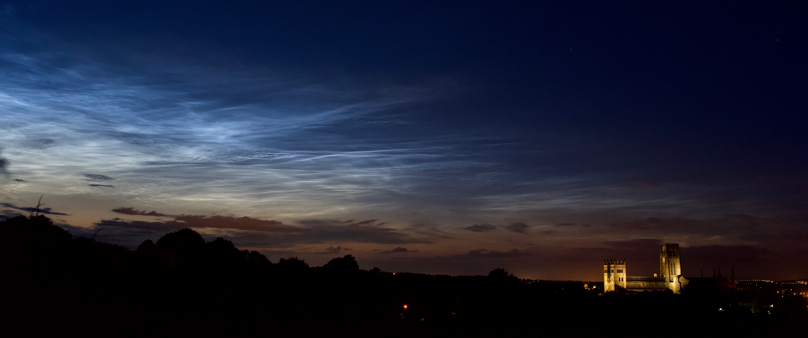

## Travels
<html lang="zh">
<head>
    <meta charset="UTF-8">
    <meta name="viewport" content="width=device-width, initial-scale=1.0">
    <title>多个地点的 Leaflet 地图</title>
    <!-- 引入 Leaflet CSS 文件 -->
    <link rel="stylesheet" href="https://unpkg.com/leaflet@1.9.4/dist/leaflet.css"
     integrity="sha256-p4NxAoJBhIIN+hmNHrzRCf9tD/miZyoHS5obTRR9BMY=" crossorigin=""/>
    
</head>
<body>
    

    
    
</body>
</html>

  
<!-- blank line -->
<figure class="video_container">
  <video controls="true" width="600" allowfullscreen="true" poster="path/to/poster_image.png">
    <source src="0501night_UT4_1080p.mov" type="video/mp4">
  </video>
</figure>
*Wonderful night at the VLT (UT4) in Paranal, Chile.*